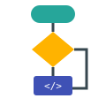
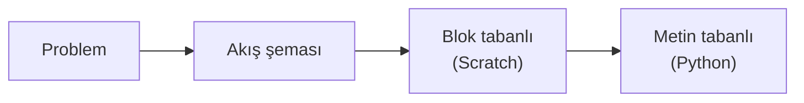

<p align="center">
    <h1 align="center">Algoritma Tasarımı</h1>
    <p align="center">2031211013 kodlu dersin materyalleri.</p>
</p>

<p align="center">
  
</p>

## Hızlı Bağlantılar

| Kaynak | Bağlantı |
|---|---|
| Ders materyalleri | [GitHub Pages sitesi](https://aligunesgit.github.io/AlgoritmaTasarimi/) |
| Ders platformu (ödevler, teslim tarihleri) | Atlas-OIS |
| İletişim ve duyurular | Atlas-OIS |
| SSS | [SSS sayfası](https://aligunesgit.github.io/AlgoritmaTasarimi/pages/faq/) |

## ℹ️ Ders bilgileri { #ders-bilgileri }

* Dersin sorumlusu
    * Dr. Öğr. Üyesi <a href="https://www.atlas.edu.tr/akademik-kadro/ali-gunes" target="_blank" rel="noopener noreferrer">Ali Güneş</a>, ali.gunes@atlas.edu.tr
* AKTS: _ders bilgi paketine göre güncellenecek_
* Süre: 14 hafta (12 içerik haftası + 2 proje sprinti)
* Değerlendirme: ara sınav, final ve proje
* Ön koşul: yok. Daha önce hiç programlama deneyimi olmayan öğrenciler için tasarlanmıştır.

## ❔ Öğrenme hedefleri

**Dersin genel amacı**

Bu ders, bir problemi çözülebilir adımlara ayırmayı ve bu adımları önce akış şeması, sonra blok tabanlı
bir ortam, en sonunda da metin tabanlı bir programlama dili ile ifade etmeyi öğretir. Amaç belirli bir
dilin söz dizimini ezberlemek değil; hangi dili kullanırsanız kullanın işe yarayacak bir **problem çözme
alışkanlığı** kazanmaktır.

Ders sonunda öğrenci:

* Algoritmanın problem çözme ve programlamadaki önemini açıklar
* Temel algoritma tasarlama tekniklerini bir probleme uygular
* Akış diyagramı çizer, okur ve elle izler
* Algoritmaları ve akış şemalarını dijital araçlarla görselleştirir
* Giriş/çıkış, veri tipleri, sabitler, değişkenler ve operatörleri doğru kullanır
* Karar yapıları, döngüler ve fonksiyonlarla program yazar
* Temel arama ve sıralama algoritmalarını uygular ve karşılaştırır
* Aynı probleme farklı algoritmalar önerip uygun olanı gerekçesiyle seçer
* Hem blok tabanlı (Scratch) hem metin tabanlı (Python) ortamda çalışır

## 🔥 Nereden başlamalı?

Materyali ham markdown olarak okumak yerine **[GitHub Pages
sitesi](https://aligunesgit.github.io/AlgoritmaTasarimi/)** üzerinden takip etmenizi öneririz. Aynı
içerik orada gezinme, arama ve diyagramlarla birlikte gösterilir.

İlk olarak [Giriş sayfasını](https://aligunesgit.github.io/AlgoritmaTasarimi/pages/before/) okuyun ve
kurulumları yapın. Ardından [Zaman Planı](https://aligunesgit.github.io/AlgoritmaTasarimi/pages/timeplan/)
sayfasını hafta hafta takip edin.

## 📂 Dersin düzeni

Her modülde aynı problem üç biçimde ele alınır:



| Hafta | Modül | Konu |
|------|--------|-------|
| 1  | [M1](m1_algoritma_ve_problem_cozme/README.md)  | Algoritma ve Problem Çözme |
| 2  | [M2](m2_tasarim_teknikleri/README.md)  | Algoritma Tasarlama Teknikleri |
| 3  | [M3](m3_akis_diyagramlari/README.md)  | Akış Diyagramları |
| 4  | [M4](m4_gorsellestirme/README.md)  | Algoritma ve Akış Şemalarının Görselleştirilmesi |
| 5  | [M5](m5_giris_cikis_veri_tipleri/README.md)  | Giriş/Çıkış Kavramları ve Temel Veri Tipleri |
| 6  | [M6](m6_degiskenler_operatorler/README.md)  | Sabitler, Değişkenler, Operatörler ve İşlem Öncelikleri |
| 7  | [M7](m7_karar_yapilari/README.md)  | Karar Yapıları |
| 8  | [Sprint A](sprint_a_proje/README.md) | Proje Sprinti A (ara sınav haftası) |
| 9  | [M8](m8_donguler/README.md)  | Döngüler |
| 10 | [M9](m9_fonksiyonlar/README.md)  | Fonksiyon Kullanımı |
| 11 | [M10](m10_arama/README.md) | Arama Algoritmaları |
| 12 | [M11](m11_siralama/README.md) | Sıralama Algoritmaları |
| 13 | [M12](m12_uygulanabilirlik/README.md) | Problem Çözümünde Farklı Algoritmaların Uygulanabilirliği |
| 14 | [Sprint B](sprint_b_final_proje/README.md) | Proje Sprinti B (final) |

## 💻 Kurulum

Bu repoyu bilgisayarınıza indirin:

```bash
git clone https://github.com/aligunesgit/AlgoritmaTasarimi.git
cd AlgoritmaTasarimi
uv sync
uv run pytest
```

Git henüz kurulu değilse bu sayfadaki "Code" düğmesinden ZIP olarak indirebilirsiniz. Araçların tam
listesi için [Giriş sayfasındaki kurulum bölümüne](pages/before.md) bakın.

## Ders kitapları

_Eklenecek._

## 📓 Kaynaklar

* [CS50x](https://cs50.harvard.edu/x/). Harvard'ın, Scratch ile başlayıp metin tabanlı dillere geçen
  ücretsiz giriş dersi.
* [Think Python, 3. baskı](https://allendowney.github.io/ThinkPython/). Allen B. Downey'in ücretsiz
  çevrimiçi okunabilen Python kitabı.
* [Python Tutor](https://pythontutor.com/). Python kodunu adım adım çalıştırıp değişkenleri görselleştirir.
* [Scratch](https://scratch.mit.edu/). MIT'nin blok tabanlı programlama ortamı.
* [VisuAlgo](https://visualgo.net/). Arama ve sıralama algoritmalarının animasyonları.
