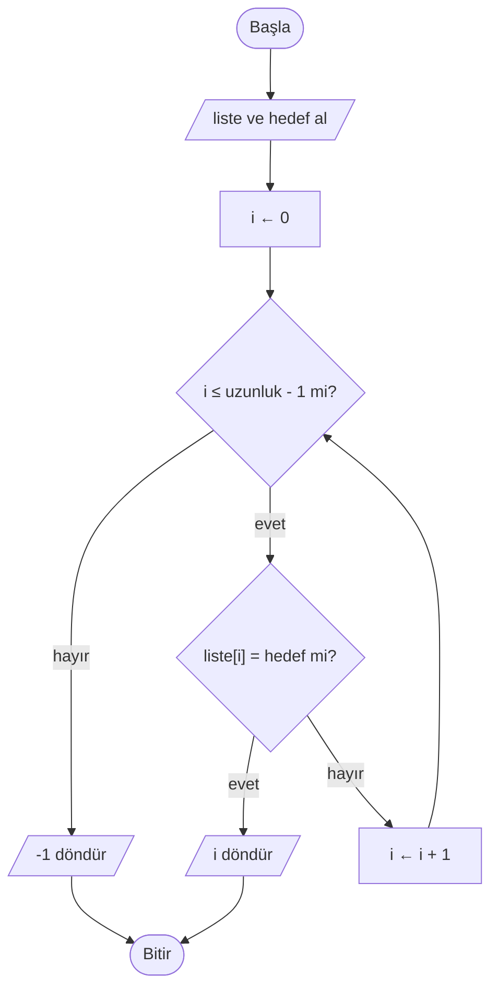
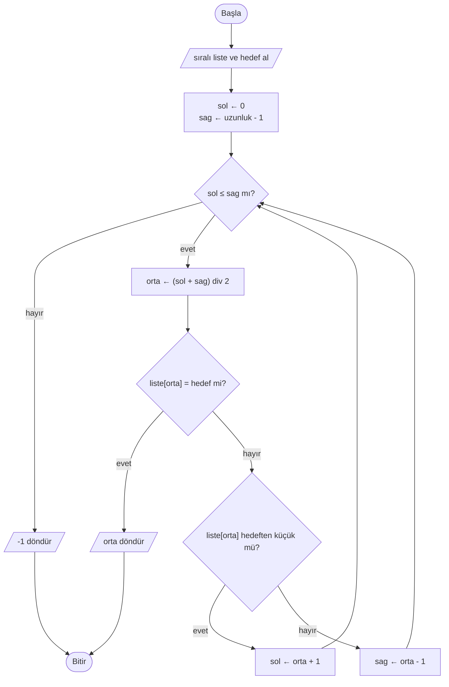

# 🔍 M10 - Arama Algoritmaları

<p align="center"><em>Hafta 11</em></p>

## ❔ Öğrenme hedefleri

Bu modülün sonunda öğrenci:

* Listelerle temel işlemleri (indeksle erişim, `len`, `for` ile gezme) arama problemine uygular
* Arama problemini girdi ve çıktısıyla tanımlar (bulunursa indeks, bulunmazsa `-1`)
* Doğrusal aramayı akış şeması, sözde kod ve Python ile uygular
* İkili aramanın çalışma mantığını ve **sıralı liste** ön koşulunu açıklar, adımlarını bir iz tablosuyla izler
* İki arama yönteminin karşılaştırma sayısını en iyi, en kötü ve ortalama durum için karşılaştırır
* Python'un hazır arama araçlarını (`in`, `list.index`, `bisect`) kendi yazdığı fonksiyonlarla ilişkilendirir

---

## 1. Listelerle çalışma: kısa bir hatırlatma

[M8](../m8_donguler/README.md)'de listeleri tanıdık. Bu modülde yapacağımız her şey, oradaki dört işleme
dayanıyor:

| İşlem | Python | Örnek (`notlar = [72, 45, 90, 38]`) |
|---|---|---|
| Liste oluşturma | `notlar = [72, 45, 90, 38]` | Dört elemanlı bir liste |
| İndeksle erişim | `notlar[i]` | `notlar[0]` → `72`, `notlar[3]` → `38` |
| Uzunluk | `len(notlar)` | `4`; son geçerli indeks `len(notlar) - 1` yani `3` |
| Gezme | `for i in range(len(notlar)):` | `i` sırayla `0, 1, 2, 3` değerlerini alır |

İndeksin **0'dan** başladığını unutmayın. `notlar[4]` yazarsak Python `IndexError` hatası verir, çünkü
dört elemanlı listenin son indeksi 3'tür. Arama algoritmalarındaki hataların çoğu bu sınırda olur.

## 2. Arama problemi { #2-arama-problemi }

Telefonunuzun rehberinde bir kişiyi, öğrenci bilgi sisteminde bir öğrenci numarasını ya da
kütüphane kataloğunda bir kitabı ararken hep aynı problemi çözersiniz:

* **Girdi:** bir liste ve aranan değer (**hedef**, target).
* **Çıktı:** hedef listede varsa **indeksi**, yoksa **`-1`**.

`-1` bir anlaşmadır (convention): hiçbir geçerli indeks negatif olmadığı için "bulunamadı" demenin
karışıklık yaratmayan bir yoludur.

| Liste | Hedef | Beklenen çıktı | Neden? |
|---|---|---|---|
| `[72, 45, 90, 38]` | `90` | `2` | `90`, 2. indekste |
| `[72, 45, 90, 38]` | `100` | `-1` | listede yok |
| `[4, 7, 4, 7]` | `7` | `1` | ilk geçtiği yer |
| `[]` | `5` | `-1` | boş listede hiçbir şey yoktur |

Son iki satır, problemi tanımlarken karar vermemiz gereken **uç durumlardır** (edge cases). Birden
fazla eşleşme varsa hangisini döndüreceğiz? Liste boşsa ne olacak? M1'deki Pólya'nın ilk adımı
("problemi anla") tam olarak bu soruları sormaktır.

## 3. Doğrusal arama (linear search) { #3-dogrusal-arama }

En doğal yöntem: listenin başından başla, her elemana tek tek bak. Eşit olanı bulursan indeksini
söyle; listenin sonuna geldiysen "yok" de. Buna **doğrusal** ya da **sıralı arama** (sequential
search) denir. Karışık bir deste kartın içinde maça ası ararken yaptığınız şey budur.

### 3.1 Akış şeması



### 3.2 Sözde kod

```text
FONKSİYON dogrusal_ara(liste, hedef)
    HER i İÇİN 0'dan uzunluk(liste) - 1'e KADAR YAP
        EĞER liste[i] = hedef İSE
            DÖNDÜR i                // bulduk, hemen çık
        EĞER SONU
    HER SONU
    DÖNDÜR -1                       // döngü bitti, hiçbiri eşit değildi
FONKSİYON SONU
```

### 3.3 Python

`exercise_files/arama_dogrusal.py`:

```python
def dogrusal_ara(liste: list[int], hedef: int) -> int:
    """`hedef` değerinin listedeki ilk indeksini döndürür; yoksa -1 döndürür."""
    for i in range(len(liste)):
        if liste[i] == hedef:
            return i  # (1)!
    return -1  # (2)!
```

1. `return` fonksiyonu o anda bitirir; döngünün geri kalanı çalışmaz. Bu yüzden ilk eşleşmeyi döndürürüz.
2. Bu satıra ancak döngü hiçbir `return`'e uğramadan bittiyse ulaşılır.

Fonksiyonları ve `return`'ü [M9](../m9_fonksiyonlar/README.md)'da işledik. Aynı dosyadaki
`dogrusal_ara_sayarak` fonksiyonu, aramayla birlikte kaç karşılaştırma yapıldığını da döndürür; bir
sonraki bölümde bu sayıyı kullanacağız.

### 3.4 Kaç karşılaştırma?

Bir algoritmanın ne kadar iş yaptığını ölçmenin basit bir yolu, **kaç kez `liste[i] == hedef`
sorusunu sorduğunu** saymaktır. `n` elemanlı bir liste için:

| Durum | Ne zaman olur? | Karşılaştırma sayısı |
|---|---|---|
| **En iyi** (best case) | Hedef ilk elemandır | `1` |
| **En kötü** (worst case) | Hedef son elemandır ya da hiç yoktur | `n` |
| **Ortalama** (average case) | Hedef listede, her konumda olma olasılığı eşit | yaklaşık `(n + 1) / 2` |

Sınıf listesinde 120 öğrenci varsa, bir öğrenci numarasını bulmak için en kötü durumda 120, ortalama
yaklaşık 60 karşılaştırma yaparız. Liste 10 katına çıkarsa iş de yaklaşık 10 katına çıkar. İş
miktarının girdi büyüklüğüyle nasıl büyüdüğünü [M12](../m12_uygulanabilirlik/README.md)'de
resmî olarak (Büyük-O gösterimi) inceleyeceğiz; burada sayarak sezgi kazanıyoruz.

!!! tip "Doğrusal aramanın avantajı"

    Doğrusal arama listenin **sıralı olmasını gerektirmez**. Her türlü listede çalışır. Liste küçükse
    ya da yalnızca bir kez arama yapacaksak genellikle en mantıklı seçim budur.

## 4. İkili arama (binary search) { #4-ikili-arama }

Sözlükte "kalem" kelimesini ararken ilk sayfadan başlamazsınız. Ortalarda bir yeri açarsınız, "m"
harfine geldiyseniz "k"nin **önce** olduğunu bilir, sağ yarıyı hiç açmazsınız. Bunu yapabilmenizin
tek nedeni sözlüğün **alfabetik sıralı** olmasıdır.

[M2](../m2_tasarim_teknikleri/README.md)'deki sayı tahmin oyununu hatırlayın: 1 ile 1000 arasında
tutulan bir sayıyı "büyük / küçük" ipuçlarıyla bulmaya çalışıyorduk. En iyi strateji hep aralığın
ortasını söylemekti: 500 → "küçük" → 250 → "büyük" → 375 ... Her tahmin aralığı yarıya indirir.
İkili arama bu stratejinin bir liste üzerindeki hâlidir.

!!! warning "Ön koşul: liste sıralı olmalı"

    İkili arama yalnızca **küçükten büyüğe sıralanmış** listede doğru çalışır. Liste sıralı değilse
    önce sıralamak gerekir. Bunu [M11](../m11_siralama/README.md)'de göreceğiz.

### 4.1 Fikir

Aramanın yapılacağı aralığı iki indeksle tutarız: `sol` (aralığın başı) ve `sag` (aralığın sonu).
Her adımda:

1. Ortadaki indeksi hesapla: `orta = (sol + sag) // 2`.
2. `liste[orta]` hedefe eşitse bulduk: `orta`'yı döndür.
3. `liste[orta]` hedeften **küçükse** hedef sağ yarıdadır: `sol = orta + 1`.
4. `liste[orta]` hedeften **büyükse** hedef sol yarıdadır: `sag = orta - 1`.
5. `sol`, `sag`'ı geçtiyse (`sol > sag`) aralık boşalmıştır: hedef yok, `-1` döndür.



### 4.2 Sözde kod ve Python

```text
FONKSİYON ikili_ara(liste, hedef)
    sol ← 0
    sag ← uzunluk(liste) - 1
    İKEN sol ≤ sag YAP
        orta ← ⌊(sol + sag) / 2⌋        // aşağı yuvarla: indeks tam sayı olmalı
        EĞER liste[orta] = hedef İSE
            DÖNDÜR orta
        DEĞİLSE EĞER liste[orta] < hedef İSE
            sol ← orta + 1              // sol yarıyı (orta dahil) at
        DEĞİLSE
            sag ← orta - 1              // sağ yarıyı (orta dahil) at
        EĞER SONU
    İKEN SONU
    DÖNDÜR -1
FONKSİYON SONU
```

`exercise_files/arama_ikili.py`:

```python
def ikili_ara(liste: list[int], hedef: int) -> int:
    """Sıralı `liste` içinde `hedef` değerini arar; bulunursa bir indeksini, yoksa -1 döndürür."""
    sol = 0
    sag = len(liste) - 1
    while sol <= sag:
        orta = (sol + sag) // 2  # (1)!
        if liste[orta] == hedef:
            return orta
        elif liste[orta] < hedef:
            sol = orta + 1
        else:
            sag = orta - 1
    return -1
```

1. `//` tam sayı bölmesidir (M6). `(0 + 10) // 2` → `5`, `(3 + 4) // 2` → `3`.

### 4.3 İz tablosu (trace table) { #43-iz-tablosu }

Liste (indeksler üstte):

| İndeks | 0 | 1 | 2 | 3 | 4 | 5 | 6 | 7 | 8 | 9 | 10 |
|---|---|---|---|---|---|---|---|---|---|---|---|
| Değer | 3 | 8 | 12 | 17 | 23 | 31 | 42 | 56 | 64 | 77 | 85 |

**Hedef = 23** (listede var):

| Adım | `sol` | `sag` | `orta` | `liste[orta]` | Karar |
|---|---|---|---|---|---|
| 1 | 0 | 10 | 5 | 31 | 31 > 23 → sol yarıya geç, `sag = 4` |
| 2 | 0 | 4 | 2 | 12 | 12 < 23 → sağ yarıya geç, `sol = 3` |
| 3 | 3 | 4 | 3 | 17 | 17 < 23 → `sol = 4` |
| 4 | 4 | 4 | 4 | 23 | eşit → **4 döndür** |

**Hedef = 20** (listede yok): ilk üç adım aynıdır.

| Adım | `sol` | `sag` | `orta` | `liste[orta]` | Karar |
|---|---|---|---|---|---|
| 4 | 4 | 4 | 4 | 23 | 23 > 20 → `sag = 3` |
| - | 4 | 3 | | | `sol > sag`, aralık boş → **-1 döndür** |

Her iki durumda da 4 karşılaştırma yaptık. Doğrusal arama 23'ü 5, olmayan 20'yi ise 11
karşılaştırmada bulurdu. Bu iki iz, `test_arama_ikili.py` içindeki `test_iz_tablosundaki_adim_sayilari`
testinde de doğrulanır.

!!! example "Kendinizi deneyin"

    Aynı listede **hedef = 77** için iz tablosunu doldurun. Kaç karşılaştırma yapılır?

    ??? success "Cevap"

        | Adım | `sol` | `sag` | `orta` | `liste[orta]` | Karar |
        |---|---|---|---|---|---|
        | 1 | 0 | 10 | 5 | 31 | 31 < 77 → `sol = 6` |
        | 2 | 6 | 10 | 8 | 64 | 64 < 77 → `sol = 9` |
        | 3 | 9 | 10 | 9 | 77 | eşit → **9 döndür** |

        3 karşılaştırma. Doğrusal arama 10 karşılaştırma yapardı.

## 5. Karşılaştırma: kaç adımda buluruz? { #5-karsilastirma }

İkili aramada her karşılaştırma aralığı yarıya indirir. 1000 elemanlı bir liste için aralık
uzunluğu yaklaşık 1000 → 500 → 250 → 125 → 62 → 31 → 15 → 7 → 3 → 1 diye küçülür. Yani **en
fazla 10 karşılaştırma** yeterlidir, çünkü 2¹⁰ = 1024 ≥ 1000. Sayı tahmin oyununda 1–1000 arasındaki
her sayıyı en fazla 10 tahminde bulabilmenizin nedeni de budur.

| Liste uzunluğu `n` | Doğrusal arama (en kötü) | İkili arama (en kötü) |
|---|---|---|
| 10 | 10 | 4 |
| 100 | 100 | 7 |
| 1 000 | 1 000 | 10 |
| 1 000 000 | 1 000 000 | 20 |
| 1 000 000 000 | 1 000 000 000 | 30 |

Liste bin kat büyüdüğünde doğrusal aramanın işi bin kat artar, ikili aramanınki ise yalnızca
yaklaşık 10 karşılaştırma artar. Bu farkın matematiksel adı (logaritmik büyüme) ve Büyük-O ile
gösterimi [M12](../m12_uygulanabilirlik/README.md)'nin konusudur.

| | Doğrusal arama | İkili arama |
|---|---|---|
| Ön koşul | Yok | Liste sıralı olmalı |
| En iyi durum | 1 | 1 (hedef tam ortadaysa) |
| En kötü durum | `n` | yaklaşık `log₂ n + 1` |
| Ne zaman tercih edilir? | Küçük ya da sıralanmamış liste, tek seferlik arama | Büyük, sıralı liste, çok sayıda arama |

!!! note "Sıralamanın bedeli"

    Sıralanmamış bir listede yalnızca **bir kez** arama yapacaksanız, önce sıralayıp sonra ikili arama
    yapmak genellikle doğrusal aramadan daha pahalıdır; çünkü sıralamanın kendisi de iş ister (M11).
    Ama aynı listede binlerce arama yapılacaksa bir kez sıralamak kendini hızla öder.

## 6. İkili aramada yaygın hatalar { #6-yaygin-hatalar }

İkili arama kısa bir algoritmadır ama doğru yazması şaşırtıcı derecede zordur. Jon Bentley,
Knuth'un TAOCP Cilt 3, §6.2.1'deki tarihçesine dayanarak ilk ikili aramanın 1946'da yayımlandığını,
her liste uzunluğu için doğru çalışan ilk sürümün ise yıllar sonra ortaya çıktığını hatırlatır
(*Programming Pearls*, 4. sütun).

| Hata | Kod | Ne olur? |
|---|---|---|
| Döngü koşulunda `<` | `while sol < sag:` | Aralıkta tek eleman kaldığında döngü biter; o eleman hiç kontrol edilmez. `ikili_ara([5], 5)` yanlışlıkla `-1` verir. |
| `orta`'yı atlamamak | `sol = orta` | `sol = 4, sag = 5` iken `orta = 4` olur, `sol` yine 4 kalır: **sonsuz döngü**. |
| Tam sayı bölmesi yerine `/` | `orta = (sol + sag) / 2` | `orta` ondalıklı olur (`5.0`), `liste[orta]` satırı `TypeError` verir. |
| Sıralanmamış liste | `ikili_ara([5, 2, 9, 1, 6], 2)` | `orta = 2` → `9 > 2` → sol yarıya geçer, sonra `5 > 2` → `-1` döndürür. Oysa 2 listede var. |

!!! tip "Sonsuz döngü testi"

    İyi bir kural: döngünün her turunda aralık **en az bir eleman küçülmeli**. `sol = orta + 1` ve
    `sag = orta - 1` bunu garanti eder, çünkü `orta` her seferinde aralıktan çıkarılır.

## 7. Python'un hazır araçları { #7-hazir-araclar }

Python, bu modülde yazdığımız algoritmaların hazır hâllerini sunar. Kendi sürümümüzü yazmamızın amacı
bu araçların **içeride ne yaptığını** anlamaktır.

| Araç | Ne yapar? | Arkasındaki algoritma |
|---|---|---|
| `hedef in liste` | `True` / `False` döndürür | Doğrusal arama |
| `liste.index(hedef)` | İlk indeksi döndürür, **yoksa `ValueError` hatası verir** | Doğrusal arama |
| `bisect.bisect_left(liste, hedef)` | Sıralı listede hedefin **eklenebileceği** en soldaki konumu döndürür | İkili arama |

```python
from bisect import bisect_left

notlar = [38, 45, 51, 66, 72, 90]
print(66 in notlar)          # True
print(notlar.index(66))      # 3
print(bisect_left(notlar, 66))  # 3  (66 burada)
print(bisect_left(notlar, 60))  # 3  (60 olsaydı 51 ile 66 arasına girerdi)
```

`list.index` hedef yoksa programı hatayla durdurduğu için önce `in` ile kontrol etmek yaygın bir
alışkanlıktır: `notlar.index(x) if x in notlar else -1`. `bisect_left` ise "bulunamadı" demez,
hedefin olması gereken yeri söyler. Kendi `ikili_ara` fonksiyonumuzun davranışını elde etmek için
Python belgelerindeki "Searching Sorted Lists" tarifini izleriz:

```python
def bisect_ile_ara(liste: list[int], hedef: int) -> int:
    i = bisect_left(liste, hedef)
    if i < len(liste) and liste[i] == hedef:
        return i
    return -1
```

`test_arama_ikili.py` içindeki `test_bisect_ile_ayni_sonuc` testi, sabit bir rastgele tohumla (seed)
üretilen 300 sıralı listede `ikili_ara` ile bu tarifin aynı sonucu verdiğini denetler.
`from bisect import bisect_left` satırı standart kütüphanedeki `bisect` modülünden bir fonksiyon alır;
testlerde `from arama_ikili import ikili_ara` yazarken yaptığımızın aynısıdır.

!!! tip "Adım adım izleyin"

    [Python Tutor](https://pythontutor.com/)'a `ikili_ara` fonksiyonunu yapıştırıp §4.3'teki listeyle
    çalıştırın; `sol`, `sag` ve `orta` değişkenlerinin her turda nasıl değiştiğini görün.
    [VisuAlgo](https://visualgo.net/) ise arama ve sıralama algoritmalarının animasyonlarını sunar.

## 8. Alıştırmalar

1. **Elle iz.** §4.3'teki listede **hedef = 56** ve **hedef = 5** için iz tablosunu kâğıtta
   doldurun. Sonuçlarınızı `ikili_ara_sayarak` ile kontrol edin.
2. **Testleri çalıştır.** `uv run pytest m10_arama` ile tüm testlerin geçtiğini doğrulayın. Sonra
   `arama_ikili.py` içinde `while sol <= sag` satırını `while sol < sag` yapın ve hangi testlerin
   neden kırıldığını açıklayın. Değişikliği geri alın.
3. **Tüm konumlar.** `exercise_files/arama_tum_konumlar.py` dosyasındaki `tum_konumlari_bul`
   fonksiyonu, doğrusal aramanın ilk eşleşmede durmayan bir çeşididir. Kodu inceleyin ve
   `dogrusal_ara` ile arasındaki tek önemli farkı bulun.
4. **Son konum.** Listede hedefin geçtiği **son** indeksi döndüren `son_konumu_bul(liste, hedef)`
   fonksiyonunu yazın (yoksa `-1`). Önce sözde kodunu yazın. Listeyi sondan başa gezebilirsiniz:
   `range(len(liste) - 1, -1, -1)`. En az üç test ekleyin.
5. **Tahmin oyunu, ters yönden.** Kullanıcı 1–1000 arasında bir sayı tutsun; program ikili arama
   stratejisiyle tahmin etsin ve kullanıcı her tahmine `b` (büyük), `k` (küçük) ya da `d` (doğru)
   desin. Programın hiçbir zaman 10'dan fazla tahmin yapmadığını gözlemleyin.
6. **Hangi yöntem?** Aşağıdaki durumlarda hangi arama yöntemini seçerdiniz? Gerekçelendirin.
    1. Bir kez aranacak, 15 elemanlı, karışık bir alışveriş listesi.
    2. Her gün binlerce kez sorgulanan, numaraya göre sıralı 40 000 kişilik öğrenci listesi.

    ??? success "Cevap"

        1. **Doğrusal arama.** Liste küçük ve sıralı değil; sıralamak aramanın kendisinden pahalıya
           gelir.
        2. **İkili arama.** Liste zaten sıralı ve çok sayıda arama yapılıyor. En kötü durumda
           40 000 yerine en fazla 16 karşılaştırma (2¹⁶ = 65 536 ≥ 40 000).

---

## Özet

Arama problemi bir listede hedef değerin yerini sorar; cevap bir indeks ya da "yok" anlamında `-1`'dir.
Doğrusal arama her elemana sırayla bakar, sıralı liste gerektirmez ve en kötü durumda `n` karşılaştırma
yapar. İkili arama yalnızca sıralı listede çalışır ama her adımda aralığı yarıya indirdiği için 1000
elemanda en fazla 10, bir milyonda en fazla 20 karşılaştırma yapar. İkili aramanın sınır koşulları
(`sol ≤ sag`, `orta ± 1`, tam sayı bölmesi) küçük ama kritik ayrıntılardır ve iz tablosuyla kolayca
denetlenir. Python'un `in`, `list.index` ve `bisect` araçları bu algoritmaların hazır hâlleridir.
Bir sonraki modülde ikili aramanın ön koşulunu, yani listeyi sıralamayı öğreneceğiz.

## İleri okuma

* [CS50x, Hafta 3: Algorithms](https://cs50.harvard.edu/x/weeks/3/). Harvard'ın bilgisayar bilimine
  giriş dersinin doğrusal ve ikili aramayı, sıralama algoritmalarıyla birlikte anlattığı haftası.
* Allen B. Downey, [*Think Python*, 3. baskı, 7. bölüm: Iteration and Search](https://allendowney.github.io/ThinkPython/chap07.html).
  Döngülerle arama kalıbını (linear search) Python örnekleriyle anlatır.
* [VisuAlgo](https://visualgo.net/). Algoritma ve veri yapısı animasyonları.

## Kaynaklar

* Donald E. Knuth, *The Art of Computer Programming, Vol. 3: Sorting and Searching*, 2. baskı,
  Addison-Wesley, 1998, §6.1 (sıralı arama) ve §6.2.1 (sıralı tabloda arama, ikili arama).
* Jon Bentley, *Programming Pearls*, 2. baskı, Addison-Wesley, 2000, 4. sütun (Writing Correct
  Programs). §6'daki tarihsel notun ve ikili aramanın doğruluğu üzerine tartışmanın kaynağı.
* Thomas H. Cormen, Charles E. Leiserson, Ronald L. Rivest, Clifford Stein, *Introduction to
  Algorithms*, 4. baskı, MIT Press, 2022, Bölüm 2 (Getting Started).
* [Python belgeleri: `bisect` — Array bisection algorithm](https://docs.python.org/3/library/bisect.html).
  §7'deki `bisect_left` ve "Searching Sorted Lists" tarifinin kaynağı.
* [Python belgeleri: Common Sequence Operations](https://docs.python.org/3/library/stdtypes.html#common-sequence-operations).
  `in` ve `index` işlemlerinin tanımı.
