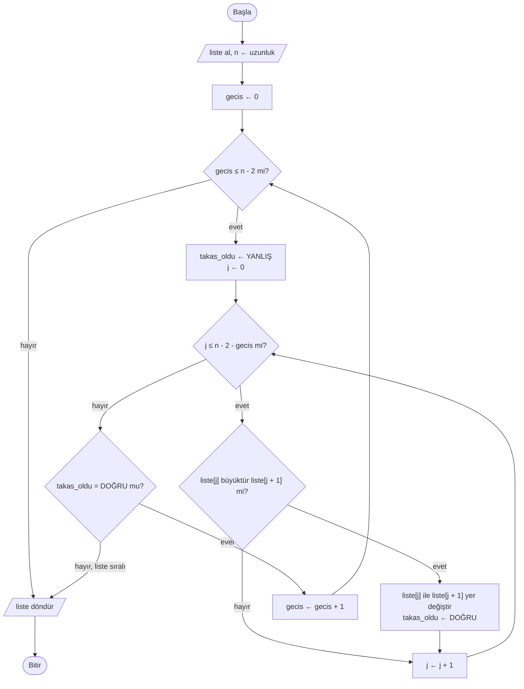
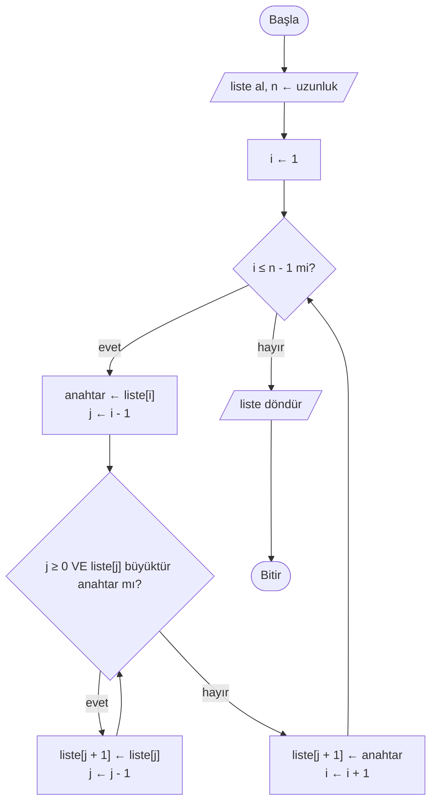

# 📶 M11 - Sıralama Algoritmaları

<p align="center"><em>Hafta 12</em></p>

## ❔ Öğrenme hedefleri

Bu modülün sonunda öğrenci:

* Sıralama problemini tanımlar ve neden önemli olduğunu (ör. ikili aramanın ön koşulu) açıklar
* Kabarcık, seçmeli ve eklemeli sıralamayı elle, bir iz tablosuyla uygular
* Bu üç algoritmayı sözde kod, akış şeması ve Python ile yazar
* Algoritmaların karşılaştırma ve yer değiştirme sayılarını ölçer ve karşılaştırır
* Kararlı (stable) sıralamanın ne demek olduğunu bir örnekle açıklar
* Python'un `sorted()` ve `list.sort()` araçlarını `key` ve `reverse` parametreleriyle kullanır
* Birleştirmeli sıralamanın böl-fethet fikrini tanır

---

## 1. Sıralama problemi { #1-siralama-problemi }

Sınav sonuçlarını en yüksekten en düşüğe dizmek, bir e-posta kutusunu tarihe göre göstermek,
rehberdeki kişileri alfabetik listelemek: hepsi aynı problemdir.

* **Girdi:** bir liste, ör. `[5, 2, 9, 1, 6]`.
* **Çıktı:** aynı elemanların küçükten büyüğe dizilmiş hâli: `[1, 2, 5, 6, 9]`.

Sıralamanın en önemli getirisi, sonrasında yapılan işleri hızlandırmasıdır.
[M10](../m10_arama/README.md)'da ikili aramanın yalnızca sıralı listede çalıştığını gördük: 1000
elemanlı sıralı bir listede en fazla 10 karşılaştırmayla arama yapabiliyorduk. Sıralı bir listede en
küçük ve en büyük eleman, tekrarlanan değerler ve ortanca (median) da kolayca bulunur.

!!! note "Yerinde mi, kopya mı?"

    Bir sıralama fonksiyonu ya verilen listeyi **yerinde** (in place) değiştirir ya da sıralanmış
    **yeni bir liste** döndürür. Bu modüldeki fonksiyonlar ikincisini yapar: önce
    `sonuc = liste.copy()` ile kopya alır, kopyayı sıralar ve onu döndürür. Böylece orijinal liste
    bozulmaz. `sonuc = liste` yazmak kopya oluşturmaz; iki isim **aynı** listeyi gösterir ve
    `sonuc` üzerindeki her değişiklik `liste`'yi de değiştirir. Python'un kendi araçlarında da bu
    ayrım vardır (bkz. [§8](#8-python-sorted)).

Üç algoritmayı da aynı örnek listeyle, `[5, 2, 9, 1, 6]` ile izleyeceğiz. Her birinde iki şeyi
sayacağız: **karşılaştırma** (iki elemanı kıyaslama) ve **yer değiştirme** (takas ya da kaydırma).

!!! tip "İki elemanın yerini değiştirmek"

    Sözde kodda iki elemanın yerini değiştirmek için geçici bir değişken kullanırız:
    `gecici ← liste[j]`, `liste[j] ← liste[j + 1]`, `liste[j + 1] ← gecici`. Python bunu tek
    satırda yazmaya izin verir: `liste[j], liste[j + 1] = liste[j + 1], liste[j]`.

## 2. Kabarcık sıralama (bubble sort) { #2-kabarcik-siralama }

**Fikir:** listeyi baştan sona gez; yan yana duran iki eleman yanlış sıradaysa yerlerini değiştir.
Bir geçişin sonunda en büyük eleman, sudaki kabarcık gibi listenin sonuna yükselir. İkinci geçişte
ikinci en büyük eleman sondan bir önceki yerine gelir, ve böyle devam eder. Bir geçişte **hiç takas
yapılmadıysa** liste sıralıdır ve durabiliriz (erken çıkış).

### 2.1 Adım adım

| Geçiş | Geçiş sonunda liste | Karşılaştırma | Takas | Not |
|---|---|---|---|---|
| Başlangıç | `[5, 2, 9, 1, 6]` | | | |
| 1 | `[2, 5, 1, 6, 9]` | 4 | 3 | 5↔2, 9↔1, 9↔6; en büyük (9) sona yerleşti |
| 2 | `[2, 1, 5, 6, 9]` | 3 | 1 | 5↔1 |
| 3 | `[1, 2, 5, 6, 9]` | 2 | 1 | 2↔1 |
| 4 | `[1, 2, 5, 6, 9]` | 1 | 0 | takas yok |
| **Toplam** | | **10** | **5** | |

Her geçişte bir eleman daha kesin yerine oturduğu için iç döngü bir eleman kısalır (4, 3, 2, 1
karşılaştırma). Bu listede erken çıkış bir şey kazandırmadı. Ama `[2, 1, 5, 6, 9]` gibi neredeyse
sıralı bir listede 1. geçişte tek takas yapılır, 2. geçişte hiç takas olmaz ve algoritma 10 yerine 7
karşılaştırmayla biter. Zaten sıralı bir listede ise tek geçiş (4 karşılaştırma) yeterlidir.

### 2.2 Akış şeması



### 2.3 Sözde kod ve Python

```text
FONKSİYON kabarcik_sirala(liste)
    n ← uzunluk(liste)
    HER gecis İÇİN 0'dan n - 2'ye KADAR YAP
        takas_oldu ← YANLIŞ
        HER j İÇİN 0'dan n - 2 - gecis'e KADAR YAP
            EĞER liste[j] > liste[j + 1] İSE
                liste[j] ile liste[j + 1]'in yerini değiştir
                takas_oldu ← DOĞRU
            EĞER SONU
        HER SONU
        EĞER DEĞİL takas_oldu İSE
            DÖNDÜR liste            // erken çıkış: bu geçişte takas yok
        EĞER SONU
    HER SONU
    DÖNDÜR liste
FONKSİYON SONU
```

`exercise_files/siralama_kabarcik.py`:

```python
def kabarcik_sirala(liste: list[int]) -> list[int]:
    """Listenin küçükten büyüğe sıralanmış bir KOPYASINI döndürür."""
    sonuc = liste.copy()
    n = len(sonuc)
    for gecis in range(n - 1):
        takas_oldu = False  # (1)!
        for j in range(n - 1 - gecis):
            if sonuc[j] > sonuc[j + 1]:
                sonuc[j], sonuc[j + 1] = sonuc[j + 1], sonuc[j]
                takas_oldu = True
        if not takas_oldu:
            break  # (2)!
    return sonuc
```

1. Bu değişkene **bayrak** (flag) denir: bir olayın (burada takasın) olup olmadığını aklında tutar.
2. `break` en yakın döngüyü (burada dış `for`'u) hemen bitirir.

## 3. Seçmeli sıralama (selection sort) { #3-secmeli-siralama }

**Fikir:** listenin en küçük elemanını bul ve başa koy. Sonra geri kalanların en küçüğünü bul ve
ikinci sıraya koy. Boy sırasına girecek bir sınıfta öğretmenin "en kısa kim?" diye bakıp onu öne
alması, sonra kalanlar arasında aynı soruyu tekrarlaması gibi. Liste iki bölüme ayrılır: solda
**sıralı** bölüm, sağda henüz **sıralanmamış** bölüm.

### 3.1 Adım adım

Kalın yazılan elemanlar sıralı bölümdür.

| Geçiş (`i`) | Sıralanmamış bölümün en küçüğü | İşlem | Geçiş sonunda liste | Karşılaştırma |
|---|---|---|---|---|
| Başlangıç | | | `[5, 2, 9, 1, 6]` | |
| 1 (`i = 0`) | 1 (indeks 3) | 5↔1 | [**1**, 2, 9, 5, 6] | 4 |
| 2 (`i = 1`) | 2 (indeks 1) | zaten yerinde, takas yok | [**1, 2**, 9, 5, 6] | 3 |
| 3 (`i = 2`) | 5 (indeks 3) | 9↔5 | [**1, 2, 5**, 9, 6] | 2 |
| 4 (`i = 3`) | 6 (indeks 4) | 9↔6 | [**1, 2, 5, 6, 9**] | 1 |
| **Toplam** | | **3 takas** | | **10** |

Son eleman kendiliğinden yerindedir, bu yüzden `n` elemanlı listede `n - 1` geçiş yeter.

### 3.2 Sözde kod ve Python

```text
FONKSİYON secmeli_sirala(liste)
    n ← uzunluk(liste)
    HER i İÇİN 0'dan n - 2'ye KADAR YAP
        en_kucuk ← i                        // sıralanmamış bölümün başını en küçük varsay
        HER j İÇİN i + 1'den n - 1'e KADAR YAP
            EĞER liste[j] < liste[en_kucuk] İSE
                en_kucuk ← j
            EĞER SONU
        HER SONU
        EĞER en_kucuk ≠ i İSE
            liste[i] ile liste[en_kucuk]'un yerini değiştir
        EĞER SONU
    HER SONU
    DÖNDÜR liste
FONKSİYON SONU
```

`exercise_files/siralama_secmeli.py`:

```python
def secmeli_sirala(liste: list[int]) -> list[int]:
    """Listenin küçükten büyüğe sıralanmış bir KOPYASINI döndürür."""
    sonuc = liste.copy()
    n = len(sonuc)
    for i in range(n - 1):
        en_kucuk = i
        for j in range(i + 1, n):
            if sonuc[j] < sonuc[en_kucuk]:
                en_kucuk = j
        if en_kucuk != i:
            sonuc[i], sonuc[en_kucuk] = sonuc[en_kucuk], sonuc[i]
    return sonuc
```

İç döngü, bir listenin en küçük elemanını döngüyle bulma kalıbıdır; tek farkı değeri değil
**indeksi** hatırlamasıdır, çünkü takas için elemanın yerini bilmemiz gerekir.

## 4. Eklemeli sıralama (insertion sort) { #4-eklemeli-siralama }

**Fikir:** elinize tek tek iskambil kartı aldığınızı düşünün. Her yeni kartı, elinizdeki zaten
sıralı kartların arasında doğru yere sokarsınız. Eklemeli sıralama da listenin solunda sıralı bir
bölüm tutar; sıradaki elemanı (**anahtar**, key) alır, ondan büyük elemanları birer sağa **kaydırır**
ve anahtarı açılan boşluğa yerleştirir.

### 4.1 Adım adım

| Adım (`i`) | Anahtar | Kaydırılanlar | Adım sonunda liste | Karşılaştırma | Kaydırma |
|---|---|---|---|---|---|
| Başlangıç | | | [**5**, 2, 9, 1, 6] | | |
| 1 | 2 | 5 | [**2, 5**, 9, 1, 6] | 1 | 1 |
| 2 | 9 | yok (5 ≤ 9) | [**2, 5, 9**, 1, 6] | 1 | 0 |
| 3 | 1 | 9, 5, 2 | [**1, 2, 5, 9**, 6] | 3 | 3 |
| 4 | 6 | 9 | [**1, 2, 5, 6, 9**] | 2 | 1 |
| **Toplam** | | | | **7** | **5** |

3\. adımda anahtar (1) sıralı bölümün hepsinden küçük olduğu için liste başına kadar gidildi.
2\. adımda ise tek bakış yetti: 9, solundaki 5'ten büyük olduğu için zaten yerindeydi.

### 4.2 Akış şeması



### 4.3 Sözde kod ve Python

```text
FONKSİYON ekleme_sirala(liste)
    HER i İÇİN 1'den uzunluk(liste) - 1'e KADAR YAP
        anahtar ← liste[i]
        j ← i - 1
        İKEN j ≥ 0 VE liste[j] > anahtar YAP
            liste[j + 1] ← liste[j]     // büyük elemanı bir sağa kaydır
            j ← j - 1
        İKEN SONU
        liste[j + 1] ← anahtar          // açılan boşluğa yerleştir
    HER SONU
    DÖNDÜR liste
FONKSİYON SONU
```

`exercise_files/siralama_ekleme.py`:

```python
def ekleme_sirala(liste: list[int]) -> list[int]:
    """Listenin küçükten büyüğe sıralanmış bir KOPYASINI döndürür."""
    sonuc = liste.copy()
    for i in range(1, len(sonuc)):
        anahtar = sonuc[i]
        j = i - 1
        while j >= 0 and sonuc[j] > anahtar:  # (1)!
            sonuc[j + 1] = sonuc[j]
            j = j - 1
        sonuc[j + 1] = anahtar
    return sonuc
```

1. Koşulların **sırası önemlidir**. Python `and` ifadesinde soldaki koşul yanlışsa sağdakine hiç
   bakmaz (kısa devre değerlendirme, short-circuit evaluation). `j` −1 olduğunda `sonuc[j]` hiç okunmaz. Sıra ters olsaydı `sonuc[-1]` listenin
   **son** elemanını okur ve algoritma sessizce yanlış çalışırdı.

## 5. Üç algoritmanın karşılaştırması { #5-karsilastirma }

Her dosyadaki `..._sayarak` fonksiyonları, sıralanmış listeyle birlikte karşılaştırma ve yer
değiştirme sayılarını döndürür. Beş elemanlı üç farklı liste için sonuçlar (`test_siralama_*.py`
dosyaları bu sayıları doğrular):

| Girdi (`n = 5`) | Kabarcık | Seçmeli | Eklemeli |
|---|---|---|---|
| Karışık `[5, 2, 9, 1, 6]` | 10 karş. / 5 takas | 10 karş. / 3 takas | 7 karş. / 5 kaydırma |
| Zaten sıralı `[1, 2, 5, 6, 9]` | 4 / 0 | 10 / 0 | 4 / 0 |
| Ters sıralı `[9, 6, 5, 2, 1]` | 10 / 10 | 10 / 2 | 10 / 10 |

Genel olarak `n` elemanlı bir liste için:

| | Kabarcık (bayraklı) | Seçmeli | Eklemeli |
|---|---|---|---|
| Karşılaştırma, en iyi durum | `n - 1` (sıralı liste) | `n(n - 1) / 2` (her zaman) | `n - 1` (sıralı liste) |
| Karşılaştırma, en kötü durum | `n(n - 1) / 2` | `n(n - 1) / 2` | `n(n - 1) / 2` |
| Yer değiştirme, en fazla | `n(n - 1) / 2` takas | `n - 1` takas | `n(n - 1) / 2` kaydırma |
| Kararlı mı? (§6) | Evet | Hayır | Evet |

Bu tablodan üç sonuç çıkar. Seçmeli sıralama listenin durumuna bakmaz, her zaman aynı sayıda
karşılaştırma yapar ama çok az takas eder; takasın pahalı olduğu durumlarda avantajlıdır. Eklemeli
sıralama neredeyse sıralı listelerde çok hızlıdır. Üçünün de en kötü durumu `n(n - 1) / 2`'dir:
1000 elemanda yaklaşık 500 000, bir milyon elemanda yaklaşık 500 milyar karşılaştırma. Bu
"karesel" büyümenin ne anlama geldiğini [M12](../m12_uygulanabilirlik/README.md)'de ayrıntılı
inceleyeceğiz.

!!! example "Kendinizi deneyin"

    `[4, 3, 2, 1]` listesini eklemeli sıralamayla sıralarken kaç karşılaştırma ve kaç kaydırma
    yapılır? Aynı listede seçmeli sıralama kaç takas yapar?

    ??? success "Cevap"

        Eklemeli: her anahtar sıralı bölümün hepsinden küçüktür, bu yüzden 1 + 2 + 3 = **6
        karşılaştırma** ve **6 kaydırma** (en kötü durum, `4 · 3 / 2 = 6`). Seçmeli: 1. geçişte 4↔1
        → `[1, 3, 2, 4]`, 2. geçişte 3↔2 → `[1, 2, 3, 4]`, 3. geçişte takas yok: **2 takas**.

## 6. Kararlılık (stability) { #6-kararlilik }

Bir sıralama algoritması, **eşit** kabul edilen elemanların baştaki sırasını koruyorsa **kararlıdır**
(stable). Sayılarda bu fark görünmez; ama kayıtları bir özelliğe göre sıraladığımızda önemlidir.
Örneğin öğrenci listesi alfabetik sıradayken notlarına göre sıralarsak, kararlı bir algoritma aynı
notu alan öğrencileri alfabetik sırada bırakır:

| Önce (alfabetik) | Nota göre kararlı sıralama | Nota göre kararsız bir sonuç |
|---|---|---|
| Ali 70, Ayşe 85, Can 70 | Ali 70, Can 70, Ayşe 85 | Can 70, Ali 70, Ayşe 85 |

Kabarcık ve eklemeli sıralama yalnızca **kesinlikle büyük** (`>`) olan elemanların yerini değiştirir,
bu yüzden kararlıdır. Seçmeli sıralama ise uzak mesafeli takas yaptığı için kararlı değildir:
`[5a, 5b, 3]` listesinde ilk geçiş 5a ile 3'ü takas eder ve sonuç `[3, 5b, 5a]` olur; iki 5'in sırası
değişmiştir.

## 7. Birleştirmeli sıralamaya bakış (merge sort) { #7-birlestirmeli-siralama }

Bu modüldeki üç algoritma da elemanları tek tek yerine taşır. **Birleştirmeli sıralama** (merge sort)
farklı bir fikir kullanır: **böl-fethet** (divide and conquer, M2). Listeyi iki yarıya böler, her
yarıyı ayrı ayrı sıralar ve sonra iki sıralı yarıyı tek bir sıralı listede **birleştirir**. Birleştirme
kolaydır: iki sıralı listenin başındaki elemanlardan küçük olanı alıp sonuca eklemek yeterlidir.

Bu yöntemle bir milyon eleman yaklaşık 20 milyon karşılaştırmayla sıralanabilir; §5'teki
algoritmaların en kötü durumundaki 500 milyar ile karşılaştırın. Birleştirmeli sıralama genellikle
özyineleme (recursion) ile yazılır; bu derste özyinelemeyi işlemediğimiz için ayrıntısını ileri
okumaya bırakıyoruz (CLRS §2.3, VisuAlgo).

## 8. Python'un hazır sıralaması: `sorted()` { #8-python-sorted }

Python'da iki hazır araç vardır:

| Araç | Ne yapar? | Döndürdüğü |
|---|---|---|
| `sorted(liste)` | Sıralanmış **yeni bir liste** üretir; orijinal değişmez | Yeni liste |
| `liste.sort()` | Listeyi **yerinde** sıralar | `None` |

Bu modüldeki fonksiyonlarımız `sorted()` gibi davranır. Sık yapılan bir hata `liste = liste.sort()`
yazmaktır: `sort()` bir şey döndürmediği için `liste` artık `None` olur.

Her iki araç da iki isteğe bağlı parametre alır:

```python
notlar = [72, 45, 90, 38, 66]
print(sorted(notlar))                # [38, 45, 66, 72, 90]
print(sorted(notlar, reverse=True))  # [90, 72, 66, 45, 38]  büyükten küçüğe

meyveler = ["elma", "kivi", "muz", "armut"]
print(sorted(meyveler, key=len))     # ['muz', 'elma', 'kivi', 'armut']  uzunluğa göre

isimler = ["ali", "Bora", "can"]
print(sorted(isimler))               # ['Bora', 'ali', 'can']  büyük harfler önce gelir
print(sorted(isimler, key=str.lower))  # ['ali', 'Bora', 'can']  harf büyüklüğü yok sayılır
```

`key` parametresine bir **fonksiyon** verilir; Python her elemanı bu fonksiyondan geçirip sonuca
göre sıralar. `key=len` örneğinde "elma" ve "kivi" ikisi de 4 harflidir ve baştaki sıraları korunur:
Python'un sıralaması **kararlıdır** (§6). Python belgeleri, kullanılan algoritmanın **Timsort**
olduğunu ve verideki mevcut sıralı parçalardan yararlandığını belirtir; bu nedenle neredeyse sıralı
listelerde çok hızlıdır.

!!! warning "Türkçe karakterler"

    Metinler karakterlerin Unicode kodlarına göre sıralanır. Bu yüzden `sorted(["Zeynep", "Çiğdem"])`
    sonucu `['Zeynep', 'Çiğdem']` olur, çünkü `Ç` harfinin kodu `Z`'ninkinden büyüktür. Türkçe
    alfabetik sıralama için ek ayar gerekir; bu dersin kapsamı dışındadır.

### Sırala, sonra ikili ara

M10 ile M11'i birleştirelim: sıralanmamış bir listede çok sayıda arama yapacaksak önce bir kez
sıralar, sonra her aramayı ikili aramayla yaparız.

```python
notlar = [72, 45, 90, 38, 66, 51]
sirali = sorted(notlar)             # [38, 45, 51, 66, 72, 90]
indeks = ikili_ara(sirali, 66)      # M10'daki fonksiyon: 3
```

Döndürülen indeksin **sıralı** listeye ait olduğuna dikkat edin; orijinal `notlar` listesinde 66'nın
indeksi 4'tür.

## 9. Alıştırmalar

1. **Elle sırala.** `[8, 3, 7, 1, 4]` listesini üç algoritmayla da kâğıtta sıralayın ve §2.1, §3.1,
   §4.1'deki gibi birer tablo doldurun. Sayılarınızı `..._sayarak` fonksiyonlarıyla kontrol edin.
2. **Testleri çalıştır.** `uv run pytest m11_siralama` ile testlerin geçtiğini doğrulayın.
   `test_rastgele_listelerde_sorted_ile_ayni_sonuc` testinin ne yaptığını açıklayın: neden
   `random.Random(2031)` gibi **sabit bir tohum** kullanıyoruz?
3. **Bayrağı kaldır.** `kabarcik_sirala_sayarak` fonksiyonundan erken çıkışı (`if not takas_oldu:
   break`) kaldırın. Zaten sıralı 10 elemanlı bir listede karşılaştırma sayısı kaçtan kaça çıkar?
4. **Büyükten küçüğe.** `secmeli_sirala` fonksiyonunu listeyi **büyükten küçüğe** sıralayacak şekilde
   değiştiren `secmeli_sirala_azalan` fonksiyonunu yazın. Tek bir karakteri değiştirmek yeterli mi?
   Testinizde sonucu `sorted(liste, reverse=True)` ile karşılaştırın.
5. **Yerinde sıralama.** `ekleme_sirala` fonksiyonunun, kopya almadan listeyi yerinde sıralayan ve
   `None` döndüren bir sürümünü yazın. Testinizde fonksiyonu çağırdıktan sonra **orijinal listenin**
   sıralı olduğunu kontrol edin.
6. **Hangi algoritma?** Her gün sonunda zaten sıralı olan 10 000 kayıtlık bir listeye gün içinde
   birkaç yeni kayıt ekleniyor ve liste yeniden sıralanıyor. Üç algoritmadan hangisini seçerdiniz?

    ??? success "Cevap"

        **Eklemeli sıralama.** Liste neredeyse sıralıdır; eklemeli sıralama yerinde olan her eleman
        için tek bir karşılaştırma yapar, yalnızca yeni kayıtlar kaydırılır. Seçmeli sıralama ise
        listenin durumuna bakmadan yaklaşık 50 milyon karşılaştırma yapardı. Gerçek bir programda
        `sorted()` kullanırdık; Timsort da mevcut sıralı parçalardan aynı şekilde yararlanır.

---

## Özet

Sıralama, elemanları küçükten büyüğe dizme problemidir ve ikili arama gibi hızlı yöntemlerin ön
koşuludur. Kabarcık sıralama yan yana elemanları takas eder ve bayrakla sıralı listede erken durur.
Seçmeli sıralama her geçişte en küçüğü seçip başa koyar; hep aynı sayıda karşılaştırma yapar ama az
takas eder. Eklemeli sıralama her elemanı sıralı bölümde doğru yere sokar ve neredeyse sıralı
listelerde çok hızlıdır. Üçünün de en kötü durumu yaklaşık `n² / 2` karşılaştırmadır. Kararlı bir
sıralama eşit elemanların sırasını korur. Pratikte Python'un kararlı ve hızlı `sorted()` /
`list.sort()` araçlarını `key` ve `reverse` ile kullanırız. Bir sonraki modülde bu adım sayılarını
Büyük-O gösterimiyle genelleştirip algoritmaları sistematik olarak karşılaştıracağız.

## İleri okuma

* [Python belgeleri: Sorting Techniques](https://docs.python.org/3/howto/sorting.html). `sorted()`,
  `key`, `reverse` ve sıralama kararlılığı üzerine resmî rehber.
* [CS50x, Hafta 3: Algorithms](https://cs50.harvard.edu/x/weeks/3/). Kabarcık, seçmeli ve
  birleştirmeli sıralamanın video anlatımları.
* [VisuAlgo: Sorting](https://visualgo.net/en/sorting). Bu modüldeki algoritmaların ve birleştirmeli
  sıralamanın adım adım animasyonları; kendi listenizi girip izleyebilirsiniz.
* Cormen vd., *Introduction to Algorithms*, 4. baskı, §2.3. Birleştirmeli sıralama ve böl-fethet
  yaklaşımı (özyineleme bilgisi gerektirir).

## Kaynaklar

* Donald E. Knuth, *The Art of Computer Programming, Vol. 3: Sorting and Searching*, 2. baskı,
  Addison-Wesley, 1998, §5.2.1 (eklemeli sıralama), §5.2.2 (değiş tokuşla sıralama, kabarcık
  sıralama dahil), §5.2.3 (seçmeli sıralama).
* Thomas H. Cormen, Charles E. Leiserson, Ronald L. Rivest, Clifford Stein, *Introduction to
  Algorithms*, 4. baskı, MIT Press, 2022, §2.1 (eklemeli sıralama) ve §2.3 (birleştirmeli sıralama).
* [Python belgeleri: Sorting Techniques](https://docs.python.org/3/howto/sorting.html). §8'deki
  Timsort ve kararlılık bilgisinin kaynağı.
* [Python belgeleri: `list.sort()`](https://docs.python.org/3/library/stdtypes.html#list.sort).
  Yerinde sıralama ve `None` dönüş değeri.
