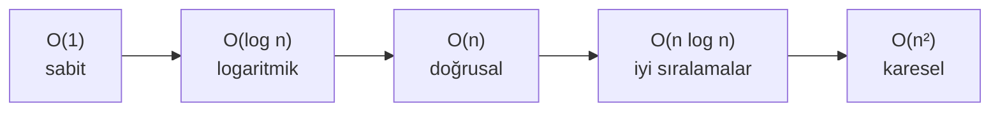
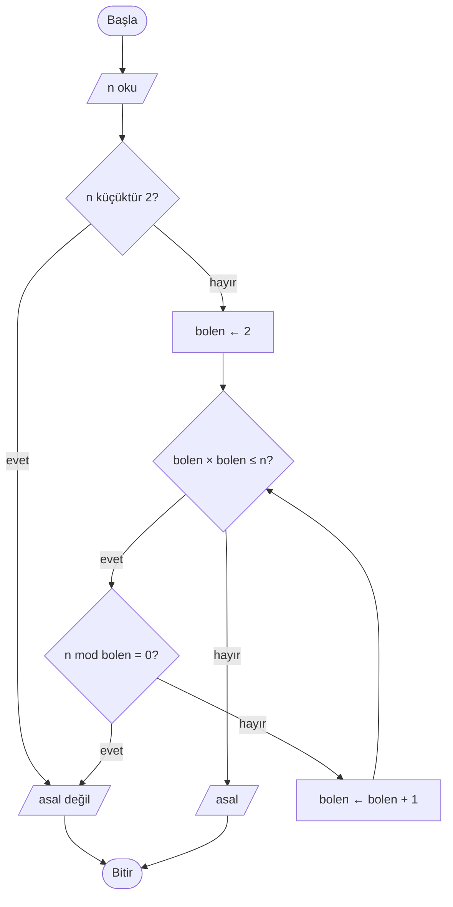
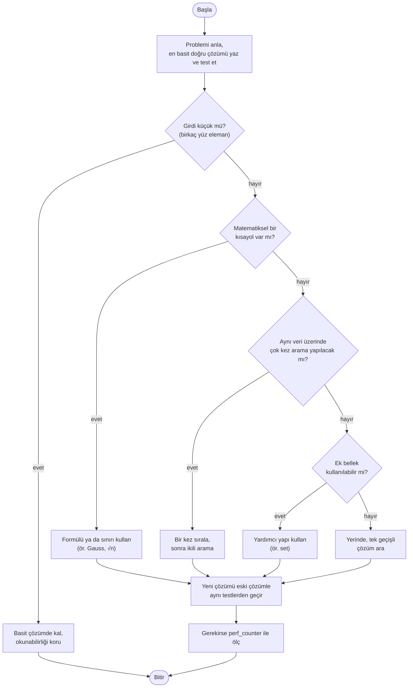

# ⚖️ M12 - Problem Çözümünde Farklı Algoritmaların Uygulanabilirliği

<p align="center"><em>Hafta 13</em></p>

## ❔ Öğrenme hedefleri

Bu modülün sonunda öğrenci:

* Aynı problem için birden çok algoritma tasarlar ve hepsinin doğru çalıştığını testlerle gösterir
* Algoritmaları doğruluk, zaman, bellek, okunabilirlik ve girdinin özelliklerine göre karşılaştırır
* Bir algoritmanın adım sayısını girdi büyüklüğü `n` cinsinden tahmin eder
* Adım sayma yoluyla büyüme hızı sezgisi kazanır ve O(1), O(log n), O(n), O(n²) gösterimlerini yorumlar
* `time.perf_counter` ile basit bir zamanlama deneyi yapar ve ölçümün tuzaklarını açıklar
* Bir problem için uygun algoritmayı gerekçesiyle seçer

---

## 1. Bir problem, birden çok çözüm { #1-bir-problem-birden-cok-cozum }

Dönem boyunca her problemi tek bir yoldan çözdük. Oysa gerçek hayatta bir problemin neredeyse her
zaman birden çok doğru çözümü vardır. Kampüste kütüphaneden yemekhaneye gitmek için ana yolu da
kullanabilirsiniz, binaların arasından kestirme de yapabilirsiniz. İkisi de sizi yemekhaneye götürür;
fark, ne kadar sürdüğü, ne kadar yorduğu ve yağmurda çamura batıp batmadığınızdır.

Algoritmalar da böyledir. M10'da aynı arama problemini [doğrusal ve ikili aramayla](../m10_arama/README.md),
M11'de aynı sıralama problemini [birkaç farklı yöntemle](../m11_siralama/README.md) çözdük. Bu modülde
şu soruya cevap arıyoruz: **Birden çok doğru algoritma varsa hangisini seçmeliyiz?**

!!! tip "Önce doğruluk, sonra hız"

    Karşılaştırmaya yalnızca **doğru** algoritmalar girer. Yanlış sonuç veren bir algoritmanın
    hızlı olması hiçbir işe yaramaz. Bu yüzden her vaka çalışmasında önce iki yöntemin aynı girdiler
    için aynı sonucu verdiğini test ediyoruz (`exercise_files/test_uygula_*.py`).

## 2. Karşılaştırma ölçütleri { #2-karsilastirma-olcutleri }

| Ölçüt | Sorulacak soru | Örnek |
|---|---|---|
| **Doğruluk** (correctness) | Her geçerli girdi için doğru sonucu veriyor mu? Uç durumlarda (boş liste, 0, negatif sayı) ne oluyor? | İkili arama sırasız listede yanlış cevap verir. |
| **Zaman** (time) | Girdi büyüdükçe adım sayısı nasıl artıyor? | 1 milyon elemanlı listede doğrusal arama 1.000.000, ikili arama yaklaşık 20 adım. |
| **Bellek** (memory, space) | Ek olarak ne kadar yer kullanıyor? | Tekrar kontrolünde `set` kullanmak hızlıdır ama listenin bir kopyası kadar yer tutar. |
| **Okunabilirlik ve bakım** (readability, maintainability) | Bir arkadaşınız kodu okuyunca anlıyor mu? Hata ayıklamak kolay mı? | Üç satırlık açık bir döngü, anlaşılması zor bir "hileli" çözümden çoğu zaman iyidir. |
| **Girdinin büyüklüğü ve özellikleri** | Girdi kaç eleman? Sıralı mı? Aynı veri üzerinde kaç kez işlem yapılacak? | 20 kişilik sınıf listesinde her yöntem anında biter; 80 milyonluk nüfus kaydında bitmez. |

Bu ölçütler bazen birbiriyle çatışır. Daha hızlı bir yöntem çoğu zaman ya daha fazla bellek ister ya
da daha zor okunur. Mühendislik, bu dengeyi probleme göre kurmaktır.

## 3. Adım sayma ve büyüme hızı { #3-adim-sayma }

Bir algoritmanın "hızını" saniyeyle ifade etmek yanıltıcıdır: aynı kod eski bir dizüstü bilgisayarda
yavaş, yeni bir masaüstünde hızlı çalışır. Bunun yerine algoritmanın **kaç temel adım** attığını
sayarız. Temel adım; bir atama, bir karşılaştırma ya da bir aritmetik işlemdir (M6).

### 3.1 Adım sayma örneği

Bir sınıftaki `n` öğrencinin notlarının en büyüğünü bulalım:

```text
BAŞLA
    en_buyuk ← notlar[0]                            // 1 adım
    HER i İÇİN 1'den uzunluk(notlar) - 1'e KADAR YAP
        EĞER notlar[i] > en_buyuk İSE              // n - 1 kez karşılaştırma
            en_buyuk ← notlar[i]
        EĞER SONU
    HER SONU
    YAZ en_buyuk                                    // 1 adım
BİTİR
```

Toplam adım sayısı kabaca `n + 1`'dir. Öğrenci sayısı iki katına çıkarsa adım sayısı da yaklaşık iki
katına çıkar. İşte bizi ilgilendiren tam olarak budur: **girdi büyüdükçe adım sayısı nasıl büyüyor?**
`n + 1` ile `n` arasındaki fark, `n` bir milyon olduğunda önemsizdir. Bu yüzden sabitleri ve küçük
terimleri atıp yalnızca **büyüme biçimine** bakarız.

### 3.2 Büyük-O gösterimine nazik giriş

**Büyük-O gösterimi** (Big-O notation), bir algoritmanın adım sayısının girdi büyüklüğü `n` ile nasıl
büyüdüğünü özetler. Genellikle **en kötü durum** (worst case) için söylenir. Bu derste dört büyüme
sınıfı yeterli:

| Gösterim | Adı | Sezgi | Örnek |
|---|---|---|---|
| **O(1)** | sabit (constant) | `n` ne olursa olsun aynı sayıda adım | Gauss formülüyle toplam, listenin ilk elemanını okumak |
| **O(log n)** | logaritmik | Her adımda problem yarıya iner | İkili arama, sözlükte kelime aramak |
| **O(n)** | doğrusal (linear) | Her elemana bir kez bakılır | Doğrusal arama, en büyük elemanı bulmak |
| **O(n²)** | karesel (quadratic) | Her eleman diğer her elemanla karşılaştırılır | İç içe döngüyle tekrar kontrolü, M11'deki kabarcık sıralaması |

Bu sınıfların farkı, `n` büyüdükçe çarpıcı hâle gelir. Aşağıdaki tablo yaklaşık adım sayılarını
gösterir (log tabanı 2):

| n | O(1) | O(log n) | O(n) | O(n log n) | O(n²) |
|---:|---:|---:|---:|---:|---:|
| 10 | 1 | ≈ 3 | 10 | ≈ 33 | 100 |
| 1.000 | 1 | ≈ 10 | 1.000 | ≈ 10.000 | 1.000.000 |
| 1.000.000 | 1 | ≈ 20 | 1.000.000 | ≈ 20.000.000 | 1.000.000.000.000 |

Tabloya O(n log n) sütununu da ekledik, çünkü iyi sıralama algoritmaları (Python'un `sorted()`
fonksiyonu dahil) bu sınıftadır. Saniyede yaklaşık 10 milyon basit adım atan bir Python programı
düşünün: O(n) algoritma 1 milyon eleman için saniyenin onda birinde biter, O(n²) algoritma ise aynı
girdi için yaklaşık **27 saat** çalışır.



Soldan sağa doğru, büyük girdiler için algoritmalar yavaşlar.

!!! note "Büyük-O her şeyi söylemez"

    Büyük-O, **büyük** `n` değerleri için davranışı anlatır. Küçük girdilerde O(n²) bir algoritma,
    sabit maliyeti yüksek O(n log n) bir algoritmadan daha hızlı olabilir. 10 elemanlı bir listede
    fark ölçülemeyecek kadar küçüktür; orada okunabilirlik daha önemlidir.

!!! example "Kendinizi deneyin"

    Bir algoritma `n = 1.000` için 2 saniye sürüyor. `n = 2.000` için yaklaşık ne kadar sürer?
    Algoritmanın (a) O(n), (b) O(n²) olduğunu ayrı ayrı düşünün.

    ??? success "Cevap"

        (a) O(n): girdi 2 katına çıktı, süre de yaklaşık 2 katına çıkar: **≈ 4 saniye**.
        (b) O(n²): süre girdinin karesiyle büyür, 2² = 4 kat: **≈ 8 saniye**.

## 4. Ölçüm: basit bir zamanlama deneyi { #4-olcum }

Adım sayma bir tahmindir; tahmini ölçümle doğrulamak iyi bir alışkanlıktır. Python'un standart
kütüphanesindeki `time.perf_counter()` fonksiyonu, kısa süreleri ölçmek için tasarlanmış yüksek
çözünürlüklü bir saat değeri döndürür. Tek başına değeri anlamsızdır; **iki çağrı arasındaki fark**
geçen süreyi saniye cinsinden verir.

```python
import time

baslangic = time.perf_counter()
sonuc = toplam_dongu(1_000_000)  # ölçmek istediğimiz iş
sure = time.perf_counter() - baslangic
print(f"{sure:.6f} saniye")
```

`exercise_files/uygula_toplam.py` dosyası bu deneyi üç farklı `n` için yapar:

```bash
uv run python m12_uygulanabilirlik/exercise_files/uygula_toplam.py
```

```text
n=     1000: döngü 0.000014 sn, Gauss 0.000000 sn
n=   100000: döngü 0.001557 sn, Gauss 0.000001 sn
n=  1000000: döngü 0.016519 sn, Gauss 0.000002 sn
```

Sizin bilgisayarınızda sayılar farklı çıkacaktır, ama **örüntü** aynı kalmalı: döngünün süresi `n` ile
birlikte yaklaşık 10'ar kat artar, formülün süresi değişmez.

!!! warning "Ölçümün tuzakları"

    * **Tek ölçüm güvenilmez.** Arka planda çalışan başka programlar süreyi etkiler. Ölçümü birkaç kez
      tekrarlayıp en küçük ya da ortanca değeri alın.
    * **Çok küçük girdiler ölçülemez.** 10 elemanlı bir işlem, saatin ayırt edebileceğinden kısa sürebilir.
      Girdiyi büyütün ya da işlemi bir döngüde çok kez yapın.
    * **Yalnızca algoritmayı ölçün.** `input()` ile kullanıcıyı beklemek ya da `print()` ile ekrana
      yazmak ölçüme girerse, algoritmayı değil klavyeyi ve ekranı ölçmüş olursunuz.
    * **Girdinin özelliği önemlidir.** Doğrusal arama, aranan eleman listenin başındaysa 1 adımda
      biter. Karşılaştırmayı hep aynı türden girdiyle (ör. en kötü durum) yapın.
    * **İlk çalıştırma farklı olabilir.** İlk çağrı bazen sonrakilerden yavaştır. Daha güvenilir
      ölçümler için Python'un `timeit` modülü bu tekrarları sizin için yapar.

## 5. Vaka çalışmaları { #5-vaka-calismalari }

### 5.1 Vaka 1: 1'den n'ye kadar toplam

Okulda anlatılan bir hikâyeye göre küçük Gauss'tan 1'den 100'e kadar sayıları toplaması istenmiş.
Gauss, sayıları tek tek eklemek yerine baştan ve sondan eşleştirmiş: 1 + 100, 2 + 99, ... Her çift
101 eder ve 50 çift vardır: 50 × 101 = 5050. Genel formül `n × (n + 1) / 2`'dir.

=== "Yöntem A: döngü"

    ```text
    BAŞLA
        OKU n
        toplam ← 0
        HER i İÇİN 1'den n'e KADAR YAP
            toplam ← toplam + i
        HER SONU
        YAZ toplam
    BİTİR
    ```

=== "Yöntem B: Gauss formülü"

    ```text
    BAŞLA
        OKU n
        toplam ← n * (n + 1) / 2
        YAZ toplam
    BİTİR
    ```

| | Döngü | Gauss formülü |
|---|---|---|
| Adım sayısı | ≈ n | birkaç adım |
| Büyüme | O(n) | O(1) |
| Okunabilirlik | Çok açık | Formülü bilmeyen için açıklama gerekir |
| Genellenebilirlik | Kolayca "sadece çift sayıları topla"ya uyarlanır | Her yeni koşul için yeni formül gerekir |

Python karşılıkları `exercise_files/uygula_toplam.py` dosyasındaki `toplam_dongu` ve `toplam_gauss`
fonksiyonlarıdır. Formülde `/` yerine `//` kullandık; `n` veya `n + 1` her zaman çift olduğu için
bölme tam çıkar ve sonuç tam sayı (`int`) olarak kalır (M6).

### 5.2 Vaka 2: Listede tekrar eden eleman var mı?

Bir kulüp etkinliğine kayıt olanların öğrenci numaraları bir listede. Aynı numara iki kez yazılmış
mı? Üç farklı fikir:

1. **İç içe döngü:** Her elemanı kendinden sonraki her elemanla karşılaştır.
2. **Önce sırala:** Listeyi sırala (M11); tekrar eden elemanlar artık **yan yana** gelir. Komşuları
   karşılaştır.
3. **Küme (`set`):** Gördüğün numaraları bir "görülenler" kümesine at; yeni numara zaten kümedeyse
   tekrar var demektir.

```text
FONKSİYON tekrar_var_sirali(liste)
    sirali ← sırala(liste)
    HER i İÇİN 0'dan uzunluk(sirali) - 2'ye KADAR YAP
        EĞER sirali[i] = sirali[i + 1] İSE
            DÖNDÜR DOĞRU
        EĞER SONU
    HER SONU
    DÖNDÜR YANLIŞ
FONKSİYON SONU
```

!!! note "Yeni bir araç: `set` (küme)"

    Python'daki `set`, aynı elemanı iki kez tutmayan bir koleksiyondur. Bir elemanın kümede olup
    olmadığını (`eleman in kume`) listeye göre çok daha hızlı, ortalamada **sabit** sürede kontrol eder.
    Listede aynı kontrol doğrusal aramadır. `set()` boş küme oluşturur, `.add(x)` eleman ekler.

| | İç içe döngü | Önce sırala | Küme (`set`) |
|---|---|---|---|
| Karşılaştırma sayısı (en kötü) | ≈ n² / 2 | ≈ n log n + n | ≈ n |
| Büyüme | O(n²) | O(n log n) | O(n) (ortalama) |
| Ek bellek | Yok | Sıralı kopya kadar | Küme kadar |
| n = 100.000 için | ≈ 5 milyar | ≈ 1,8 milyon | ≈ 100.000 |

Üç yöntemin kodu `exercise_files/uygula_tekrar.py` dosyasındadır. Testler, üçünün de aynı girdilere
aynı cevabı verdiğini kontrol eder. İç içe döngü ek bellek istemez; bellek çok kısıtlıysa (ör. küçük
bir gömülü cihaz) hâlâ mantıklı bir seçim olabilir.

### 5.3 Vaka 3: Arama. Ne zaman sıralamak değer? { #5-3-arama }

M10'da gördük: doğrusal arama her listede çalışır ama O(n) adım sürer; ikili arama O(log n) adımda
biter ama **sıralı liste** ister. Liste sıralı değilse önce sıralamamız gerekir ve sıralamanın bedeli
O(n log n)'dir. Tek bir arama için bu bedel ödenmeye değmez: doğrusal arama (n adım), sıralamadan
(n log n adım) zaten daha ucuzdur.

Hesap, **aynı liste üzerinde çok kez arama yapıldığında** değişir. `k` arama yapacaksak:

* Yalnız doğrusal arama: `k × n` adım
* Bir kez sırala + her seferinde ikili arama: `n log n + k × log n` adım

`n = 1.000.000` (log n ≈ 20) için:

| Arama sayısı k | Doğrusal (k × n) | Sırala + ikili (n log n + k log n) | Kazanan |
|---:|---:|---:|---|
| 1 | 1.000.000 | ≈ 20.000.020 | Doğrusal |
| 10 | 10.000.000 | ≈ 20.000.200 | Doğrusal |
| 100 | 100.000.000 | ≈ 20.002.000 | Sırala + ikili |
| 10.000 | 10.000.000.000 | ≈ 20.200.000 | Sırala + ikili (yaklaşık 500 kat) |

Kabaca **log n'den fazla arama** yapacaksanız (burada ≈ 20) sıralamak kendini amorti eder. Bir
kütüphane kataloğu gün boyunca binlerce kez aranır; kataloğu bir kez sıralı tutmak açıkça doğru
seçimdir. Tek seferlik küçük bir listede ise doğrusal arama hem yeterli hem daha okunaklıdır.

`exercise_files/uygula_arama.py` iki yöntemin adım sayılarını karşılaştırır (listede olmayan bir
değer arandığında):

```text
n=       10: doğrusal        10 adım, ikili   3 adım
n=     1000: doğrusal      1000 adım, ikili   9 adım
n=  1000000: doğrusal   1000000 adım, ikili  19 adım
```

### 5.4 Vaka 4: Asal sayı testi

`n` sayısının asal olup olmadığını anlamak için 2'den `n - 1`'e kadar her sayıyı bölen olarak
deneyebiliriz. Ama daha iyisi var: `n = a × b` ise `a` ile `b`'den biri mutlaka **√n'den küçük ya da
eşit**tir. (İkisi de √n'den büyük olsaydı çarpımları n'den büyük olurdu.) Demek ki √n'ye kadar bölen
bulamadıysak, ondan sonra da bulamayız.



```python
def asal_mi_karekok(n: int) -> bool:
    """Yalnızca bolen * bolen ≤ n olan bölenleri dener. En kötü yaklaşık √n adım: O(√n)."""
    if n < 2:
        return False
    bolen = 2
    while bolen * bolen <= n:  # (1)!
        if n % bolen == 0:
            return False
        bolen = bolen + 1
    return True
```

1. `bolen ≤ √n` yerine `bolen * bolen ≤ n` yazdık. Böylece karekök hesabı ve ondalıklı sayılarla
   uğraşmamıza gerek kalmaz; yalnızca tam sayı çarpması kullanırız.

| Sayı | Tüm bölenler (2 … n-1) | √n'ye kadar |
|---:|---:|---:|
| 97 (asal) | 95 deneme | 8 deneme |
| 10.007 (asal) | 10.005 deneme | 99 deneme |
| 1.000.003 (asal) | 1.000.001 deneme | 999 deneme |

√n sınıfı tablomuzda yoktu: O(√n), O(log n)'den yavaş ama O(n)'den çok daha hızlı büyür. İki
yöntem ve deneme sayacı `exercise_files/uygula_asal.py` dosyasındadır.

## 6. Hangi yaklaşımı seçmeliyim? { #6-karar-semasi }

Aşağıdaki akış şeması kesin bir kural değil, bir düşünme sırasıdır. Her kararda §2'deki ölçütleri
aklınızda tutun.



!!! tip "Önce çalıştır, sonra hızlandır"

    İlk yazdığınız çözüm yavaş olsa da, doğruluğu test edilmiş bir **referans çözüm** olarak değerlidir.
    Daha hızlı bir yöntem yazdığınızda, iki yöntemi aynı girdilerle karşılaştıran bir test (bu
    modüldeki `test_iki_yontem_*` testleri gibi) yeni yöntemin hata getirmediğini gösterir.

## 7. Alıştırmalar

1. **Adım sayma.** Aşağıdaki işlerin her biri için büyüme sınıfını (O(1), O(log n), O(n), O(n²))
   tahmin edin: (a) bir listenin son elemanını okumak, (b) sınıftaki her öğrencinin diğer her
   öğrenciyle tokalaşması, (c) telefon rehberinde ortadan açıp yarıya bölerek isim aramak,
   (d) bir listedeki notların ortalamasını almak.

    ??? success "Cevap"

        (a) O(1): `liste[len(liste) - 1]` tek adımdır. (b) O(n²): yaklaşık n × (n - 1) / 2 tokalaşma.
        (c) O(log n): ikili aramanın ta kendisi. (d) O(n): her notu bir kez toplarız.

2. **En büyük eleman.** Bir listenin en büyük elemanını iki yolla bulun: (a) listeyi `sorted()` ile
   sıralayıp son elemanı almak, (b) §3.1'deki tek geçişli döngü. İki yöntemi Python'da yazın, aynı
   sonucu verdiklerini test edin ve büyüme sınıflarını karşılaştırın.

    ??? success "Cevap"

        (a) Sıralama O(n log n) sürer. (b) Tek geçiş O(n) sürer ve ek bellek istemez. İkisi de doğru,
        ama yalnızca en büyük eleman gerekiyorsa sıralamak gereksiz iş yapar. Boş liste için iki
        yöntemin de ne yapacağına karar verin (ör. `None` döndürmek) ve bunu da test edin.

3. **EBOB.** İki pozitif tam sayının en büyük ortak bölenini (EBOB) iki yolla bulun: (a) küçük
   sayıdan başlayıp geriye doğru, ikisini de bölen ilk sayıyı aramak, (b) Öklid algoritması:
   `b ≠ 0` olduğu sürece `a, b ← b, a mod b`, sonunda `a` EBOB'dur. Önce sözde kodunu, sonra Python
   kodunu yazın. `ebob(1_000_000, 999_999)` için iki yöntemin döngü sayısını karşılaştırın.

    ??? success "Cevap"

        (a) En kötü durumda küçük sayı kadar deneme yapar: burada yaklaşık 1 milyon. (b) Öklid
        algoritması yalnızca 2 turda biter (1.000.000 mod 999.999 = 1, sonra 999.999 mod 1 = 0), EBOB = 1.
        Öklid algoritmasının tur sayısı genel olarak O(log n) ile büyür.

4. **Zamanlama deneyi.** `uygula_tekrar.py` içindeki üç yöntemi `list(range(n))` (tekrarsız, yani en
   kötü durum) girdisiyle `n = 1.000, 2.000, 4.000` için `time.perf_counter` ile ölçün. `n` iki katına
   çıktığında her yöntemin süresi yaklaşık kaç katına çıkıyor? Sonuç §5.2'deki tabloyla uyumlu mu?
5. **Gerekçeli seçim.** Bir e-ticaret sitesinde 2 milyon ürün kodu var ve gün boyunca her saniye
   yüzlerce "bu ürün var mı?" sorgusu geliyor. §6'daki akış şemasını izleyerek bir yöntem seçin ve
   seçiminizi §2'deki ölçütlerle iki üç cümlede gerekçelendirin.
6. **Testleri çalıştırın.** `uv run pytest m12_uygulanabilirlik` ile tüm testlerin geçtiğini doğrulayın.
   Sonra `asal_mi_karekok` fonksiyonundaki `<=` işaretini `<` yapın; hangi test başarısız oluyor, neden?

    ??? success "Cevap"

        `bolen * bolen < n` olursa tam kareler (4, 9, 25, 49...) kaçırılır: örneğin 9 için yalnızca
        bolen = 2 denenir ve 9 asal sanılır. `test_asal_olmayanlar` ve `test_iki_yontem_uyumlu`
        başarısız olur. Sınır değerlerde (≤ ile <) dikkatli olmak, hızlı algoritmaların en sık
        hata kaynağıdır.

---

## Özet

Bir problemin çoğu zaman birden çok doğru çözümü vardır ve aralarından seçim yapmak için doğruluk,
zaman, bellek, okunabilirlik ve girdinin özelliklerine bakarız. Saniye yerine adım sayarak
algoritmaların girdiyle nasıl büyüdüğünü makineden bağımsız biçimde karşılaştırabiliriz. Büyük-O
gösterimi bu büyümeyi özetler: O(1) sabit, O(log n) yarıya bölen, O(n) her elemana bir kez bakan,
O(n²) her çifti karşılaştıran algoritmalardır. Ölçüm (`time.perf_counter`) tahminlerimizi doğrular,
ama tekrar, yeterince büyük girdi ve yalnızca algoritmayı ölçmek gibi kurallara uyulmalıdır. Dört
vaka çalışması aynı dersi verdi: küçük girdide basit ve okunaklı çözüm yeterlidir; girdi büyüdükçe
doğru algoritmayı seçmek saniyelerle saatler arasındaki farkı yaratır. Final projesinde
([Proje Sprinti B](../sprint_b_final_proje/README.md)) bu karşılaştırmayı kendi probleminiz için
yapacaksınız.

## İleri okuma

* Allen B. Downey, [*Think Python*, 3. baskı](https://allendowney.github.io/ThinkPython/). Kitabın
  döngüler ve listeler bölümleri, bu modüldeki kodların dayandığı yapıları tekrar etmek için uygundur.
* [VisuAlgo](https://visualgo.net/). Sıralama ve arama algoritmalarını adım adım canlandırır; adım
  sayısının `n` ile nasıl büyüdüğünü gözle görmek için kullanışlıdır.
* [Python Tutor](https://pythontutor.com/). `asal_mi_tum` ile `asal_mi_karekok` fonksiyonlarını
  küçük bir sayıyla adım adım izleyip kaç tur döndüklerini sayın.
* Thomas H. Cormen, Charles E. Leiserson, Ronald L. Rivest, Clifford Stein, *Introduction to
  Algorithms*, 4. baskı, MIT Press, 2022, Bölüm 2–3. Algoritma analizine ve asimptotik gösterime
  (Büyük-O) ayrıntılı giriş. İleri düzeydir; merak edenler için.

## Kaynaklar

* [Python belgeleri: `time.perf_counter`](https://docs.python.org/3/library/time.html#time.perf_counter).
  §4'teki zamanlama deneyinin kaynağı.
* [Python belgeleri: `timeit`](https://docs.python.org/3/library/timeit.html). §4'te önerilen
  tekrarlı ölçüm modülü.
* [Python belgeleri: Built-in Types, "Set Types"](https://docs.python.org/3/library/stdtypes.html#set-types-set-frozenset).
  §5.2'deki `set` yapısının kaynağı.
* [Python belgeleri: `sorted`](https://docs.python.org/3/library/functions.html#sorted). §5.2 ve
  §5.3'te kullanılan hazır sıralama fonksiyonu.
* Donald E. Knuth, *The Art of Computer Programming, Vol. 1: Fundamental Algorithms*, 3. baskı,
  Addison-Wesley, 1997, §1.2.11 (asimptotik gösterim); *Vol. 2: Seminumerical Algorithms*, 3. baskı,
  Addison-Wesley, 1997, §4.5.2 (Öklid algoritması).
* Thomas H. Cormen vd., *Introduction to Algorithms*, 4. baskı, MIT Press, 2022, Bölüm 3
  ("Characterizing Running Times"). §3'teki Büyük-O tanımının kaynağı.
