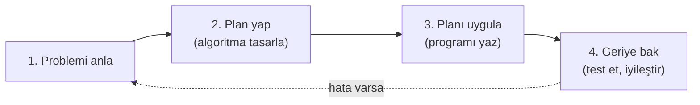
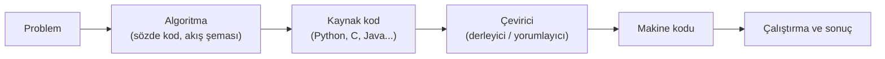
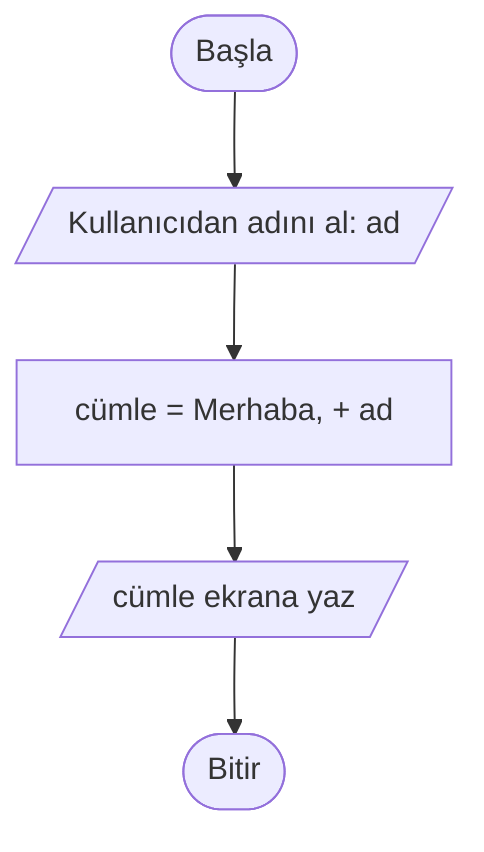

# 💡 M1 - Algoritma ve Problem Çözme

<p align="center"><em>Hafta 1</em></p>

## ❔ Öğrenme hedefleri

Bu modülün sonunda öğrenci:

* Algoritmanın ne olduğunu tanımlar ve günlük hayattan algoritma örnekleri verir
* Problem → algoritma → program → çalıştırma zincirini açıklar
* İyi bir algoritmanın beş temel özelliğini sıralar ve bir algoritmayı bu özelliklere göre değerlendirir
* Derleyici ile yorumlayıcı arasındaki farkı açıklar
* Blok tabanlı ve metin tabanlı programlama ortamlarını karşılaştırır
* Basit bir "selamlama" programının akış şemasını çizer, Python'da yazıp çalıştırır ve test eder

---

## 1. Algoritma nedir?

**Algoritma**, bir problemi çözmek ya da bir işi yapmak için izlenen, sırası belli ve sonlu sayıda
adımdan oluşan yol tarifidir. Kelime, 9. yüzyılda Bağdat'ta çalışan matematikçi **Muhammed bin Musa
el-Harezmî**'nin adının Latince yazılışı olan *Algoritmi*'den gelir. El-Harezmî'nin hesaplama
yöntemlerini anlatan eserleri Avrupa'ya bu isimle çevrilmiştir.

Algoritma bilgisayara özgü bir kavram değildir. Her gün farkında olmadan onlarca algoritma uygularız:

| Günlük iş | Algoritmanın adımları (özet) |
|---|---|
| Çay demlemek | Suyu kaynat → demliğe çay koy → üzerine su ekle → 15 dakika demlendir → bardağa koy |
| Navigasyonla yol bulmak | Konumunu al → hedefi al → olası yolları hesapla → en kısa olanı seç → adım adım tarif et |
| Kütüphanede kitap bulmak | Konu kodunu öğren → ilgili rafa git → kodları sırayla tara → kitabı al |
| ATM'den para çekmek | Kartı tak → şifreyi gir → şifre doğruysa tutarı gir → bakiye yeterliyse parayı ver |

Bu örneklerden ikisi dersin ilerleyen haftalarında karşımıza çıkacak iki fikri şimdiden içeriyor:
ATM örneğindeki "şifre doğruysa" bir **karar** (M7), kütüphane örneğindeki "kodları sırayla tara" ise
bir **arama** (M10) adımıdır.

!!! tip "Algoritma ≠ program"

    Algoritma, bir çözümün **fikridir**; hangi dille ifade edildiğinden bağımsızdır. Program ise o
    fikrin belirli bir programlama dilinde yazılmış, bilgisayarın çalıştırabileceği hâlidir. Aynı
    algoritma Türkçe cümlelerle, sözde kodla, akış şemasıyla ya da Python koduyla ifade
    edilebilir. Bu derste her algoritmayı bu biçimlerin birkaçıyla birden yazacağız.

## 2. Problem çözme süreci

Programlamaya yeni başlayanların en sık yaptığı hata, problemi anlamadan klavyeye oturmaktır. Matematikçi
George Pólya'nın *How to Solve It* (1945) kitabında önerdiği dört adımlı yöntem, programlama için de
geçerlidir:



| Adım | Kendinize sorun | Bu derste karşılığı |
|---|---|---|
| **1. Problemi anla** | Girdiler neler? Çıktı ne olmalı? Hangi kısıtlar var? | Girdi/çıktı listesi (M5) |
| **2. Plan yap** | Bu problemi daha önce gördüğüm bir probleme benzetebilir miyim? Parçalara ayırabilir miyim? | Tasarım teknikleri (M2), sözde kod, akış şeması (M3) |
| **3. Planı uygula** | Her adımı doğru ifade ettim mi? | Python ile kodlama |
| **4. Geriye bak** | Sonuç doğru mu? Farklı girdilerle de çalışıyor mu? Daha iyi bir yol var mı? | Test yazma, algoritma karşılaştırma (M12) |

Kesikli ok önemli: 4. adımda bir hata bulursanız çoğu zaman sorun koddan değil, problemin yanlış ya da
eksik anlaşılmasından kaynaklanır. Bu yüzden geri dönüş 3. adıma değil, 1. adıma yapılır.

### Örnek: iki sayının ortalaması

1. **Anla.** Girdi: iki sayı. Çıktı: bu iki sayının aritmetik ortalaması. Sayılar ondalıklı olabilir.
2. **Plan yap.**
    1. Birinci sayıyı al.
    2. İkinci sayıyı al.
    3. İki sayıyı topla.
    4. Toplamı 2'ye böl.
    5. Sonucu göster.
3. **Uygula.** Aynı adımları Python'da yazarız (bkz. [§6](#6-ilk-program)
   ve `exercise_files/ortalama.py`).
4. **Geriye bak.** `4` ve `6` için `5` bekleriz. Peki `3` ve `4` için? Sonuç `3.5` olmalı; programımız
   tam sayı bölmesi yapıyorsa `3` verir ve bu bir hatadır. Bu tür ince noktaları M6'da operatörleri
   işlerken ayrıntılı göreceğiz.

## 3. İyi bir algoritmanın özellikleri { #3-iyi-bir-algoritmanin-ozellikleri }

Donald Knuth, *The Art of Computer Programming* serisinin ilk cildinde bir algoritmanın taşıması gereken
beş özelliği tanımlar:

| Özellik | Anlamı | Olmazsa ne olur? |
|---|---|---|
| **Sonluluk** (finiteness) | Algoritma sonlu sayıda adımdan sonra mutlaka biter. | "Çay demlenene kadar bekle" deyip demlenmeyi kontrol etmezseniz sonsuza kadar beklersiniz. |
| **Belirlilik** (definiteness) | Her adım açık ve tek anlamlıdır. | "Biraz tuz ekle" adımını iki kişi farklı yorumlar. Bilgisayar ise hiç yorumlayamaz. |
| **Girdi** (input) | Sıfır ya da daha fazla girdi alır. | Girdisi belirsiz bir algoritmayı test edemezsiniz. |
| **Çıktı** (output) | En az bir çıktı üretir. | Sonuç vermeyen bir işlem dizisi bir problemi çözmez. |
| **Etkinlik** (effectiveness) | Her adım, kâğıt kalemle sınırlı sürede yapılabilecek kadar temeldir. | "En iyi hamleyi bul" tek bir adım değildir; kendisi ayrı bir algoritma gerektirir. |

Bu beş özelliğe ek olarak pratikte iki şeye daha bakarız: **doğruluk** (her geçerli girdi için doğru
sonucu veriyor mu?) ve **verimlilik** (bunu makul sürede ve bellekte yapıyor mu?). Verimliliği M12'de
ayrıntılı ele alacağız.

!!! example "Kendinizi deneyin"

    Aşağıdaki "algoritma" hangi özellikleri ihlal ediyor?

    1. Bir sayı düşün.
    2. Sayı büyükse küçült.
    3. 2. adıma dön.

    ??? success "Cevap"

        **Belirlilik** ihlal ediliyor: "büyük" ve "küçült" tanımlı değil (neye göre büyük, ne kadar
        küçült?). **Sonluluk** da ihlal ediliyor: bitiş koşulu olmadığı için 3. adım algoritmayı sonsuza
        kadar döndürür. Ayrıca **çıktı** yok: algoritma hiçbir sonuç bildirmiyor.

## 4. Algoritmadan programa

Bilgisayarın işlemcisi yalnızca **makine dilini**, yani ikilik sistemde (0 ve 1) kodlanmış çok basit
komutları anlar. İnsanların bu dilde program yazması son derece zordur. Bu yüzden algoritmalarımızı
**yüksek seviyeli** bir programlama diliyle yazar, sonra bir çevirici programın bunu makine diline
dönüştürmesine izin veririz.



Çevirici programlar iki temel yaklaşımla çalışır:

| | Derleyici (compiler) | Yorumlayıcı (interpreter) |
|---|---|---|
| **Çalışma biçimi** | Programın tamamını önce makine koduna çevirir, sonra çalıştırılabilir bir dosya üretir. | Programı satır satır okuyup o anda çalıştırır. |
| **Hata bildirimi** | Çeviri aşamasında, program çalışmadan önce. | Hatalı satıra gelindiğinde, çalışma sırasında. |
| **Hız** | Çalışan program genellikle daha hızlıdır. | Genellikle daha yavaştır. |
| **Deneme kolaylığı** | Her değişiklikten sonra yeniden derlemek gerekir. | Kodu yazıp hemen denemek kolaydır. |
| **Örnek diller** | C, C++, Go, Rust | Python, JavaScript, Ruby |

!!! note "Python için küçük bir düzeltme"

    Python'u "yorumlanan dil" olarak sınıflandırırız. Teknik olarak standart Python yorumlayıcısı
    (CPython), kodu önce *bytecode* adı verilen bir ara koda çevirir ve bu ara kodu yorumlar. Bu
    derste bu ayrıntı önemli değildir. Bilmeniz gereken şu: Python'da yazdığınız kodu ayrı bir derleme
    adımı olmadan hemen çalıştırabilirsiniz.

## 5. Blok ve metin tabanlı programlama ortamları

Programlama ortamlarını, kodun nasıl yazıldığına göre iki gruba ayırabiliriz.

**Blok tabanlı** ortamlarda komutlar yapboz parçalarına benzeyen bloklardır. Blokları sürükleyip
birbirine takarak program oluşturursunuz. Bloklar yalnızca anlamlı biçimde birbirine takılabildiği
için söz dizimi hatası (noktalı virgül unutmak, parantezi kapatmamak gibi) yapmak neredeyse imkânsızdır.
Böylece bütün dikkatinizi algoritmanın mantığına verebilirsiniz.

**Metin tabanlı** ortamlarda program, belirli söz dizimi kurallarına uyan bir metin olarak yazılır.
Profesyonel yazılımların neredeyse tamamı bu şekilde geliştirilir.

| | Blok tabanlı | Metin tabanlı |
|---|---|---|
| **Kod yazımı** | Blokları sürükle-bırak | Klavyeyle yazma |
| **Söz dizimi hatası** | Neredeyse yok | Sık (özellikle başlangıçta) |
| **Öğrenme eğrisi** | Çok hızlı başlangıç | Daha yavaş başlangıç |
| **Büyük programlar** | Hızla karmaşıklaşır, yönetmesi zorlaşır | Dosyalara, modüllere ve fonksiyonlara bölünerek yönetilir |
| **Kullanım alanı** | Eğitim, hızlı prototip | Profesyonel yazılım geliştirme |
| **Örnekler** | Scratch, Blockly, MIT App Inventor, Code.org | Python, C, Java, JavaScript |

Bu iki grup birbirinin rakibi değildir; aynı fikrin iki farklı gösterimidir. Blok tabanlı bir
ortamdaki "`10 defa tekrarla`" bloğu ile Python'daki `for i in range(10):` satırı aynı algoritmik
fikri (tekrar) ifade eder. Blok tabanlı ortamlar daha çok okul öncesi ve ortaokul düzeyinde kullanılır.
Bu derste doğrudan metin tabanlı bir dil olan Python ile çalışacağız. Algoritmanın mantığını ise önce
akış şeması ve sözde kodla, dilden bağımsız olarak kuracağız.

### Bu derste kullanacağımız ortamlar

| Ortam | Tür | Nerede çalışır | Ne için kullanacağız |
|---|---|---|---|
| [Python](https://www.python.org/) + [VS Code](https://code.visualstudio.com/) | Metin tabanlı | Bilgisayarınızda | Kavramların gerçek bir dilde uygulanması, alıştırmalar |
| [Python Tutor](https://pythontutor.com/) | Görselleştirme | Tarayıcıda | Python kodunu adım adım izleme (M4) |

Kurulum adımları [Giriş sayfasındadır](../pages/before.md#kurulum).

## 6. İlk program: selamlama { #6-ilk-program }

Kullanıcıya adını soran ve onu adıyla selamlayan küçük bir program yazalım. Önce algoritmayı yazıyoruz:

1. Kullanıcıya adını sor.
2. Verilen cevabı al.
3. "Merhaba, " ifadesini cevapla birleştir.
4. Oluşan cümleyi göster.

### 6.1 Akış şeması

Aynı adımların akış şeması aşağıdadır. Sembollerin anlamlarını M3'te ayrıntılı işleyeceğiz. Şimdilik
şu kadarı yeterli: oval başlangıç ve bitişi, paralelkenar giriş/çıkışı, dikdörtgen işlemi gösterir.



### 6.2 Python

Aynı algoritma Python'da şöyle yazılır (`exercise_files/merhaba.py`):

```python
def selamla(ad: str) -> str:
    """Verilen ada göre bir selam cümlesi döndürür."""
    return f"Merhaba, {ad}!"


if __name__ == "__main__":
    kullanici = input("Adınız nedir? ")  # (1)!
    print(selamla(kullanici))  # (2)!
```

1. Adım 1 ve 2: `input()` kullanıcıya soruyu gösterir ve cevabı bir metin olarak döndürür. Akış
   şemasındaki ilk giriş kutusunun karşılığıdır.
2. Adım 3 ve 4: `selamla()` metinleri birleştirir, `print()` sonucu ekrana yazar. Akış şemasındaki
   işlem ve çıkış kutularının karşılığıdır.

Çalıştırmak için repo klasöründe:

```bash
uv run python m1_algoritma_ve_problem_cozme/exercise_files/merhaba.py
```

```text
Adınız nedir? Ayşe
Merhaba, Ayşe!
```

Selamlama işini ayrı bir `selamla` fonksiyonuna koymamızın nedeni, programı **test edilebilir**
kılmaktır. `test_merhaba.py` dosyası bu fonksiyonu otomatik olarak dener:

```python
from merhaba import selamla


def test_selamla():
    assert selamla("Ayşe") == "Merhaba, Ayşe!"
```

```bash
uv run pytest m1_algoritma_ve_problem_cozme
```

Fonksiyonları M9'da, testleri de dönem boyunca ayrıntılı işleyeceğiz. Şimdilik şunu bilmeniz yeterli:
`assert` satırı "bu ifade doğru olmalı" der. Doğru değilse test başarısız olur ve size nerede hata
olduğunu gösterir. Bu, Pólya'nın 4. adımının ("geriye bak") otomatikleştirilmiş hâlidir.

## 7. Alıştırmalar

1. **Günlük algoritma.** Sabah uyandığınızdan evden çıkana kadar yaptıklarınızı en az 8 adımlık bir
   algoritma olarak yazın. İçinde en az bir karar ("eğer yağmur yağıyorsa...") bulunsun. Sonra
   algoritmanızı [§3](#3-iyi-bir-algoritmanin-ozellikleri)'teki beş özelliğe göre değerlendirin.
2. **Belirsizliği gider.** "Makarnayı pişene kadar kaynat" adımını, bir robotun uygulayabileceği kadar
   belirli hâle getirin.
3. **Akış şemasını genişlet.** §6.1'deki akış şemasını, program selamdan sonra kullanıcıya
   "Bugün nasılsın?" diye sorup cevabı `"Anladım, <cevap>."` biçiminde ekrana yazacak şekilde
   genişletin. Kâğıt üzerinde çizmeniz yeterli.
4. **Python selamlama.** `merhaba.py` dosyasını çalıştırın. Ardından `selamla` fonksiyonunu,
   `"Merhaba, Ayşe! Algoritma Tasarımı dersine hoş geldin."` çıktısını verecek şekilde değiştirin ve
   `test_merhaba.py` dosyasını yeni çıktıya göre güncelleyin.
5. **Ortalama.** `exercise_files/ortalama.py` dosyasını inceleyin ve §2'deki dört adımın her birinin
   kodda nereye karşılık geldiğini bulun. `uv run pytest m1_algoritma_ve_problem_cozme` ile testlerin
   geçtiğini doğrulayın.

---

## Özet

Algoritma, bir problemi çözmek için izlenen, sırası belli, sonlu ve tek anlamlı adımlar dizisidir.
Program ise bu adımların bilgisayarın çalıştırabileceği bir dilde yazılmış hâlidir. İyi bir çözüm,
klavyeden önce gelir: problemi anlamak, plan yapmak, uygulamak ve geriye bakmak. Programlama dilleri
blok tabanlı ve metin tabanlı olarak iki gruba ayrılabilir, ancak ikisi de aynı algoritmik fikirleri
ifade eder. Bu derste her kavramı önce akış şemasıyla, sonra Python'da göreceğiz. Bir sonraki
modülde, bir problemi algoritmaya dönüştürmek için kullanabileceğimiz sistematik tekniklere geçiyoruz.

## İleri okuma

* [CS50P, Hafta 0: Functions, Variables](https://cs50.harvard.edu/python/weeks/0/). Harvard'ın
  Python ile programlamaya giriş dersinin ilk haftası. `input()`, `print()` ve ilk fonksiyonları anlatır.
* Allen B. Downey, [*Think Python*, 3. baskı, 1. bölüm](https://allendowney.github.io/ThinkPython/chap01.html).
  Programlamanın ne olduğuna ve Python'la ilk adımlara ücretsiz bir giriş.

## Kaynaklar

* George Pólya, *How to Solve It: A New Aspect of Mathematical Method*, Princeton University Press,
  1945. §2'deki dört adımlı problem çözme yönteminin kaynağı.
* Donald E. Knuth, *The Art of Computer Programming, Vol. 1: Fundamental Algorithms*, 3. baskı,
  Addison-Wesley, 1997, §1.1. §3'teki beş algoritma özelliğinin kaynağı.
* [Python belgeleri: Glossary, "bytecode"](https://docs.python.org/3/glossary.html#term-bytecode).
  §4'teki CPython notunun kaynağı.
