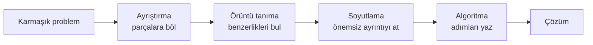
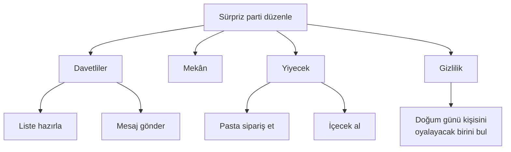
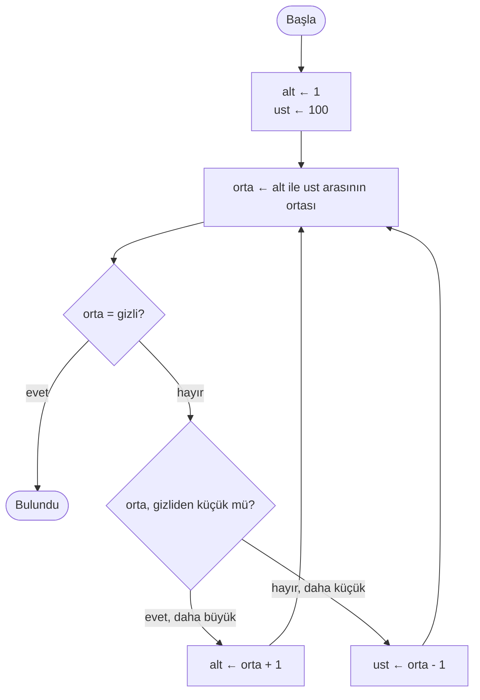

# 🧩 M2 - Algoritma Tasarlama Teknikleri

<p align="center"><em>Hafta 2</em></p>

## ❔ Öğrenme hedefleri

Bu modülün sonunda öğrenci:

* Hesaplamalı düşünmenin dört temel bileşenini bir probleme uygular
* Bir problemi alt problemlere ayırır (ayrıştırma, decomposition)
* Soyutlama ve örüntü tanımayı günlük hayattan ve programlamadan örneklerle açıklar
* Bir çözümü adım adım iyileştirme (stepwise refinement) ile üç seviyede inceltir
* Doğal dilde yazılmış bir çözümü dersin sözde kod (pseudocode) standardına dönüştürür
* Kaba kuvvet (brute force) ve böl-fethet (divide and conquer) yaklaşımlarını en kötü durumdaki adım
  sayısına göre karşılaştırır

---

## 1. Hesaplamalı düşünme { #1-hesaplamali-dusunme }

M1'de Pólya'nın dört adımını gördük. İkinci adım "plan yap" diyordu, ama planın *nasıl* yapılacağını
söylemiyordu. Bu modül o boşluğu dolduruyor.

Jeannette Wing, 2006'da *Communications of the ACM* dergisinde yayımlanan kısa makalesinde
**hesaplamalı düşünme** (computational thinking) kavramını yaygınlaştırdı. Wing'e göre hesaplamalı
düşünme yalnızca bilgisayar bilimcilerine ait değildir; problemleri bir bilgisayarın (ya da bir
insanın) adım adım çözebileceği biçimde ifade etme becerisidir ve okuma-yazma ya da aritmetik gibi
herkesin öğrenmesi gereken temel bir beceridir.

Eğitimde bu beceri genellikle dört bileşenle anlatılır:



| Bileşen | Kendinize sorun | Kısa örnek |
|---|---|---|
| **Ayrıştırma** (decomposition) | Bu problemi hangi küçük problemlere bölebilirim? | "Tatil planla" → ulaşım, konaklama, bütçe, program |
| **Örüntü tanıma** (pattern recognition) | Bu parçalardan hangileri birbirine ya da daha önce çözdüğüm bir probleme benziyor? | Her fiş satırı "fiyat × adet" biçiminde |
| **Soyutlama** (abstraction) | Hangi ayrıntılar çözüm için önemli, hangileri değil? | Metro haritasında sokaklar yok, yalnızca duraklar var |
| **Algoritma** (algorithm design) | Çözümü hangi sırayla, hangi adımlarla yazarım? | Sözde kod ya da akış şeması |

!!! note "Sıra katı değildir"

    Bileşenler bir tarif gibi sırayla uygulanmak zorunda değildir. Pratikte aralarında gidip gelirsiniz:
    ayrıştırırken bir örüntü fark eder, soyutlarken bir parçayı yeniden bölersiniz. Diyagram yalnızca
    fikirlerin nasıl bağlandığını gösterir.

Aşağıdaki üç bölüm ilk üç bileşeni ayrı ayrı ele alıyor. Dördüncü bileşen olan algoritma yazımı için
§4'te adım adım iyileştirmeyi, §5'te ise dersin sözde kod standardını göreceğiz.

## 2. Ayrıştırma { #2-ayristirma }

**Ayrıştırma**, büyük ve karmaşık bir problemi, her biri ayrı ayrı çözülebilecek küçük alt problemlere
bölmektir. Alt problemler yeterince küçükse her birinin çözümü neredeyse kendiliğinden ortaya çıkar.

### Gündelik örnek: doğum günü partisi

"Arkadaşıma sürpriz doğum günü partisi düzenle" tek başına ele alınamayacak kadar büyük bir iştir.
Parçalara bölelim:



Her yaprak artık tek bir kişiye verilebilecek kadar küçük ve belirli bir iştir. Ayrıştırmanın ikinci
faydası da budur: parçalar birbirinden bağımsızsa aynı anda farklı kişiler tarafından yapılabilir.

### Programlama örneği: market fişi

"Bir market fişinin ödenecek toplamını hesapla" problemini düşünelim. Fişte üç ürün var, %10 indirim
uygulanıyor ve sonuca vergi ekleniyor. Problemi dört alt probleme ayırabiliriz:

| Alt problem | Girdi | Çıktı |
|---|---|---|
| 1. Satır tutarı | birim fiyat, adet | fiyat × adet |
| 2. İndirim | tutar, indirim oranı | indirimli tutar |
| 3. Vergi | tutar, vergi oranı | vergili tutar |
| 4. Birleştirme | üç satır tutarı, oranlar | ödenecek toplam |

`exercise_files/ayristirma_market.py` dosyasında her alt problem ayrı bir fonksiyondur. Fonksiyonları
M1'deki gibi, test edilebilsin diye bir kutuya koyuyoruz; ayrıntısı [M9](../m9_fonksiyonlar/README.md)'da.

```python
def indirim_uygula(tutar: float, oran: float) -> float:
    """Alt problem 2: tutara indirim uygular. oran 0 ile 1 arasındadır (0.10 = %10)."""
    return tutar * (1 - oran)
```

Bu yaklaşımın somut bir faydası var: indirim hesabında bir hata olursa yalnızca `indirim_uygula`
fonksiyonuna bakmanız yeter. Test dosyası da her parçayı ayrı ayrı sınar.

## 3. Soyutlama ve örüntü tanıma { #3-soyutlama-ve-oruntu-tanima }

### 3.1 Soyutlama

**Soyutlama**, bir problemin çözümü için gerekli olan bilgiyi tutup geri kalan ayrıntıyı bilinçli
olarak atmaktır. Amaç bilgiyi azaltmak değil, dikkati doğru yere vermektir.

**Gündelik örnek.** Harry Beck'in 1931'de tasarladığı Londra metro haritası soyutlamanın klasik
örneğidir. Harita gerçek mesafeleri ve sokakları göstermez; yalnızca durakları, hatları ve aktarma
noktalarını gösterir. Yolcunun sorusu "hangi hatla, kaç durak?" olduğu için bu yeterlidir. İstanbul'daki
raylı sistem haritaları da aynı mantıkla çizilir.

**Programlama örneği.** M1'de yazdığımız `ortalama(a, b)` fonksiyonu bir soyutlamadır. Onu kullanan kişi
içeride toplama mı yapıldığını, önce bölme mi yapıldığını bilmek zorunda değildir; yalnızca "iki sayı ver,
ortalamasını al" sözleşmesini bilmesi yeterlidir. Benzer şekilde bir öğrenci kayıt sisteminde öğrencinin
göz rengini değil, numarasını, adını ve notlarını saklarız: problem için önemli olan budur.

| Durum | Tutulan bilgi | Atılan bilgi |
|---|---|---|
| Metro haritası | Duraklar, hatlar, aktarmalar | Gerçek mesafe, sokaklar, binalar |
| Not hesaplama | Vize, final, ağırlıklar | Sınavın hangi sınıfta yapıldığı |
| Navigasyon | Yol ağı, trafik, hız sınırı | Binaların rengi |

### 3.2 Örüntü tanıma

**Örüntü tanıma**, problemin parçaları arasında ya da problemle daha önce çözülmüş problemler arasında
benzerlik bulmaktır. Bir örüntü bulduğunuzda aynı çözümü tekrar tekrar yazmak yerine bir kez yazıp
yeniden kullanırsınız.

**Gündelik örnek.** Taksi ücreti, elektrik faturası ve telefon tarifesi aynı örüntüye uyar:
`sabit ücret + birim fiyat × miktar`. Birini hesaplamayı öğrenen, diğerlerini de hesaplayabilir.

**Programlama örneği.** Market fişindeki her satır "birim fiyat × adet" biçimindedir. Bu örüntüyü fark
ettiğimiz için her ürüne ayrı bir hesap yazmak yerine tek bir `ara_toplam` fonksiyonu yazdık ve üç
kez kullandık. İleride döngüler ([M8](../m8_donguler/README.md)) tekrar eden örüntüleri daha da kısa
yazmamızı sağlayacak.

!!! example "Kendinizi deneyin"

    Aşağıdaki üç hesapta ortak örüntü nedir?

    1. Bir dikdörtgenin çevresi: `2 × kısa kenar + 2 × uzun kenar`
    2. Bir sınıfta toplam sandalye: `sıra sayısı × sıradaki sandalye`
    3. Bir haftalık cep harçlığı: `7 × günlük harçlık`

    ??? success "Cevap"

        İkinci ve üçüncü hesap aynı örüntüdür: **tekrar sayısı × birim miktar**. Bu, fiş satırındaki
        `birim_fiyat × adet` ile de aynıdır. Birincisi bu örüntünün iki kez kullanılıp toplanmasıdır
        (`2 × a + 2 × b`). Örüntüyü görmek, üçü için de aynı "çarp" adımını kullanabileceğinizi söyler.

## 4. Adım adım iyileştirme { #4-adim-adim-iyilestirme }

Niklaus Wirth 1971'de yayımladığı "Program Development by Stepwise Refinement" makalesinde program
yazmayı bir dizi **inceltme** (refinement) adımı olarak tanımlar. Önce çözümü birkaç kaba cümleyle
yazarsınız. Sonra her cümleyi, bir sonraki seviyede daha ayrıntılı adımlara açarsınız. Bu işlem, her
adım doğrudan programlama diline çevrilebilecek kadar belirli olana kadar sürer.

Ayrıştırma ile yakından ilişkilidir; fark şudur: ayrıştırma "hangi parçalar var?" sorusunu, adım adım
iyileştirme ise "her parçayı hangi sırayla, ne kadar ayrıntıda yazarım?" sorusunu yanıtlar.

### Örnek: dönem notu hesabı, üç seviyede

**Problem.** Bir öğrencinin vize (%40) ve final (%60) notundan dönem notunu hesapla; not 50 ve üzeriyse
"Geçti", değilse "Kaldı" yaz.

**Seviye 1: kaba plan.** Üç cümle yeter.

```text
BAŞLA
    Notları al
    Dönem notunu hesapla
    Sonucu bildir
BİTİR
```

**Seviye 2: her cümleyi aç.** Hangi notlar? Nasıl hesaplanır? Ne bildirilir?

```text
BAŞLA
    Vize notunu al
    Final notunu al
    Dönem notu ← vizenin %40'ı + finalin %60'ı
    Dönem notunu yaz
    Not 50 ve üzeriyse "Geçti", değilse "Kaldı" yaz
BİTİR
```

**Seviye 3: her adım koda çevrilebilir hâlde.** Artık dersin sözde kod standardını (§5) kullanıyoruz:
değişken adları, `←` ile atama ve açık bir karar yapısı.

```text
BAŞLA
    OKU vize
    OKU final
    donem_notu ← vize * 0.4 + final * 0.6
    donem_notu ← donem_notu değerini bir ondalığa yuvarla
    YAZ "Dönem notu: " + donem_notu
    EĞER donem_notu ≥ 50 İSE
        YAZ "Geçti"
    DEĞİLSE
        YAZ "Kaldı"
    EĞER SONU
BİTİR
```

Seviye 3'ün hesap kısmı `exercise_files/iyilestirme_donem_notu.py` dosyasındadır. Geçti/kaldı kararını
Python'da [M7](../m7_karar_yapilari/README.md)'de ekleyeceğiz.

```python
def agirlikli_ortalama(vize: float, final: float, vize_agirlik: float = 0.4) -> float:
    """Vize ve finalin ağırlıklı ortalamasını bir ondalık basamağa yuvarlayarak döndürür."""
    final_agirlik = 1 - vize_agirlik
    return round(vize * vize_agirlik + final * final_agirlik, 1)
```

!!! tip "Ne zaman durmalı?"

    Bir satırı okuduğunuzda "bunu nasıl yapacağım?" sorusu hâlâ aklınıza geliyorsa, o satır bir
    seviye daha inceltilmelidir. Seviye 1'deki "Dönem notunu hesapla" satırı bu soruyu doğurur;
    seviye 3'teki `donem_notu ← vize * 0.4 + final * 0.6` satırı doğurmaz.

## 5. Sözde kod yazım kuralları { #5-sozde-kod }

**Sözde kod** (pseudocode), bir algoritmayı herhangi bir programlama dilinin söz dizimine bağlı kalmadan,
ama doğal dilden daha kesin biçimde yazmanın yoludur. Derleyicisi yoktur; okuyan insanın algoritmayı
belirsizlik olmadan anlaması yeterlidir. Yine de herkes farklı yazarsa bu amaca ulaşılamaz. Bu yüzden
ders boyunca **tek bir standart** kullanacağız. Bu bölüm o standardın resmî tanımıdır; sonraki bütün
modüller aynısını kullanır.

### 5.1 Genel kurallar

* Sözde kod her zaman bir `BAŞLA` ... `BİTİR` bloğu içindedir.
* **Anahtar kelimeler BÜYÜK harfle** yazılır; değişken adları küçük harf ve alt çizgilidir (`ogrenci_sayisi`).
* Bir bloğun içi **4 boşluk** içeri girintilenir. Her blok kendi `... SONU` satırıyla kapanır.
* Atama `←` ile gösterilir: `toplam ← 0` "toplam kutusuna 0 koy" demektir. `=` işareti ise yalnızca
  karşılaştırmada kullanılır.
* Karşılaştırma işaretleri: `= ≠ < > ≤ ≥`. Mantıksal bağlaçlar: `VE`, `VEYA`, `DEĞİL`.
* Yorumlar `//` ile başlar ve satırın sonuna kadar sürer.
* Listeler M8'den itibaren kullanılacak: `liste[i]`, `uzunluk(liste)`; indeks 0'dan başlar (Python ile aynı).

### 5.2 Anahtar kelime tablosu

| Sözde kod | Anlamı | Python karşılığı | Ayrıntı |
|---|---|---|---|
| `BAŞLA` / `BİTİR` | Algoritmanın başı ve sonu | (dosyanın başı/sonu) | M1 |
| `OKU x` | Kullanıcıdan değer al | `x = input(...)` | M5 |
| `YAZ ifade` | Ekrana yaz | `print(ifade)` | M5 |
| `x ← ifade` | Atama | `x = ifade` | M6 |
| `EĞER koşul İSE` ... `EĞER SONU` | Karar | `if koşul:` | M7 |
| `DEĞİLSE EĞER koşul İSE` | Ek koşul | `elif koşul:` | M7 |
| `DEĞİLSE` | Hiçbir koşul sağlanmazsa | `else:` | M7 |
| `İKEN koşul YAP` ... `İKEN SONU` | Koşul doğru oldukça tekrarla | `while koşul:` | M8 |
| `HER i İÇİN a'dan b'ye KADAR YAP` ... `HER SONU` | Sayarak tekrarla | `for i in range(a, b + 1):` | M8 |
| `FONKSİYON ad(x)` ... `FONKSİYON SONU` | Fonksiyon tanımı | `def ad(x):` | M9 |
| `DÖNDÜR ifade` | Fonksiyondan değer döndür | `return ifade` | M9 |
| `VE`, `VEYA`, `DEĞİL` | Mantıksal bağlaçlar | `and`, `or`, `not` | M6, M7 |
| `// metin` | Yorum | `# metin` | M1 |

Hepsi bir arada:

```text
BAŞLA
    OKU ad                          // girdi
    YAZ "Merhaba, " + ad            // çıktı
    toplam ← 0                      // atama
    EĞER not ≥ 50 İSE
        YAZ "Geçti"
    DEĞİLSE EĞER not ≥ 45 İSE
        YAZ "Bütünleme"
    DEĞİLSE
        YAZ "Kaldı"
    EĞER SONU
    İKEN sayac < 10 YAP
        sayac ← sayac + 1
    İKEN SONU
    HER i İÇİN 1'den 10'a KADAR YAP
        toplam ← toplam + i
    HER SONU
    FONKSİYON kare(x)
        DÖNDÜR x * x
    FONKSİYON SONU
BİTİR
```

Bu tablonun hepsini bu hafta ezberlemeniz gerekmez. Karar ve döngü satırlarını ilgili haftalarda
ayrıntılı işleyeceğiz; şimdilik `OKU`, `YAZ` ve `←` ile sıralı algoritmalar yazabilmeniz yeterli.

!!! warning "Sık yapılan hatalar"

    * `toplam = toplam + 1` yazmak: sözde kodda `=` karşılaştırmadır, atama için `←` kullanın.
    * `EĞER` bloğunu `EĞER SONU` ile kapatmayı unutmak: girinti bozulduğunda hangi satırın bloğun
      içinde olduğu anlaşılmaz.
    * Python söz dizimini karıştırmak (`if x > 5:`). Sözde kod dilden bağımsız olmalıdır.
    * Belirsiz adımlar yazmak: "notları düzgünce hesapla". M1 §3'teki **belirlilik** özelliğini hatırlayın.

## 6. Kaba kuvvet ve böl-fethet sezgisi { #6-kaba-kuvvet-ve-bol-fethet }

Aynı problemi çözen birden fazla algoritma olabilir ve bunlar çok farklı sürelerde bitebilir. Bunu
bir oyunla görelim.

**Oyun.** Arkadaşınız 1 ile 100 arasında bir sayı tuttu. Her tahmininizde size "doğru", "daha büyük" ya
da "daha küçük" diyor. En kötü durumda kaç tahminde bulursunuz?

### 6.1 Kaba kuvvet: sırayla dene

**Kaba kuvvet** (brute force), olası bütün cevapları tek tek denemektir: 1 mi? 2 mi? 3 mü? ... Basittir
ve her zaman doğru sonuca ulaşır, ama gizli sayı 100 ise **100 tahmin** gerekir.

```text
BAŞLA
    OKU gizli
    tahmin ← 1
    sayac ← 1
    İKEN tahmin ≠ gizli YAP
        tahmin ← tahmin + 1
        sayac ← sayac + 1
    İKEN SONU
    YAZ sayac
BİTİR
```

### 6.2 Böl-fethet: yarıya böl

**Böl-fethet** (divide and conquer) yaklaşımında problemi daha küçük parçalara bölüp yalnızca işe yarayan
parçayla devam edersiniz. Bu oyunda: her seferinde kalan aralığın **ortasını** tahmin edin. "Daha büyük"
cevabı alt yarıyı, "daha küçük" cevabı üst yarıyı tek hamlede eler.



Gizli sayı 37 olsun:

| Tahmin no | Aralık | Tahmin | Cevap | Kalan aday sayısı |
|---|---|---|---|---|
| 1 | 1–100 | 50 | daha küçük | 49 (1–49) |
| 2 | 1–49 | 25 | daha büyük | 24 (26–49) |
| 3 | 26–49 | 37 | **doğru** | – |

Her tahmin aday sayısını yaklaşık yarıya indirir: 100 → 50 → 25 → 12 → 6 → 3 → 1. En kötü durumda
bile **7 tahmin** yeter. Karşılaştırma:

| Aralık | Kaba kuvvet (en kötü) | Yarıya bölme (en kötü) |
|---|---|---|
| 1–10 | 10 | 4 |
| 1–100 | 100 | 7 |
| 1–1000 | 1000 | 10 |
| 1–1 000 000 | 1 000 000 | 20 |

Aralık 10 kat büyüdüğünde kaba kuvvet 10 kat yavaşlar, yarıya bölme ise yalnızca 3–4 tahmin fazla ister.
Bu yöntemin adı **ikili arama**dır (binary search) ve [M10](../m10_arama/README.md)'da ayrıntılı işlenecek;
büyüme hızlarının karşılaştırılması ise [M12](../m12_uygulanabilirlik/README.md)'nin konusudur.

`exercise_files/tahmin_oyunu.py` iki yöntemi de uygular ve kaç tahmin gerektiğini sayar:

```bash
uv run python m2_tasarim_teknikleri/exercise_files/tahmin_oyunu.py
```

```text
1 ile 100 arasında gizli bir sayı girin: 100
Kaba kuvvet  : 100 tahmin
Yarıya bölme : 7 tahmin
```

Koddaki `while` ve `if` satırlarını M7 ve M8'de ayrıntılı göreceğiz. Şimdilik kodu §6.1'deki sözde kodla
satır satır eşleştirmeyi deneyin.

!!! note "Kaba kuvvet her zaman kötü değildir"

    Yarıya bölme yalnızca "daha büyük / daha küçük" bilgisi aldığımız, yani adayların **sıralı** olduğu
    durumda işe yarar. Bir kilidin 3 haneli şifresini ararken böyle bir ipucu yoksa kaba kuvvetten başka
    yol yoktur. Ayrıca aday sayısı küçükse (ör. 5 seçenek) basit ve hatasız bir kaba kuvvet çözümü çoğu
    zaman en doğru tercihtir.

## 7. Alıştırmalar

1. **Hesaplamalı düşünme.** "Sınav haftası için çalışma programı hazırla" problemini ele alın. Dört
   bileşenin her biri için birer cümle yazın: nasıl ayrıştırırsınız, hangi örüntüyü görürsünüz, neyi
   soyutlarsınız, algoritmanın ilk üç adımı nedir?
2. **Ayrıştırma ağacı.** "Kulüp için bir tanıtım günü düzenle" problemini §2'deki gibi en az iki seviyeli
   bir ayrıştırma ağacıyla gösterin (kâğıt üzerinde ya da Mermaid ile).
3. **Adım adım iyileştirme.** "Bir apartman dairesinin aylık aidat payını hesapla" problemini üç seviyede
   inceltin. Toplam gider, daire sayısı ve daire metrekaresine göre paylaştırma olsun. Son seviye §5'teki
   standarda uymalı.
4. **Sözde koddaki hatalar.** Aşağıdaki sözde kodda standarda uymayan üç şey bulun.

    ```text
    BAŞLA
        oku sayi
        kare = sayi * sayi
        EĞER kare > 100 İSE
            YAZ "büyük"
    BİTİR
    ```

    ??? success "Cevap"

        (1) `oku` küçük harfle yazılmış, `OKU` olmalı. (2) Atama `=` ile yapılmış, `kare ← sayi * sayi`
        olmalı. (3) `EĞER` bloğu `EĞER SONU` ile kapatılmamış.

5. **Tahmin oyunu.** `tahmin_oyunu.py` dosyasını 1, 50, 37 ve 100 için çalıştırın. Yarıya bölmenin 1–1000
   aralığında en kötü durumda 10 tahmin gerektirdiğini `test_tahmin_oyunu.py`'deki testten doğrulayın.
   Sonra 1–2000 aralığı için kaç tahmin gerektiğini önce kâğıt üzerinde tahmin edin, sonra kodla kontrol edin.
6. **Market fişi.** `ayristirma_market.py` dosyasına "kargo ücreti ekle" adında beşinci bir alt problem
   ekleyin (sabit 30 TL) ve `fis_toplami` fonksiyonunu buna göre güncelleyin. Yeni davranış için
   `test_ayristirma_market.py`'ye bir test yazın. Testleri `uv run pytest m2_tasarim_teknikleri` ile çalıştırın.

---

## Özet

Hesaplamalı düşünme, bir problemi adım adım çözülebilecek biçimde ifade etme becerisidir ve dört
bileşenle anlatılır: ayrıştırma problemi parçalara böler, örüntü tanıma parçalar arasındaki benzerliği
bulur, soyutlama önemsiz ayrıntıyı atar, algoritma tasarımı da çözümü sıralı adımlara döker. Adım adım
iyileştirme, kaba bir plandan başlayıp her satırı koda çevrilebilir hâle gelene kadar inceltmektir. Bu
inceltmenin son seviyesini dersin sözde kod standardıyla yazıyoruz. Aynı problem için farklı
algoritmalar çok farklı sürelerde bitebilir: 1–100 arası tahmin oyununda kaba kuvvet en kötü durumda
100, yarıya bölme ise 7 tahmin ister. Bir sonraki modülde algoritmaları akış şemalarıyla çizmeyi ve elle
izlemeyi öğreneceğiz.

## İleri okuma

* [CS50P, Hafta 0: Functions, Variables](https://cs50.harvard.edu/python/weeks/0/). Bir problemi küçük
  fonksiyonlara bölmenin Python'daki ilk örnekleri.
* Allen B. Downey, [*Think Python*, 3. baskı, 3. bölüm](https://allendowney.github.io/ThinkPython/chap03.html).
  Fonksiyonların neden yazıldığını ve bir programı parçalara bölmeyi anlatır.
* [VisuAlgo](https://visualgo.net/). Arama ve sıralama algoritmalarını adım adım canlandıran site;
  ikili aramayı M10'dan önce merak edenler için.

## Kaynaklar

* Jeannette M. Wing, "Computational Thinking", *Communications of the ACM*, 49(3), 33–35, 2006.
  §1'deki hesaplamalı düşünme kavramının kaynağı. Dört bileşenli çerçeve (ayrıştırma, örüntü tanıma,
  soyutlama, algoritma) Wing'in makalesinden sonra okul müfredatlarında yaygınlaşmış bir öğretim
  özetidir.
* Niklaus Wirth, "Program Development by Stepwise Refinement", *Communications of the ACM*, 14(4),
  221–227, 1971. §4'teki adım adım iyileştirme yönteminin kaynağı.
* George Pólya, *How to Solve It: A New Aspect of Mathematical Method*, Princeton University Press, 1945.
* Thomas H. Cormen, Charles E. Leiserson, Ronald L. Rivest, Clifford Stein, *Introduction to Algorithms*,
  4. baskı, MIT Press, 2022, §2.3. Böl-fethet yaklaşımının tanımı.
* Donald E. Knuth, *The Art of Computer Programming, Vol. 3: Sorting and Searching*, 2. baskı,
  Addison-Wesley, 1998, §6.2.1. İkili aramanın ayrıntılı çözümlemesi.
