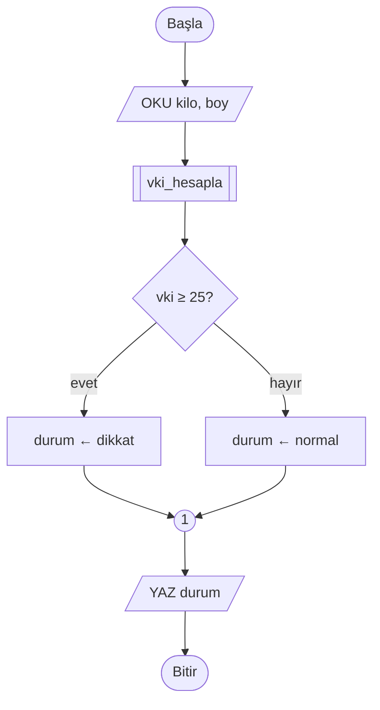
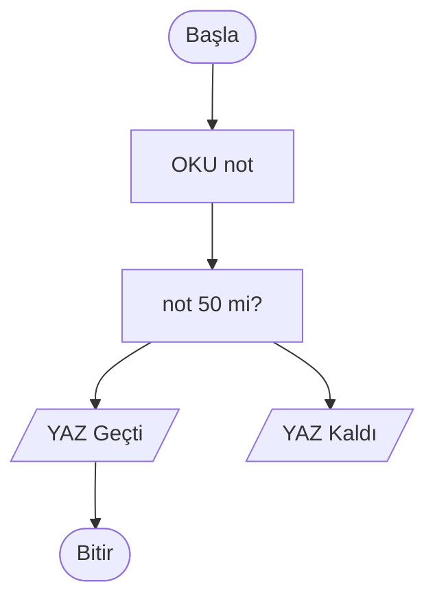
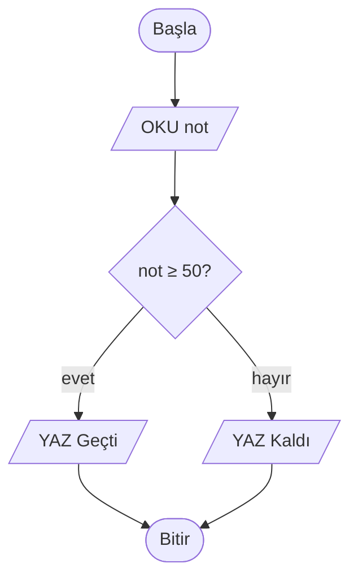
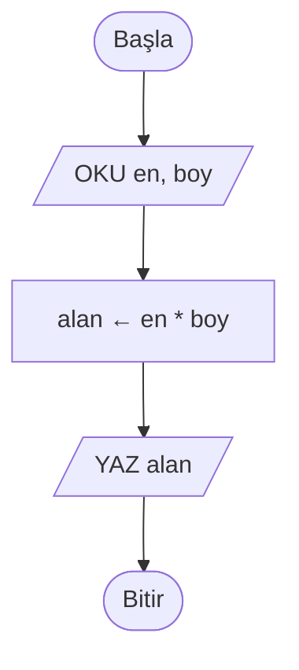
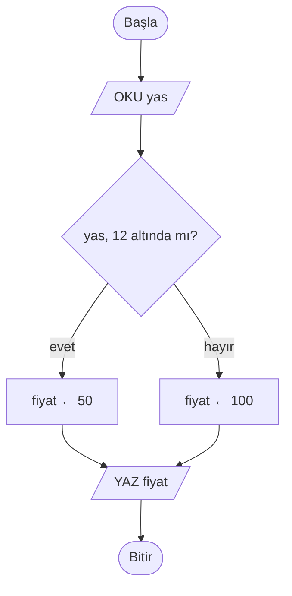
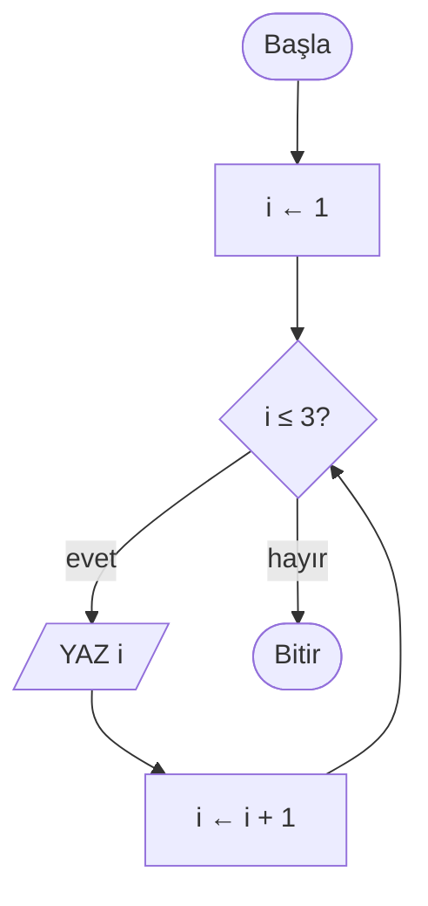
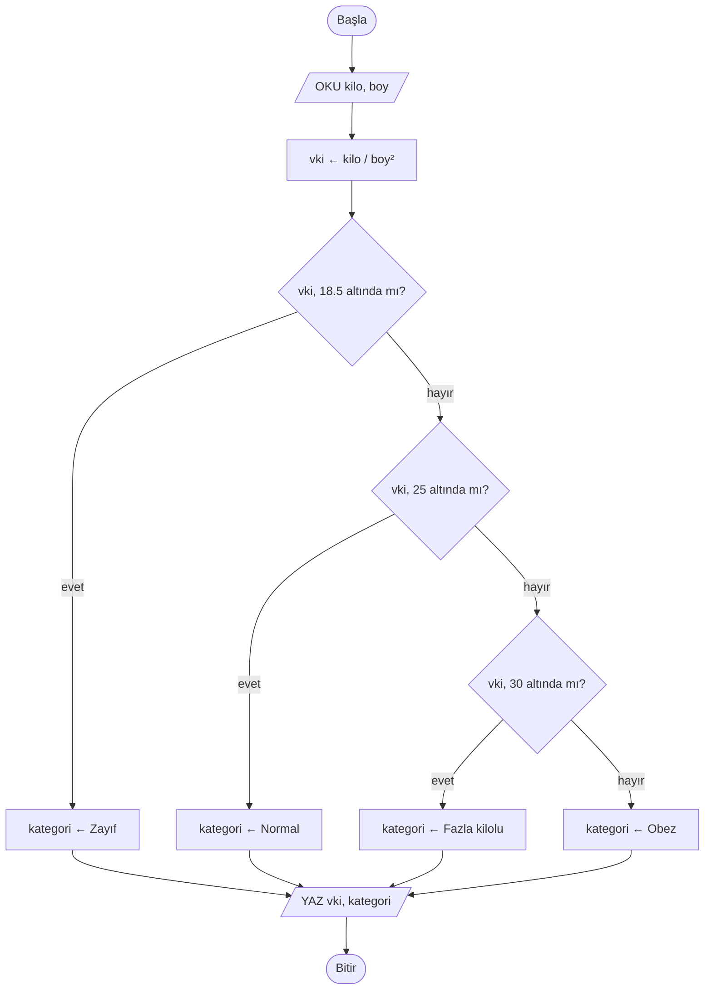
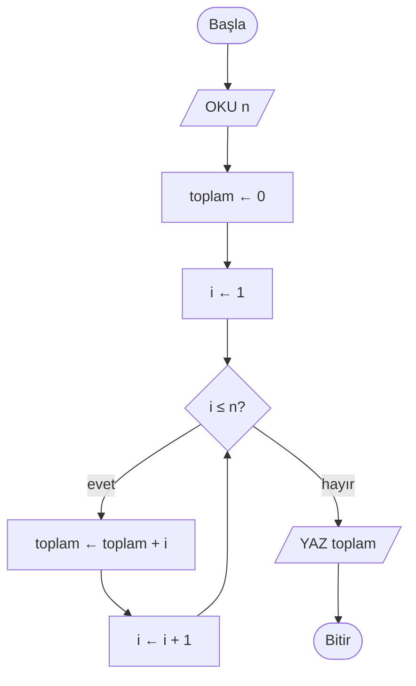
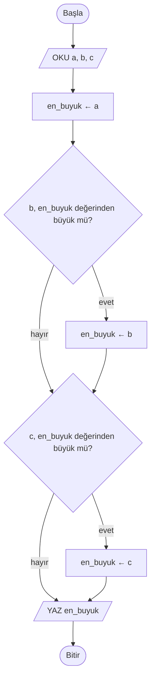

# 🔷 M3 - Akış Diyagramları

<p align="center"><em>Hafta 3</em></p>

## ❔ Öğrenme hedefleri

Bu modülün sonunda öğrenci:

* Standart akış diyagramı sembollerini (ISO 5807) tanır ve doğru kullanır
* Sıra, seçim ve tekrar yapılarını akış diyagramıyla gösterir
* Akış şeması çizme kurallarını uygular ve sık yapılan hataları fark eder
* Bir akış diyagramını iz tablosu (trace table) ile elle çalıştırır
* Sözde kod ile akış diyagramı arasında çift yönlü dönüşüm yapar
* Akış şeması çizmek için kâğıt-kalem ve dijital araçlar arasında seçim yapar

---

## 1. Akış diyagramı nedir, neden kullanılır?

**Akış diyagramı** (flowchart), bir algoritmanın adımlarını standart şekillerle ve bu şekilleri birleştiren
oklarla gösteren çizimdir. Şekil adımın **türünü** (giriş mi, karar mı, işlem mi), ok ise **sırayı**
söyler. M1'de selamlama programının, M2'de tahmin oyununun akış şemasını gördünüz; bu modülde sembolleri
ve kuralları resmî olarak öğreniyoruz.

M2'de öğrendiğimiz sözde kod da bir algoritmayı dilden bağımsız yazmanın yoludur. İkisi birbirinin
alternatifi değil, tamamlayıcısıdır:

| | Akış diyagramı | Sözde kod |
|---|---|---|
| **Güçlü yanı** | Kararların ve döngülerin nereye dallandığı bir bakışta görünür | Yazması ve düzeltmesi hızlıdır, koda çevirmesi kolaydır |
| **Zayıf yanı** | Büyük algoritmalarda çizim sayfalara yayılır | Dallanmalar girinti içinde kaybolabilir |
| **En uygun olduğu yer** | Küçük–orta algoritmalar, anlatım, hata ayıklama | Uzun algoritmalar, koda geçişten hemen önce |

Günlük hayatta akış şemalarını farkında olmadan görürüz: bir hastanenin acil servis kapısındaki "hasta
kabul süreci" panosu, bir cihazın kullanım kılavuzundaki "arıza giderme" şeması ya da bir üniversitenin
"ders kayıt adımları" duyurusu çoğu zaman birer akış şemasıdır.

## 2. Standart semboller { #2-standart-semboller }

Akış şeması sembolleri uluslararası **ISO 5807** standardında tanımlanmıştır. Bu derste en sık kullanılan
altı sembolle çalışacağız. Mermaid ile yazılışlarını da veriyoruz; M4'te Mermaid'i ayrıntılı işleyeceğiz.

| Sembol | Şekil | Anlamı | Mermaid yazımı |
|---|---|---|---|
| **Başla / Bitir** (terminal) | Oval (yuvarlak köşeli) | Algoritmanın giriş ve çıkış noktası | `A(["Başla"])` |
| **İşlem** (process) | Dikdörtgen | Hesaplama, atama | `B["toplam ← a + b"]` |
| **Giriş / Çıkış** (input/output) | Paralelkenar | Kullanıcıdan veri alma, ekrana yazma | `C[/"OKU a"/]` |
| **Karar** (decision) | Eşkenar dörtgen (baklava) | Evet/hayır sorusu; iki çıkışı vardır | `D{"a ≥ 50?"}` |
| **Bağlantı** (connector) | Küçük daire | Uzak ya da başka sayfadaki bir noktaya bağlanma | `E(("A"))` |
| **Alt program** (predefined process) | Kenarları çift çizgili dikdörtgen | Başka yerde tanımlanmış bir işi çağırma | `F[["vki_hesapla"]]` |

Oklar (flow lines) akışın yönünü gösterir. Mermaid'de `-->` ile düz ok, `-->|"evet"|` ile etiketli ok çizilir.

Altı sembolün hepsi bir arada:



!!! note "Neden standart?"

    Aynı şekil herkes için aynı anlamı taşımazsa diyagram, bir iletişim aracı olmaktan çıkar. Karar için
    dikdörtgen çizerseniz okuyan kişi o kutudan neden iki ok çıktığını anlamaz. Standart semboller
    sayesinde bir akış şemasını hiç tanımadığınız biri de aynı biçimde okur.

## 3. Çizim kuralları ve sık yapılan hatalar { #3-cizim-kurallari }

İyi bir akış şeması şu kurallara uyar:

1. **Tek başlangıç, tek bitiş.** Her şema bir `Başla` ile başlar ve (tercihen) tek bir `Bitir` ile biter.
2. **Yön yukarıdan aşağıya, soldan sağa.** Geri dönüş okları (döngüler) bu kuralın bilinçli istisnasıdır.
3. **Her işlem kutusunun bir girişi, bir çıkışı** vardır. Yalnızca karar kutusunun iki çıkışı olur.
4. **Karar kutusunun her çıkışı etiketlenir** (`evet` / `hayır` ya da `doğru` / `yanlış`).
5. **Oklar kesişmemelidir.** Kesişme kaçınılmazsa bağlantı sembolü kullanın.
6. **Kutu içi metin kısa ve belirli** olmalıdır: "hesapla" değil, `ortalama ← toplam / 2`.
7. **Her yol bir yere varır.** Hiçbir ok boşlukta bitmez; hiçbir kutu ulaşılamaz durumda kalmaz.

Aşağıdaki şemada dört hata var. Okumadan önce bulmaya çalışın:



??? success "Cevap"

    1. `OKU not` bir giriş işlemidir; dikdörtgen değil **paralelkenar** olmalı.
    2. `not 50 mi?` bir karardır; dikdörtgen değil **baklava** olmalı. Ayrıca soru belirsiz: "50'ye eşit
       mi" değil, "50 veya üzeri mi" (`not ≥ 50?`) sorulmalı.
    3. Karardan çıkan oklar **etiketsiz**; hangi yolun "evet" olduğu anlaşılmıyor.
    4. `YAZ Kaldı` kutusundan çıkan ok yok; bu yol **hiçbir yere varmıyor**.

Düzeltilmiş hâli:



## 4. Sıra, seçim ve tekrar yapıları { #4-uc-temel-yapi }

Corrado Böhm ve Giuseppe Jacopini 1966'da yayımladıkları makalede önemli bir sonuç gösterdiler: herhangi
bir akış şeması, yalnızca **üç temel yapı** birleştirilerek yeniden çizilebilir (gerekirse birkaç yardımcı
değişken eklenerek). Bu sonuç, "kodun içinde istediğin yere atla" (`goto`) yerine düzenli bloklarla program
yazmayı savunan **yapısal programlama** (structured programming) yaklaşımının dayanaklarından biri oldu.

| Yapı | Ne yapar? | Sözde kod | Python | Ayrıntı |
|---|---|---|---|---|
| **Sıra** (sequence) | Adımlar birbiri ardına bir kez çalışır | alt alta satırlar | alt alta satırlar | M5, M6 |
| **Seçim** (selection) | Koşula göre iki yoldan biri seçilir | `EĞER ... İSE` | `if` | M7 |
| **Tekrar** (iteration) | Koşul doğru oldukça bir blok tekrarlanır | `İKEN ... YAP` | `while`, `for` | M8 |

### 4.1 Sıra

Dikdörtgen alanını hesaplayan algoritma yalnızca sıralı adımlardan oluşur. Her kutu bir kez çalışır.



### 4.2 Seçim

Bir sinema bileti 12 yaşından küçükler için 50 TL, diğerleri için 100 TL olsun. Karar kutusu akışı iki
yola ayırır; iki yol daha sonra **tekrar birleşir**.



### 4.3 Tekrar

Tekrar yapısında bir ok **geri döner**. Koşul kontrolü döngünün başındadır: koşul yanlış olduğu anda
döngüden çıkılır. Aşağıdaki şema ekrana 1'den 3'e kadar sayıları yazar.



!!! warning "Sonsuz döngü"

    `i ← i + 1` kutusunu unutursanız `i` hep 1 kalır, koşul hep doğru olur ve algoritma hiç bitmez.
    Bu, M1 §3'teki **sonluluk** özelliğinin ihlalidir. Her döngüde koşulu bir gün yanlış yapacak bir
    adım bulunmalıdır.

### 4.4 Yapıları birleştirmek: vücut kitle indeksi

Gerçek algoritmalar bu üç yapının birleşimidir. Vücut kitle indeksi (VKİ) `kilo / boy²` formülüyle
hesaplanır ve Dünya Sağlık Örgütü yetişkinler için 18,5'in altını zayıf, 18,5–25'i normal, 25–30'u
fazla kilolu, 30 ve üzerini obez olarak sınıflar. Aşağıdaki şemada sıra ve art arda seçimler var:



Python karşılığı `exercise_files/akis_vki.py` dosyasındadır. Karar yapısını
[M7](../m7_karar_yapilari/README.md)'de ayrıntılı göreceğiz; şimdilik her `elif` satırının şemadaki
bir baklavaya karşılık geldiğini görmeniz yeterli.

## 5. İz tablosu ile elle çalıştırma { #5-iz-tablosu }

Bir akış şemasının doğru çalışıp çalışmadığını bilgisayara gerek kalmadan sınamanın yolu onu **elle
izlemektir** (desk checking). Bunun için bir **iz tablosu** (trace table) kullanırız: her sütun bir
değişkeni ya da koşulu, her satır bir adımı gösterir. Bir değişken değiştiğinde yeni değerini o satıra
yazarsınız.

Örnek: 1'den `n`'ye kadar sayıların toplamını bulan şema.



`n = 4` için iz tablosu (boş hücre "değişmedi" demektir):

| Adım | Çalışan kutu | `n` | `i` | `toplam` | `i ≤ n?` | Çıktı |
|---|---|---|---|---|---|---|
| 1 | `OKU n` | 4 | | | | |
| 2 | `toplam ← 0` | | | 0 | | |
| 3 | `i ← 1` | | 1 | | | |
| 4 | `i ≤ n?` | | | | 1 ≤ 4 → evet | |
| 5 | `toplam ← toplam + i` | | | 1 | | |
| 6 | `i ← i + 1` | | 2 | | | |
| 7 | `i ≤ n?` | | | | 2 ≤ 4 → evet | |
| 8 | `toplam ← toplam + i` | | | 3 | | |
| 9 | `i ← i + 1` | | 3 | | | |
| 10 | `i ≤ n?` | | | | 3 ≤ 4 → evet | |
| 11 | `toplam ← toplam + i` | | | 6 | | |
| 12 | `i ← i + 1` | | 4 | | | |
| 13 | `i ≤ n?` | | | | 4 ≤ 4 → evet | |
| 14 | `toplam ← toplam + i` | | | 10 | | |
| 15 | `i ← i + 1` | | 5 | | | |
| 16 | `i ≤ n?` | | | | 5 ≤ 4 → hayır | |
| 17 | `YAZ toplam` | | | | | **10** |

Tablo bize üç şey söyler: sonuç doğru (1 + 2 + 3 + 4 = 10), döngü gövdesi tam 4 kez çalıştı ve döngü
`i` 5 olduğunda bitti. Aynı algoritmanın Python hâli `exercise_files/akis_toplam.py` dosyasındadır;
`while` döngüsünü [M8](../m8_donguler/README.md)'de işleyeceğiz.

!!! tip "Uç durumları da izleyin"

    `n = 0` için tabloyu doldurun: 4. adımda `1 ≤ 0` yanlış olduğu için döngü **hiç çalışmaz** ve
    çıktı 0 olur. `test_akis_toplam.py` dosyasındaki `test_sifir_ve_negatif` testi tam olarak bunu
    sınar. İz tablosu, hangi durumlar için test yazmanız gerektiğini de gösterir.

M4'te aynı izlemeyi [Python Tutor](https://pythontutor.com/) ile otomatik yapacağız; ama önce elle
yapabilmek, aracın ne gösterdiğini anlamanın şartıdır.

## 6. Sözde kod ↔ akış diyagramı dönüşümü { #6-donusum }

Sözde koddaki her yapının akış şemasında sabit bir karşılığı vardır:

| Sözde kod | Akış şeması |
|---|---|
| `BAŞLA` / `BİTİR` | Oval |
| `OKU x`, `YAZ x` | Paralelkenar |
| `x ← ifade` | Dikdörtgen |
| `EĞER koşul İSE` ... `DEĞİLSE` ... `EĞER SONU` | Baklava; iki yol `EĞER SONU`'nun hemen ardından birleşir |
| `İKEN koşul YAP` ... `İKEN SONU` | Baklava; `evet` yolu gövdeye gider ve sonunda oku baklavaya geri döner |
| `FONKSİYON` çağrısı | Alt program kutusu |

### 6.1 Sözde koddan akış şemasına

Üç sayının en büyüğünü bulan sözde kod:

```text
BAŞLA
    OKU a, b, c
    en_buyuk ← a
    EĞER b > en_buyuk İSE
        en_buyuk ← b
    EĞER SONU
    EĞER c > en_buyuk İSE
        en_buyuk ← c
    EĞER SONU
    YAZ en_buyuk
BİTİR
```

Satırları sırayla sembole çeviriyoruz. İki `EĞER` bloğu art arda olduğu için iki baklava art arda gelir;
her birinin `hayır` yolu bir sonraki adıma atlar:



Python hâli `exercise_files/akis_en_buyuk.py` dosyasındadır.

### 6.2 Akış şemasından sözde koda

Ters yönde çalışırken her baklavanın bir `EĞER` mi yoksa bir `İKEN` mi olduğuna karar vermeniz gerekir.
Kural basit: **bir ok baklavaya geri dönüyorsa döngüdür**, dönmüyorsa karardır.

!!! example "Kendinizi deneyin"

    Aşağıdaki şemayı dersin standardına uygun sözde koda çevirin.

    ```mermaid
    flowchart TD
        A(["Başla"]) --> B["sayac ← 10"]
        B --> C{"sayac ≥ 1?"}
        C -->|"evet"| D[/"YAZ sayac"/]
        D --> E["sayac ← sayac - 1"]
        E --> C
        C -->|"hayır"| F[/"YAZ Kalkış"/]
        F --> Z(["Bitir"])
    ```

    ??? success "Cevap"

        `E` kutusundan çıkan ok baklavaya geri döndüğü için bu bir **döngüdür**:

        ```text
        BAŞLA
            sayac ← 10
            İKEN sayac ≥ 1 YAP
                YAZ sayac
                sayac ← sayac - 1
            İKEN SONU
            YAZ "Kalkış"
        BİTİR
        ```

        Program 10'dan 1'e geri sayar, sonra "Kalkış" yazar.

## 7. Çalışma yöntemleri { #7-calisma-yontemleri }

Akış şemasını çizmek için tek doğru araç yoktur. Hangisini seçeceğiniz, şemanın ne işe yarayacağına bağlıdır.

| Yöntem | Ne zaman? | Artısı | Eksisi |
|---|---|---|---|
| **Kâğıt-kalem** | İlk taslak, sınav, laboratuvarda hızlı fikir | En hızlısı; araç gerektirmez | Düzeltmesi zor, paylaşması zor |
| **[draw.io](https://www.drawio.com/)** | Rapor ve sunum için temiz çizim | Ücretsiz, tarayıcıda çalışır, hazır akış şeması sembolleri var | Kutuları elle yerleştirmek zaman alır |
| **[Mermaid](https://mermaid.js.org/syntax/flowchart.html)** | Ders notları, README, sürüm kontrolüne giren belgeler | Şema metin olarak yazılır, yerleşimi otomatik yapılır | Yerleşim üzerinde denetim sınırlıdır |
| **[Flowgorithm](https://www.flowgorithm.org/)** | Şemayı **çalıştırarak** denemek | Şemayı adım adım yürütür, çeşitli dillere kod üretebilir | Masaüstü uygulamasıdır, kurulum gerektirir |

Önerimiz şu sıra: fikri kâğıt üzerinde kurun, iz tablosuyla elle sınayın, sonra teslim edeceğiniz
şemayı draw.io ya da Mermaid ile temize çekin. Bu sayfadaki bütün şemalar Mermaid ile yazılmıştır;
sayfanın kaynağına bakarak nasıl yazıldıklarını görebilirsiniz. Bu araçların kullanımını ve kodu adım
adım görselleştirmeyi [M4](../m4_gorsellestirme/README.md)'te ayrıntılı işleyeceğiz.

## 8. Alıştırmalar

1. **Sembol seçimi.** Şu adımların her biri için hangi sembolü kullanırsınız? (a) Kullanıcıdan şifre al,
   (b) şifre doğru mu?, (c) `deneme ← deneme + 1`, (d) "Hoş geldiniz" yaz, (e) daha önce yazılmış
   `sms_gonder` işlemini çağır.
2. **Hata avı.** §3'teki yedi kuralı kullanarak M1 §6.1'deki selamlama şemasını değerlendirin. Kurallara
   uyuyor mu?
3. **Çiz.** Bir otoparkta ilk saat 40 TL, sonraki her saat 20 TL olsun. Saat sayısını okuyup ücreti yazan
   algoritmanın akış şemasını çizin. (İpucu: 1 saat için ayrı bir durum var.)
4. **İz tablosu.** §6.1'deki "en büyük" şemasını `a = 3, b = 8, c = 5` için iz tablosuyla izleyin.

    ??? success "Cevap"

        | Adım | Çalışan kutu | `en_buyuk` | Koşul | Çıktı |
        |---|---|---|---|---|
        | 1 | `OKU a, b, c` | | | |
        | 2 | `en_buyuk ← a` | 3 | | |
        | 3 | `b, en_buyuk değerinden büyük mü?` | | 8 > 3 → evet | |
        | 4 | `en_buyuk ← b` | 8 | | |
        | 5 | `c, en_buyuk değerinden büyük mü?` | | 5 > 8 → hayır | |
        | 6 | `YAZ en_buyuk` | | | **8** |

5. **Dönüşüm.** §4.2'deki sinema bileti şemasını dersin standardına uygun sözde koda çevirin. Sonra
   65 yaş ve üzerine 60 TL indirimli fiyat ekleyerek hem sözde kodu hem şemayı güncelleyin.
6. **Python ile karşılaştır.** `exercise_files/` klasöründeki üç dosyayı açın ve her Python satırının
   bu sayfadaki hangi şema kutusuna karşılık geldiğini işaretleyin. Testleri
   `uv run pytest m3_akis_diyagramlari` ile çalıştırın.

---

## Özet

Akış diyagramı, bir algoritmayı standart sembollerle çizer: oval başlangıç ve bitişi, dikdörtgen işlemi,
paralelkenar giriş/çıkışı, baklava kararı, küçük daire bağlantıyı, çift kenarlı dikdörtgen alt programı
gösterir. Böhm ve Jacopini'nin gösterdiği gibi her algoritma üç temel yapıyla kurulabilir: sıra, seçim
ve tekrar. İyi bir şemada tek başlangıç ve bitiş vardır, karar çıkışları etiketlidir ve hiçbir yol boşlukta
kalmaz. İz tablosu, bir şemayı bilgisayarsız çalıştırıp hem sonucu hem döngünün kaç kez döndüğünü görmemizi
sağlar. Sözde kod ile akış şeması birebir dönüştürülebilir; baklavaya geri dönen bir ok varsa o yapı bir
döngüdür. Bir sonraki modülde bu şemaları dijital araçlarla çizmeyi ve kodu adım adım görselleştirmeyi
öğreneceğiz.

## İleri okuma

* [Mermaid belgeleri: Flowcharts](https://mermaid.js.org/syntax/flowchart.html). Bu sayfadaki bütün
  şekillerin ve ok türlerinin yazılışı.
* [Flowgorithm](https://www.flowgorithm.org/). Akış şemasını çalıştırarak deneyebileceğiniz ücretsiz araç.
* Allen B. Downey, [*Think Python*, 3. baskı, 5. bölüm](https://allendowney.github.io/ThinkPython/chap05.html).
  Koşullu ifadeler; §4.2 ve §4.4'teki kararların Python karşılığına erken bir bakış.

## Kaynaklar

* ISO 5807:1985, *Information processing — Documentation symbols and conventions for data, program and
  system flowcharts, program network charts and system resources charts*. §2'deki sembollerin kaynağı.
* Corrado Böhm, Giuseppe Jacopini, "Flow diagrams, Turing machines and languages with only two formation
  rules", *Communications of the ACM*, 9(5), 366–371, 1966. §4'teki üç temel yapı sonucunun kaynağı.
* Edsger W. Dijkstra, "Go To Statement Considered Harmful", *Communications of the ACM*, 11(3), 147–148,
  1968. Yapısal programlama tartışmasını başlatan mektup.
* World Health Organization, *Obesity: Preventing and Managing the Global Epidemic*, WHO Technical Report
  Series 894, 2000. §4.4'teki VKİ sınıflarının kaynağı.
* [Python Tutor](https://pythontutor.com/). §5'teki elle izlemenin otomatik karşılığı (M4).
