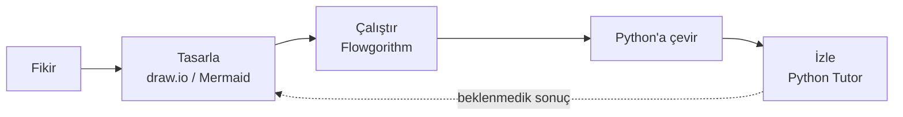
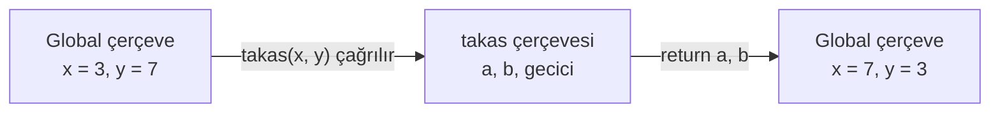
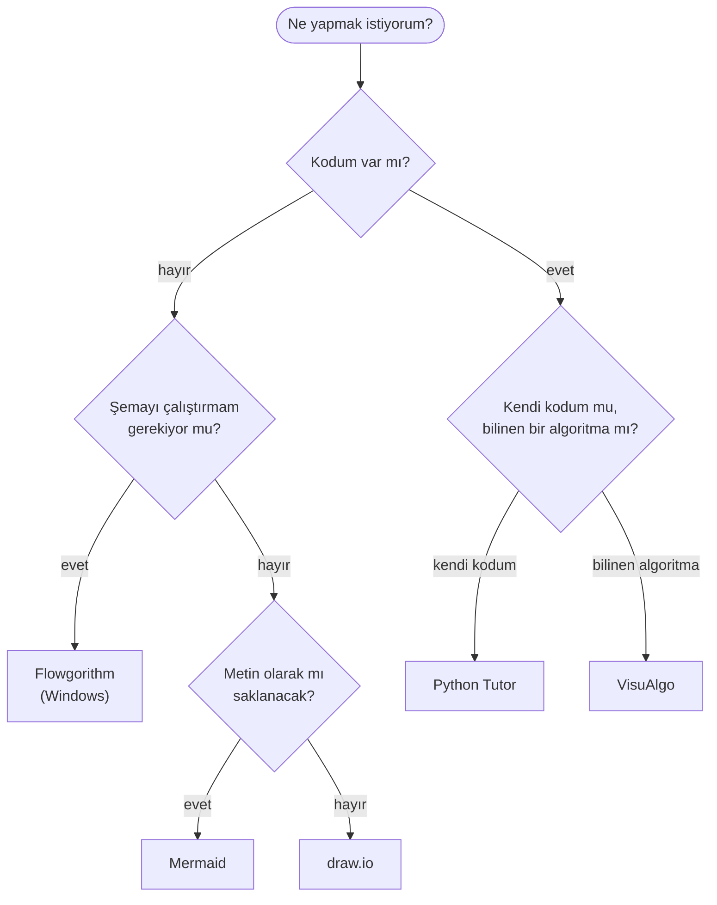

# 👁️ M4 - Algoritma ve Akış Şemalarının Görselleştirilmesi

<p align="center"><em>Hafta 4</em></p>

## ❔ Öğrenme hedefleri

Bu modülün sonunda öğrenci:

* Bir algoritmayı görselleştirmenin neden işe yaradığını açıklar
* draw.io ve Mermaid ile akış şeması çizer
* Flowgorithm ile çalıştırılabilir bir akış şeması oluşturur (Windows)
* Python Tutor ile kodun bellek ve değişken durumunu adım adım izler ve bunu elle hazırlanan iz tablosuyla karşılaştırır
* Bir algoritmayı, amaca göre en uygun görselleştirme aracıyla sunar

---

## 1. Görselleştirme neden önemli?

[M3](../m3_akis_diyagramlari/README.md)'te akış şemalarını kâğıt üzerinde çizdik ve bir algoritmayı **iz tablosu** (trace table) ile elle
çalıştırdık. Bu hafta aynı işleri dijital araçlarla yapacağız. Araç değişiyor ama amaç aynı kalıyor:
algoritmanın içinde **ne olduğunu gözle görmek**.

Bir metro haritasını düşünün. İstasyonların gerçek konumlarını değil, hatların birbirine nasıl
bağlandığını gösterir. Aynı bilgiyi "Kızılay'dan bir sonraki durak..." diye cümlelerle anlatsaydık,
aktarma noktalarını bulmak çok daha zor olurdu. Akış şemaları da algoritmanın "hat haritası"dır:
kararların nerede dallandığı, hangi adımların tekrarlandığı tek bakışta görülür.

Görselleştirme üç ayrı iş için kullanılır:

| Amaç | Soru | Bu haftaki araç |
|---|---|---|
| **Tasarlamak** | Algoritmanın adımları ve kararları neler? | draw.io, Mermaid |
| **Çalıştırıp denemek** | Akış şeması gerçekten doğru sonucu veriyor mu? | Flowgorithm |
| **İzlemek** | Kod çalışırken değişkenlerin değeri adım adım nasıl değişiyor? | Python Tutor |
| **Karşılaştırmak** | İki algoritma aynı işi nasıl farklı yapıyor? | VisuAlgo (M10, M11) |



!!! tip "Araç değil düşünce"

    Hiçbir araç yanlış bir algoritmayı düzeltmez. Araçların işi, hatayı **daha erken ve daha kolay
    görmenizi** sağlamaktır. Bu yüzden her araçta önce kâğıtta yaptığınızı tekrarlayın, sonra aracın
    size ek olarak ne gösterdiğine bakın.

## 2. Araçlara genel bakış { #2-araclara-genel-bakis }

| Araç | Ne yapar? | Nerede çalışır? | Ücret | Güçlü yanı | Sınırı |
|---|---|---|---|---|---|
| [draw.io](https://www.drawio.com/) (diagrams.net) | Sürükle-bırak diyagram çizer | Tarayıcı, masaüstü, VS Code eklentisi | Ücretsiz | Serbest yerleşim, zengin sembol kütüphanesi | Çizimi çalıştıramazsınız |
| [Mermaid](https://mermaid.js.org/) | Metinden diyagram üretir | Tarayıcı, GitHub, bu ders sitesi | Ücretsiz, açık kaynak | Metin olduğu için sürüm kontrolüne ve kopyala-yapıştıra uygun | Yerleşimi araç belirler, ince ayar zor |
| [Flowgorithm](http://www.flowgorithm.org/) | Akış şemasını çalıştırır, koda çevirir | Yalnızca Windows | Ücretsiz | Şemayı adım adım yürütür, değişkenleri gösterir | macOS/Linux sürümü yok |
| [Python Tutor](https://pythontutor.com/) | Python kodunu adım adım yürütüp belleği çizer | Tarayıcı | Ücretsiz | Değişkenleri kutu ve ok olarak gösterir | Küçük programlar için; `input()` desteği sınırlı |
| [VisuAlgo](https://visualgo.net/) | Hazır algoritmaları animasyonla gösterir | Tarayıcı | Ücretsiz | Sıralama gibi algoritmaları adım adım canlandırır | Kendi kodunuzu çalıştırmaz |

## 3. draw.io (diagrams.net) ile akış şeması

draw.io, önceden adı diagrams.net olan, kayıt gerektirmeyen bir çizim aracıdır. Kâğıtta çizdiğiniz
şemayı temize çekmek için en rahat yoldur.

**Nasıl başlanır?**

1. Tarayıcıda [app.diagrams.net](https://app.diagrams.net/) adresini açın. Kayıt yeri sorulursa
   **Device** (bilgisayarınız) seçin.
2. **Create New Diagram** → şablonlardan **Flowcharts** kategorisini ya da boş bir sayfa seçin.
3. Sol paneldeki **Flowchart** sembol grubundan başla/bitir (oval), işlem (dikdörtgen), karar (eşkenar
   dörtgen) ve giriş/çıkış (paralelkenar) sembollerini sürükleyin.
4. Bir sembolün üzerine gelince çıkan mavi oklardan birini çekerek bağlantı kurun. Karar kutusundan
   çıkan oklara çift tıklayıp "evet" / "hayır" etiketi yazın.
5. **File → Save as** ile `.drawio` dosyası olarak kaydedin; paylaşmak için **File → Export as → PNG**
   (ya da SVG) kullanın.

!!! note "VS Code içinde draw.io"

    VS Code'a **Draw.io Integration** eklentisini kurarsanız `.drawio` uzantılı bir dosyayı doğrudan
    editörde açıp çizebilirsiniz. Böylece şema, kodla aynı klasörde durur.

M3'teki sembol kurallarının hepsi burada da geçerlidir: tek başla, en az bir bitir; her karar kutusundan
iki etiketli çıkış; oklar yukarıdan aşağıya ve soldan sağa. Semboller ISO 5807 standardına dayanır.

## 4. Mermaid ile metinden diyagram { #4-mermaid }

Mermaid'de diyagramı çizmezsiniz, **yazarsınız**. Kısa bir metin, tarayıcıda otomatik olarak diyagrama
dönüşür. Bu ders sitesindeki bütün akış şemaları Mermaid ile yazılmıştır. Metin olduğu için bir
arkadaşınıza e-postayla gönderebilir, bir satırını değiştirip şemayı güncelleyebilirsiniz.

**Nasıl başlanır?**

1. Tarayıcıda [mermaid.live](https://mermaid.live/) editörünü açın.
2. Sol taraftaki kodu silip aşağıdaki "Kod" sekmesindeki metni yapıştırın.
3. Sağ tarafta diyagram anında çizilir. Editörün dışa aktarma seçenekleriyle PNG ya da SVG olarak indirebilirsiniz.
4. Aynı metni GitHub'daki bir `.md` dosyasına ```` ```mermaid ```` bloğu içinde yazarsanız GitHub da
   diyagramı çizer.

Aşağıda, basit bir "sınavdan geçti mi?" algoritmasının Mermaid kaynağı ve çıktısı iki sekmede yer alıyor:

=== "Kod"

    ```text
    flowchart TD
        A(["Başla"]) --> B[/"Notu oku: not"/]
        B --> C{"not ≥ 50?"}
        C -->|"evet"| D[/"Geçti yaz"/]
        C -->|"hayır"| E[/"Kaldı yaz"/]
        D --> F(["Bitir"])
        E --> F
    ```

=== "Sonuç"

    ```mermaid
    flowchart TD
        A(["Başla"]) --> B[/"Notu oku: not"/]
        B --> C{"not ≥ 50?"}
        C -->|"evet"| D[/"Geçti yaz"/]
        C -->|"hayır"| E[/"Kaldı yaz"/]
        D --> F(["Bitir"])
        E --> F
    ```

Kodu satır satır okuyalım. İlk satır `flowchart TD`, yukarıdan aşağıya (**T**op-**D**own) bir akış
şeması başlatır; `LR` yazarsanız soldan sağa çizer. Sonraki her satır "şu düğümden şu düğüme bir ok"
demektir. `A`, `B`, `C` düğümlerin kısa adlarıdır ve ekranda görünmez; görünen metin tırnak içindedir.
Bir düğümün şeklini, metni çevreleyen parantezler belirler.

### 4.1 Mermaid mini başvuru { #41-mermaid-mini-basvuru }

**Düğüm şekilleri**

| Akış şeması sembolü | Mermaid yazımı | Ne zaman? |
|---|---|---|
| Başla / Bitir (oval) | `A(["Başla"])` | Algoritmanın giriş ve çıkış noktası |
| İşlem (dikdörtgen) | `B["toplam ← a + b"]` | Hesaplama, atama |
| Giriş / Çıkış (paralelkenar) | `C[/"Sayıyı oku: a"/]` | `OKU` ve `YAZ` adımları |
| Karar (eşkenar dörtgen) | `D{"a ≥ 0?"}` | Evet/hayır sorusu |
| Alt program | `E[["ortalama hesapla"]]` | Başka yerde tanımlanmış bir iş (M9) |

**Oklar ve etiketler**

```text
A --> B                 düz ok
A -.-> B                kesikli ok (ör. "hata varsa geri dön")
C -->|"evet"| D         etiketli ok (karar çıkışları)
A --> B --> C           zincir: tek satırda birden çok ok
```

!!! warning "Mermaid'de sık yapılan hatalar"

    * **Tırnaksız etiket.** `B[toplam: a + b]` içindeki `:` gibi karakterler Mermaid'i şaşırtır. Metni
      her zaman çift tırnağa alın: `B["toplam: a + b"]`.
    * **Etikette `<`, `>` ya da tırnak.** Bunlar da ayrıştırmayı bozar. Karşılaştırmaları `≥ ≤ ≠`
      karakterleriyle ya da "küçükse", "büyük eşit" gibi kelimelerle yazın.
    * **Aynı adı iki düğüme vermek.** `A` adını ikinci kez kullanırsanız Mermaid yeni bir düğüm
      çizmez, eskisine ok çeker. Bu bazen istenir (iki yolun aynı "Bitir"e varması gibi), bazen hata olur.
    * **Satır sonu.** Uzun bir metni bölmek için tırnak içinde `<br>` kullanın: `A["ilk satır<br>ikinci satır"]`.

## 5. Flowgorithm: çalıştırılabilir akış şemaları

draw.io ve Mermaid ile çizdiğiniz şema bir resimdir; doğru olup olmadığını ancak siz elle izleyerek
anlarsınız. [Flowgorithm](http://www.flowgorithm.org/) ise akış şemasını **bir program gibi
çalıştırır**. Sacramento State Üniversitesi'nden Devin Cook tarafından eğitim amacıyla geliştirilmiştir.

**Nasıl başlanır?** (yalnızca Windows)

1. [flowgorithm.org](http://www.flowgorithm.org/) adresinden indirip kurun.
2. Yeni bir dosyada yalnızca **Main** ve **End** kutuları vardır. İki kutu arasındaki oka tıklayınca
   eklenebilecek semboller listelenir.
3. Önce bir **Declare** kutusuyla değişkeni ve tipini tanımlayın (ör. `not`, Integer). Ardından
   **Input**, **Assign**, **If**, **Output** kutularını ekleyin.
4. Araç çubuğundaki çalıştır düğmesiyle şemayı yürütün. Adım adım çalıştırma seçeneğiyle her kutuda
   durup **Variable Watch** penceresinde değişkenlerin o anki değerlerini görebilirsiniz.
5. **Source Code Viewer** penceresinde dil olarak Python'u seçin: şemanızın Python karşılığını görürsünüz.

!!! note "Değişken tipleri"

    Flowgorithm her değişken için baştan bir **tip** (Integer, Real, String, Boolean) ister. Bu,
    haftaya M5'te işleyeceğimiz `int`, `float`, `str` ve `bool` tiplerinin karşılığıdır. Python'da
    tipi baştan yazmak zorunlu değildir, ama tip kavramı yine de oradadır.

!!! tip "macOS veya Linux kullanıyorsanız"

    Flowgorithm'in yalnızca Windows sürümü vardır. Bu durumda şemanızı draw.io ya da Mermaid ile çizin,
    kâğıt üzerinde iz tablosuyla izleyin, sonra Python'a çevirip Python Tutor'da çalıştırın. Aynı
    öğrenme hedefine ulaşırsınız; laboratuvardaki Windows bilgisayarlarda Flowgorithm'i de deneyebilirsiniz.

## 6. Python Tutor ile kod görselleştirme { #6-python-tutor }

[Python Tutor](https://pythontutor.com/), Philip Guo'nun geliştirdiği ve dünyada yaygın olarak
kullanılan ücretsiz bir görselleştirme aracıdır. Yazdığınız Python kodunu satır satır çalıştırır ve her
adımda belleğin resmini çizer.

**Nasıl başlanır?**

1. [pythontutor.com](https://pythontutor.com/) adresini açın ve Python'u seçerek kod düzenleme
   sayfasına geçin.
2. Dil listesinde **Python 3** seçili olduğundan emin olun.
3. Kodunuzu kutuya yapıştırın ve **Visualize Execution** düğmesine basın.
4. **Next >** ile bir adım ileri, **< Prev** ile bir adım geri gidin. Kaydırma çubuğuyla istediğiniz
   adıma atlayabilirsiniz.

Ekranın iki yarısı vardır:

* **Sol taraf: kod.** Açık yeşil ok az önce çalışan satırı, kırmızı ok bir sonra çalışacak satırı gösterir.
* **Sağ taraf: bellek.** **Frames** bölümünde değişken adları ve değerleri kutular hâlinde durur. Bir
  fonksiyon çağrıldığında o fonksiyona ait yeni bir kutu grubu (çerçeve, frame) açılır ve fonksiyon
  bitince kaybolur. **Print output** alanında `print()` ile yazılan metinler görünür.

!!! warning "`input()` yerine değeri doğrudan yazın"

    Python Tutor, kullanıcıdan girdi okuyan programlarda sınırlı destek sunar. Görselleştirme
    yaparken `a = int(input())` yerine `a = 3` gibi değeri doğrudan yazın. Bu haftanın alıştırma
    dosyaları bu yüzden `input()` kullanmaz.

### 6.1 Örnek: iki değişkenin takası

İki bardaktaki çay ile suyun yerini değiştirmek istediğinizi düşünün. Birini diğerine dökerseniz
karışır; üçüncü, boş bir bardağa ihtiyacınız vardır. Programlamada da iki değişkenin değerini takas
etmek için geçici bir değişken kullanırız:

```text
BAŞLA
    a ← 3
    b ← 7
    gecici ← a
    a ← b
    b ← gecici
    YAZ a, b
BİTİR
```

```python
a = 3
b = 7
gecici = a
a = b
b = gecici
print(a, b)
```

Bu altı satırı Python Tutor'a yapıştırıp **Next >** ile ilerlediğinizde **Frames** bölümünde sırayla
şunları görürsünüz:

| Adım | Çalışan satır | a | b | gecici | Ekran |
|---|---|---|---|---|---|
| 1 | `a = 3` | 3 | | | |
| 2 | `b = 7` | 3 | 7 | | |
| 3 | `gecici = a` | 3 | 7 | 3 | |
| 4 | `a = b` | 7 | 7 | 3 | |
| 5 | `b = gecici` | 7 | 3 | 3 | |
| 6 | `print(a, b)` | 7 | 3 | 3 | `7 3` |

Bu tablo, M3'te kâğıt üzerinde hazırladığınız **iz tablosunun** ta kendisidir. Farkı şudur: iz
tablosunda her satırı siz doldurursunuz ve hata yapabilirsiniz; Python Tutor aynı tabloyu bilgisayarın
**gerçekte** yaptığı işe göre gösterir.

### 6.2 İz tablosu mu, Python Tutor mu? { #62-iz-tablosu-mu-python-tutor-mu }

| | Elle iz tablosu (M3) | Python Tutor |
|---|---|---|
| Kim yürütür? | Siz | Bilgisayar |
| Ne öğretir? | Algoritmayı adım adım düşünmeyi | Kodun gerçekte ne yaptığını |
| Hata bulma | Kendi hatalarınızı da tabloya taşıyabilirsiniz | Beklentinizle gerçek arasındaki farkı gösterir |
| Nerede kullanılır? | Sınavda, kâğıt üzerinde, kod yazmadan önce | Kod yazdıktan sonra, "neden böyle çıktı?" sorusunda |
| Sınırı | Uzun programlarda yorucu | Çok uzun ya da girdi bekleyen programlarda zor |

İkisini birlikte kullanmanın en verimli yolu: önce tabloyu **kâğıtta doldurun**, sonra Python Tutor'da
çalıştırıp adım adım karşılaştırın. İlk farkın çıktığı satır, yanlış anladığınız yerdir.

!!! example "Kendinizi deneyin"

    Takas programında `gecici = a` satırını silip yalnızca `a = b` ve `b = a` yazsaydık ne olurdu?
    Önce iz tablosunu kâğıtta doldurun, sonra Python Tutor'da deneyin.

    ??? success "Cevap"

        `a = b` satırından sonra `a` da `b` de 7 olur; 3 değeri kaybolmuştur. `b = a` satırı ise 7'yi
        tekrar `b`'ye yazar. Ekranda `7 7` görünür. Python Tutor'da 3 değerinin hiçbir kutuda kalmadığını
        açıkça görürsünüz. Python'da aynı işi tek satırda `a, b = b, a` ile de yapabilirsiniz; bu yazımı
        ileride kullanacağız.

### 6.3 Fonksiyon içindeki değişkenler

Alıştırma dosyalarında kodu M1'deki gibi, test edilebilsin diye bir fonksiyon "kutusuna" koyuyoruz;
fonksiyonların ayrıntısını M9'da göreceğiz. Python Tutor'da bu kutunun karşılığını açıkça görürsünüz:
fonksiyon çağrıldığında **Frames** bölümünde fonksiyon adıyla yeni bir çerçeve açılır, fonksiyonun
değişkenleri bu çerçevenin içinde durur ve `return` satırından sonra çerçeve kaybolur.



## 7. Algoritma animasyonları: VisuAlgo

[VisuAlgo](https://visualgo.net/), Singapur Ulusal Üniversitesi'nde (NUS) Steven Halim ve ekibi
tarafından geliştirilmiş bir animasyon sitesidir. Python Tutor sizin kodunuzu gösterir; VisuAlgo ise
hazır algoritmaları, üzerinde çalıştıkları veriyle birlikte canlandırır. Örneğin bir sayı dizisinin
adım adım sıralanışını, hangi iki elemanın karşılaştırıldığını renklerle görürsünüz.

**Nasıl başlanır?**

1. [visualgo.net](https://visualgo.net/) adresini açın ve **Sorting** (sıralama) modülünü seçin.
2. Üstteki menüden bir algoritma seçin (ör. Bubble Sort).
3. Sol alttaki menüden kendi dizinizi girin ya da rastgele bir dizi oluşturun, ardından **Sort** deyin.
4. Alttaki oynatma düğmeleriyle animasyonu yavaşlatın, durdurun, adım adım ilerletin.

Bu aracı asıl olarak arama (M10) ve sıralama (M11) haftalarında, algoritmaları karşılaştırırken
kullanacağız. Şimdilik bir kez açıp bir sıralamayı izlemeniz yeterli.

## 8. Hangi aracı ne zaman kullanmalı?



| Durum | Önerilen araç |
|---|---|
| Ödev raporuna temiz bir akış şeması koymak | draw.io |
| Şemayı bir `.md` dosyasında ya da GitHub'da tutmak | Mermaid |
| Şemanın doğru sonuç verdiğini kod yazmadan denemek | Flowgorithm |
| "Programım neden yanlış sonuç veriyor?" | Python Tutor |
| Bir sıralama algoritmasının nasıl çalıştığını görmek | VisuAlgo |

## 9. Alıştırmalar

Alıştırma dosyaları `exercise_files/` klasöründedir. Her dosyanın içeriğini Python Tutor'a yapıştırın,
`if __name__ == "__main__":` satırını silip altındaki satırların girintisini kaldırın ve programı adım
adım izleyin.

1. **Takas** (`gorsel_takas.py`). Programı çalıştırmadan önce `a`, `b`, `gecici`, `x`, `y` için bir
   iz tablosu doldurun. Sonra Python Tutor'da izleyin. `takas` çerçevesi ne zaman açılıp ne zaman
   kapanıyor? `x` ve `y`, `takas` çalışırken değişiyor mu?
2. **Sıcaklık** (`gorsel_sicaklik.py`). `sicaklik = 25` için `carpim` ve `fahrenheit` değişkenlerinin
   hangi adımda ortaya çıktığını not edin. `sicaklik` değerini `-40` yapıp tekrar izleyin; ilginç
   olan nedir?
3. **Kart bakiyesi** (`gorsel_bakiye.py`). Tek bir `bakiye` değişkeni üç kez değer alıyor. İz tablonuzda
   bu değişkenin sütununda kaç farklı değer var? Python Tutor'da her atamadan sonra kutunun içinin
   değiştiğini gözlemleyin.
4. **Mermaid ile çiz.** `gorsel_bakiye.py` dosyasındaki algoritmanın akış şemasını
   [mermaid.live](https://mermaid.live/) üzerinde yazın. Başla/bitir, giriş, işlem ve çıkış
   sembollerinin hepsini kullanın.
5. **draw.io ile çiz.** Aynı şemayı draw.io'da çizip PNG olarak dışa aktarın. İki aracı hız, düzen
   ve değiştirme kolaylığı açısından iki cümleyle karşılaştırın.
6. **(Windows) Flowgorithm.** Sıcaklık dönüşümünü Flowgorithm'de kurun, çalıştırın ve Source Code
   Viewer'daki Python çıktısını `gorsel_sicaklik.py` ile karşılaştırın.

Testlerin geçtiğini doğrulamak için:

```bash
uv run pytest m4_gorsellestirme
```

---

## Özet

Görselleştirme, algoritmanın içinde ne olduğunu gözle görmemizi sağlar. Tasarlamak için draw.io
(sürükle-bırak) ya da Mermaid (metinden diyagram), şemayı çalıştırmak için Flowgorithm, kendi Python
kodumuzu adım adım izlemek için Python Tutor, bilinen algoritmaları canlandırmak için VisuAlgo
kullanırız. Python Tutor'un gösterdiği değişken tablosu, M3'te elle doldurduğumuz iz tablosunun
bilgisayar tarafından üretilmiş hâlidir; ikisini karşılaştırmak hatayı bulmanın en kısa yoludur.
Bir sonraki modülde programların kullanıcıdan nasıl veri aldığını ve bu verilerin hangi tiplerde
saklandığını göreceğiz.

## İleri okuma

* [Mermaid belgeleri: Flowcharts](https://mermaid.js.org/syntax/flowchart.html). Bütün düğüm
  şekilleri, ok türleri ve yön seçenekleri.
* [Python Tutor](https://pythontutor.com/). Ana sayfadaki hazır örnekleri adım adım izleyin.
* Allen B. Downey, [*Think Python*, 3. baskı, 2. bölüm](https://allendowney.github.io/ThinkPython/chap02.html).
  Değişkenler ve atama; bölümdeki durum diyagramları (state diagram) Python Tutor'un çizdiği
  kutuların kâğıt üzerindeki karşılığıdır.

## Kaynaklar

* Philip J. Guo, "Online Python Tutor: Embeddable Web-Based Program Visualization for CS Education",
  *Proceedings of the 44th ACM Technical Symposium on Computer Science Education (SIGCSE '13)*, 2013.
  Python Tutor'un tanıtıldığı makale.
* ISO 5807:1985, *Information processing — Documentation symbols and conventions for data, program
  and system flowcharts*. §3 ve §4'teki akış şeması sembollerinin standardı.
* [draw.io](https://www.drawio.com/), [Mermaid](https://mermaid.js.org/),
  [Flowgorithm](http://www.flowgorithm.org/), [VisuAlgo](https://visualgo.net/). Araçların resmî sayfaları.
