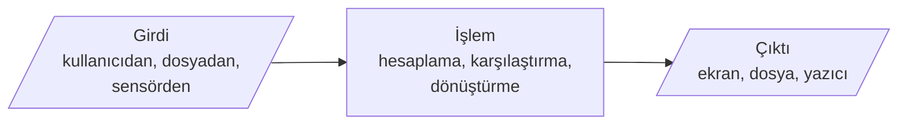
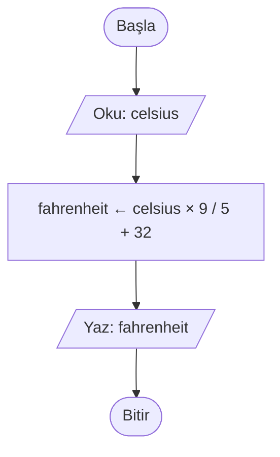
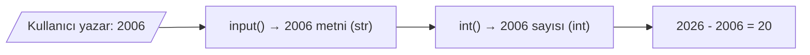
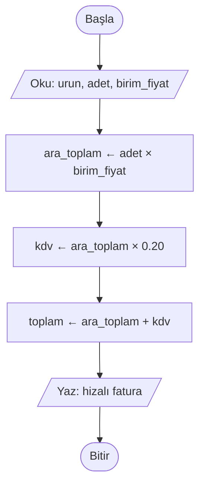

# ⌨️ M5 - Giriş/Çıkış Kavramları ve Temel Veri Tipleri

<p align="center"><em>Hafta 5</em></p>

## ❔ Öğrenme hedefleri

Bu modülün sonunda öğrenci:

* Bir programın girdi, işlem ve çıktı adımlarını ayırt eder
* Akış şemasında ve sözde kodda giriş/çıkış adımlarını doğru sembolle gösterir
* `input()` ve `print()` ile kullanıcıyla etkileşim kurar
* Temel veri tiplerini (`int`, `float`, `str`, `bool`) tanır ve `type()` ile bir değerin tipini öğrenir
* `int()`, `float()`, `str()`, `bool()` ile tip dönüşümü yapar ve hatalı girdinin neden `ValueError` verdiğini açıklar
* Çıktıyı f-string ile biçimlendirir (ondalık basamak, hizalama)

---

## 1. Girdi – İşlem – Çıktı (IPO) modeli { #1-ipo-modeli }

Neredeyse her program üç parçadan oluşur: dışarıdan **veri alır**, bu veriyi **işler** ve bir
**sonuç üretir**. Buna **Girdi – İşlem – Çıktı** modeli (Input – Process – Output, kısaca IPO) denir.

Bir çay ocağını düşünün. Girdi: su, çay, şeker. İşlem: suyu kaynatmak, demlemek, bardağa koymak.
Çıktı: bir bardak çay. Market kasası da aynı modele uyar: ürünlerin barkodları girdi, fiyatların
toplanıp KDV'nin eklenmesi işlem, fiş ise çıktıdır.



M1'de Pólya'nın "problemi anla" adımında girdileri ve çıktıyı listelemiştik. IPO modeli bu listeyi
bir tabloya döker. Bir problemi kodlamaya başlamadan önce bu tabloyu doldurmak, işin yarısıdır:

| Problem | Girdi | İşlem | Çıktı |
|---|---|---|---|
| Sıcaklık dönüştürücü | Celsius değeri | F = C × 9 / 5 + 32 | Fahrenheit değeri |
| Fatura hesabı | Ürün adı, adet, birim fiyat | Ara toplam, KDV, genel toplam | Hizalı fatura metni |
| Süre gösterimi | Toplam saniye | Saat, dakika ve saniyeye ayırma | `01:02:05` biçiminde metin |
| Vücut kitle indeksi | Kilo (kg), boy (m) | kilo / boy² | İndeks değeri |

!!! tip "Önce çıktıyı düşünün"

    "Ne üretmem gerekiyor?" sorusunun cevabı, "ne almam gerekiyor?" sorusunu da belirler. Vücut kitle
    indeksini hesaplamak için boy santimetre olarak alınırsa işlem adımına bir de "100'e böl" eklemek
    gerekir. Birim, girdinin bir parçasıdır.

## 2. Akış şemasında giriş/çıkış sembolleri

M3'te gördüğümüz gibi girdi ve çıktı adımları akış şemasında **paralelkenar** ile gösterilir. İşlem
adımları ise dikdörtgendir. Sözde kodda girdi için `OKU`, çıktı için `YAZ` kullanırız:

```text
BAŞLA
    OKU celsius                           // girdi
    fahrenheit ← celsius * 9 / 5 + 32     // işlem
    YAZ fahrenheit                        // çıktı
BİTİR
```



| Akış şeması | Sözde kod | Python |
|---|---|---|
| Paralelkenar (girdi) | `OKU celsius` | `celsius = float(input("Sıcaklık: "))` |
| Dikdörtgen (işlem) | `fahrenheit ← celsius * 9 / 5 + 32` | `fahrenheit = celsius * 9 / 5 + 32` |
| Paralelkenar (çıktı) | `YAZ fahrenheit` | `print(fahrenheit)` |

Tablonun ilk satırındaki `float(...)` parçası sözde kodda yok. Bunun nedeni bir sonraki bölümün konusu.

## 3. Python'da `input()` ve `print()` { #3-input-ve-print }

### 3.1 `input()`: kullanıcıdan veri almak

`input()` ekrana bir soru yazar, kullanıcının bir şeyler yazıp Enter'a basmasını bekler ve yazılanı
**metin** olarak döndürür:

```python
ad = input("Adınız: ")
```

!!! warning "`input()` her zaman `str` döndürür"

    Kullanıcı `25` yazsa bile `input()` size `25` sayısını değil, `"25"` **metnini** verir. Bu yüzden
    aşağıdaki kod beklediğiniz sonucu vermez:

    ```python
    yas = input("Yaşınız: ")    # kullanıcı 19 yazar
    print(yas + 1)              # TypeError: can only concatenate str (not "int") to str
    ```

    Python bir metinle bir sayıyı toplayamaz. Önce metni sayıya çevirmek gerekir (bkz. [§5](#5-tip-donusumu)).

### 3.2 `print()`: ekrana yazmak

`print()` kendisine verilen değerleri ekrana yazar. Birden fazla değeri virgülle ayırarak
verebilirsiniz; Python araya varsayılan olarak bir boşluk koyar ve en sona bir satır sonu ekler.
Bu iki davranışı `sep` (ayırıcı, separator) ve `end` (son) parametreleriyle değiştirebilirsiniz:

```python
print("Ali", "Ayşe", "Can")                # Ali Ayşe Can
print("Ali", "Ayşe", "Can", sep=", ")      # Ali, Ayşe, Can
print("2026", "09", "24", sep="-")         # 2026-09-24
print("Yükleniyor", end="...")             # satır sonu yerine ... yazar
print("tamam")                             # aynı satıra devam eder: Yükleniyor...tamam
print()                                    # boş bir satır
```

!!! example "Kendinizi deneyin"

    Aşağıdaki iki satır ekrana ne yazar?

    ```python
    print("a", "b", "c", sep="")
    print(1, 2, 3, sep=" < ", end="!\n")
    ```

    ??? success "Cevap"

        İlk satır `abc` yazar (ayırıcı boş metin). İkinci satır `1 < 2 < 3!` yazar ve alt satıra geçer.
        `print()` sayıları yazmadan önce kendisi metne çevirir; bu yüzden `sep` bir metin olsa da
        sayılarla birlikte kullanılabilir.

## 4. Temel veri tipleri { #4-temel-veri-tipleri }

Bilgisayar belleğindeki her değerin bir **tipi** (type) vardır. Tip, değerin ne tür bir bilgi
olduğunu ve onunla hangi işlemlerin yapılabileceğini belirler. Bir telefon numarasıyla toplama
yapmayız, bir yaşla da "büyük harfe çevir" diyemeyiz.

| Tip | Anlamı | Örnek değerler | Günlük hayattan örnek |
|---|---|---|---|
| `int` (integer) | Tam sayı | `0`, `19`, `-7`, `2026` | Öğrenci sayısı, doğum yılı |
| `float` (floating point) | Ondalıklı sayı | `3.14`, `-0.5`, `36.6`, `2.0` | Sıcaklık, fiyat, not ortalaması |
| `str` (string) | Metin (karakter dizisi) | `"Ayşe"`, `"25"`, `""` | Ad, adres, T.C. kimlik numarası |
| `bool` (boolean) | Mantıksal değer | `True`, `False` | Derse kayıtlı mı? Ödev teslim edildi mi? |

Bir değerin tipini `type()` fonksiyonuyla öğrenebilirsiniz:

```python
print(type(19))        # <class 'int'>
print(type(19.0))      # <class 'float'>
print(type("19"))      # <class 'str'>
print(type(True))      # <class 'bool'>
```

!!! note "Ondalık ayırıcı nokta"

    Python'da ondalık ayırıcı **nokta**dır: `36.6`. Türkçede alıştığımız virgül (`36,6`) Python'da
    başka bir anlama gelir; bu yüzden kullanıcıdan ondalıklı sayı isterken bunu soruda belirtmek iyi
    bir alışkanlıktır: `input("Sıcaklık (ör. 36.6): ")`.

!!! tip "Sayı gibi görünen metinler"

    T.C. kimlik numarası, telefon numarası ya da posta kodu rakamlardan oluşur ama bunlarla aritmetik
    yapılmaz. Üstelik posta kodu `06100` gibi sıfırla başlayabilir ve `int`'e çevrilirse baştaki sıfır
    kaybolur. Bu tür değerleri `str` olarak saklayın. Tip seçerken "bununla hesap yapacak mıyım?" diye sorun.

`bool` tipi şimdilik az kullanacağımız ama çok önemli bir tiptir. Karşılaştırmaların (`19 > 18`)
sonucu bir `bool` değerdir ve M7'deki karar yapılarının tamamı bu değerlere dayanır.

## 5. Tip dönüşümü (type casting) { #5-tip-donusumu }

Bir değeri bir tipten diğerine çevirmek için tipin adını bir fonksiyon gibi kullanırız:

| Dönüşüm | Örnek | Sonuç | Not |
|---|---|---|---|
| `int(metin)` | `int("42")` | `42` | Metin bir tam sayı olmalı; boşluklar sorun değil: `int(" 42 ")` → `42` |
| `int(ondalikli)` | `int(3.99)` | `3` | Yuvarlamaz, ondalık kısmı **atar** |
| `float(metin)` | `float("36.6")` | `36.6` | `float("5")` → `5.0` |
| `str(sayi)` | `str(2026)` | `"2026"` | Her değer metne çevrilebilir |
| `bool(deger)` | `bool(0)`, `bool("")` | `False` | Sıfır ve boş metin `False`, geri kalan her şey `True` |

Girdi okuyan hemen her programda aynı kalıbı görürsünüz: önce `input()` ile metni al, sonra doğru
tipe çevir.

```python
dogum_yili = int(input("Doğum yılınız: "))
boy = float(input("Boyunuz (m): "))
```

Burada iki fonksiyon iç içe çalışır: önce içteki `input()` bir metin döndürür, sonra dıştaki `int()`
bu metni tam sayıya çevirir.



### 5.1 Hatalı girdi: `ValueError`

Kullanıcı her zaman beklediğiniz şeyi yazmaz. Metin bir sayıya çevrilemiyorsa Python programı
durdurur ve bir **hata** (exception) bildirir:

```python
int("iki bin")    # ValueError: invalid literal for int() with base 10: 'iki bin'
int("2006.5")     # ValueError: int() ondalıklı bir metni tam sayıya çeviremez
float("36,6")     # ValueError: could not convert string to float: '36,6'  (virgül kabul edilmez)
```

Hata mesajının son satırı ne olduğunu söyler: `ValueError`, "değerin tipi doğru (metin) ama içeriği
bu dönüşüme uygun değil" demektir. Bu tür hataları yakalayıp kullanıcıdan tekrar girdi istemenin
yolları (`try`/`except`) vardır; bunları ileride göreceğiz. Şimdilik hata mesajını okuyup nedenini
anlayabilmeniz yeterli.

!!! warning "`bool()` tuzağı"

    `bool("False")` sonucu `True`'dur! `bool()` metnin **anlamına** bakmaz, yalnızca boş olup
    olmadığına bakar. Boş olmayan her metin `True` sayılır. Kullanıcıdan "evet/hayır" almak
    istiyorsanız cevabı metin olarak karşılaştırmanız gerekir (M7).

## 6. Çıktı biçimlendirme: f-string { #6-f-string }

M1'deki selamlama programında `f"Merhaba, {ad}!"` yazmıştık. Başında `f` olan bu metinlere
**f-string** (biçimlendirilmiş metin) denir. Süslü parantez `{ }` içine yazılan değişken ya da ifade,
metne değeri ile yerleştirilir. İki nokta üst üste (`:`) sonrasına ise bir **biçim belirteci** (format
specifier) yazabilirsiniz:

| Yazım | Anlamı | Örnek | Çıktı |
|---|---|---|---|
| `{x}` | Değeri olduğu gibi yaz | `f"{fiyat}"` | `12.5` |
| `{x:.2f}` | 2 ondalık basamakla yaz (yuvarlar) | `f"{12.5:.2f}"` | `12.50` |
| `{x:.0f}` | Ondalık basamak yok | `f"{2.6:.0f}"` | `3` |
| `{x:02d}` | En az 2 basamak, başı sıfırla doldur | `f"{7:02d}"` | `07` |
| `{x:<10}` | 10 karakterlik alanda sola yasla | `f"{'elma':<10}"` | `elma      ` |
| `{x:>10}` | 10 karakterlik alanda sağa yasla | `f"{'elma':>10}"` | `      elma` |
| `{x:^10}` | 10 karakterlik alanda ortala | `f"{'elma':^10}"` | `   elma   ` |
| `{x:>8.2f}` | Sağa yasla ve 2 basamak | `f"{3.5:>8.2f}"` | `    3.50` |

Hizalama, sütunlu çıktılarda işe yarar. Bir market fişinde fiyatların alt alta, virgülleri aynı
hizada durması okumayı kolaylaştırır:

```python
print(f"{'Çay':<10}{12.5:>8.2f} TL")
print(f"{'Simit':<10}{15:>8.2f} TL")
print(f"{'Toplam':<10}{27.5:>8.2f} TL")
```

```text
Çay          12.50 TL
Simit        15.00 TL
Toplam       27.50 TL
```

!!! note "`round()` ile `:.2f` farkı"

    `round(12.5678, 2)` sayının kendisini `12.57` yapar; sonuç yine bir `float`'tır ve hesapta
    kullanılabilir. `f"{12.5678:.2f}"` ise sayıya dokunmaz, yalnızca **gösterimini** `"12.57"` metni
    olarak üretir. Hesaplamayı değil, ekrana yazılanı biçimlendirmek istiyorsanız f-string kullanın.

## 7. Örnekler: IPO modelinden Python'a

Aşağıdaki üç program `exercise_files/` klasöründedir. Her birinde mantık, M1'deki gibi test
edilebilsin diye bir fonksiyon "kutusuna" konmuştur (ayrıntısı M9'da); `input()` ve `print()` ise
`if __name__ == "__main__":` bloğundadır.

### 7.1 Sıcaklık dönüştürücü (`io_sicaklik.py`)

```python
def sicaklik_raporu(celsius: float) -> str:
    fahrenheit = celsiustan_fahrenheita(celsius)
    return f"{celsius:.1f} °C = {fahrenheit:.1f} °F"


if __name__ == "__main__":
    metin = input("Sıcaklık (°C): ")  # (1)!
    derece = float(metin)  # (2)!
    print(sicaklik_raporu(derece))  # (3)!
```

1. **Girdi.** `metin` bir `str`'dir, ör. `"36.6"`.
2. **Dönüşüm.** `derece` artık bir `float`'tır: `36.6`. Kullanıcı `abc` yazarsa program burada `ValueError` ile durur.
3. **İşlem ve çıktı.** Sonuç tek ondalık basamakla biçimlenir: `36.6 °C = 97.9 °F`.

### 7.2 Fatura ve KDV (`io_fatura.py`)

Türkiye'de genel KDV oranı 2023'ten bu yana %20'dir; örnekte bu oranı kullanıyoruz. Program ürün
adı (`str`), adet (`int`) ve birim fiyat (`float`) okur; üç farklı tip, üç farklı dönüşüm demektir.



```text
Ürün adı: Defter
Adet: 3
Birim fiyat (TL): 50
Ürün               Defter
Ara toplam      150.00 TL
KDV (%20)        30.00 TL
Toplam          180.00 TL
```

### 7.3 Saniyeyi saat:dakika:saniyeye çevirme (`io_sure.py`)

Bir video oynatıcısı süreyi `3725` saniye olarak değil, `01:02:05` olarak gösterir. Bunun için iki
yeni operatör kullanıyoruz: `//` (tam bölme, kaç tane sığar?) ve `%` (kalan, ne artar?). Bu
operatörleri M6'da ayrıntılı göreceğiz.

```text
BAŞLA
    OKU toplam_saniye
    saat ← toplam_saniye // 3600       // 3725 // 3600 = 1
    kalan ← toplam_saniye % 3600       // 3725 % 3600 = 125
    dakika ← kalan // 60               // 125 // 60 = 2
    saniye ← kalan % 60                // 125 % 60 = 5
    YAZ saat, ":", dakika, ":", saniye
BİTİR
```

Python'da çıktı satırı `f"{saat:02d}:{dakika:02d}:{saniye:02d}"` olur; `02d` sayesinde `1` yerine
`01` yazılır.

## 8. Alıştırmalar

1. **IPO tablosu.** Şu problemler için girdi, işlem ve çıktıyı bir tabloda yazın: (a) bir dikdörtgenin
   alanı ve çevresi, (b) üç sınav notunun ortalaması, (c) TL'yi avroya çevirme (kur da bir girdidir).
2. **Tip tahmini.** Her satırın sonucunu ve tipini önce tahmin edin, sonra Python'da deneyin:
   `int("7") + 3`, `"7" + "3"`, `float("7")`, `int(7.9)`, `str(7) * 3`, `bool(0.0)`, `bool(" ")`.
3. **Sıcaklık** (`io_sicaklik.py`). Programı çalıştırıp `36.6`, `-40` ve `abc` girin. Üçüncüsünde
   hata mesajının son satırını not edin: hangi satırda, hangi tipte hata oluştu?
4. **Fatura** (`io_fatura.py`). Programı `Kalem`, `4`, `12.5` girdileriyle çalıştırın ve çıktıyı elle
   hesapladığınız sonuçla karşılaştırın. Sonra `test_io_fatura.py` dosyasına %10 KDV oranı için
   `kdv_tutari` fonksiyonunu deneyen bir test ekleyin.
5. **Süre** (`io_sure.py`). Bir filmin süresi 8130 saniye ise ekranda ne görünür? Önce sözde kodu elle
   izleyin, sonra programla doğrulayın.
6. **Tip dönüşümü** (`tip_donusum.py`). `yas_hesapla` fonksiyonunu `"2006"`, `" 2006 "` ve `"2006.5"`
   ile deneyin. Neden ikincisi çalışıyor da üçüncüsü çalışmıyor?
7. **Kendi programınız.** Kullanıcıdan kilo (kg) ve boy (m) alıp vücut kitle indeksini iki ondalık
   basamakla yazan bir program yazın. Önce IPO tablosunu ve akış şemasını hazırlayın.

Testlerin geçtiğini doğrulamak için:

```bash
uv run pytest m5_giris_cikis_veri_tipleri
```

---

## Özet

Her program girdi alır, işler ve çıktı üretir (IPO). Akış şemasında girdi ve çıktı paralelkenarla,
sözde kodda `OKU` ve `YAZ` ile gösterilir. Python'da girdi `input()` ile alınır ve **her zaman metin**
(`str`) olarak gelir; sayı gerekiyorsa `int()` ya da `float()` ile dönüştürülür. Dönüştürülemeyen
girdiler `ValueError` verir. Dört temel tip `int`, `float`, `str` ve `bool`'dur; `type()` bir değerin
tipini söyler. Çıktı `print()` ile yazılır, `sep` ve `end` ile ayarlanır, f-string ile biçimlendirilir.
Bir sonraki modülde değişkenleri, sabitleri ve operatörleri (`//` ve `%` dahil) ayrıntılı işleyeceğiz.

## İleri okuma

* [CS50P, Hafta 0: Functions, Variables](https://cs50.harvard.edu/python/weeks/0/). `input()`,
  `print()`, `str`, `int`, `float` ve f-string'lere video anlatımlı giriş.
* Allen B. Downey, [*Think Python*, 3. baskı, 2. bölüm](https://allendowney.github.io/ThinkPython/chap02.html).
  Değişkenler, değerler ve tipler.
* [Python eğitimi: Fancier Output Formatting](https://docs.python.org/3/tutorial/inputoutput.html).
  f-string ve biçim belirteçlerinin daha geniş anlatımı.

## Kaynaklar

* [Python belgeleri: Built-in Functions](https://docs.python.org/3/library/functions.html). `input()`,
  `print()`, `type()`, `int()`, `float()`, `str()`, `bool()` ve `round()`.
* [Python belgeleri: Format Specification Mini-Language](https://docs.python.org/3/library/string.html#format-specification-mini-language).
  §6'daki biçim belirteçlerinin (`.2f`, `02d`, `<`, `>`, `^`) tam tanımı.
* [Python belgeleri: Truth Value Testing](https://docs.python.org/3/library/stdtypes.html#truth-value-testing).
  `bool()` dönüşümünde hangi değerlerin `False` sayıldığı.
* [Python belgeleri: Built-in Exceptions, `ValueError`](https://docs.python.org/3/library/exceptions.html#ValueError).
  §5.1'deki hata türünün tanımı.
