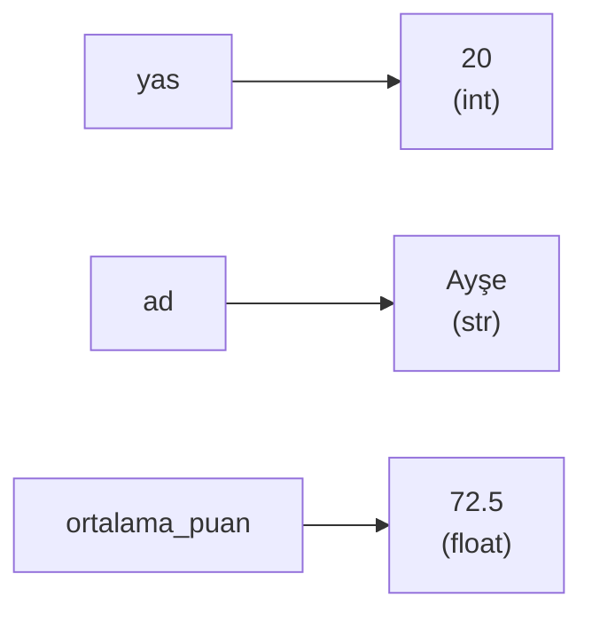
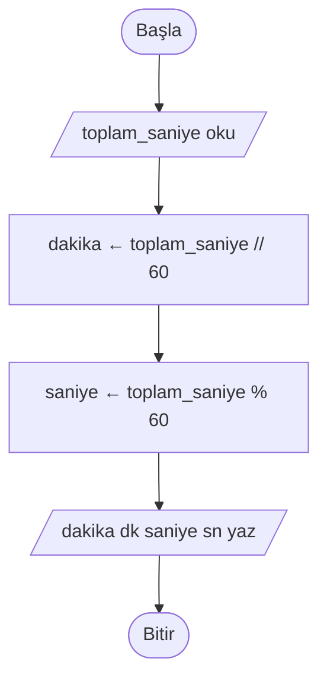
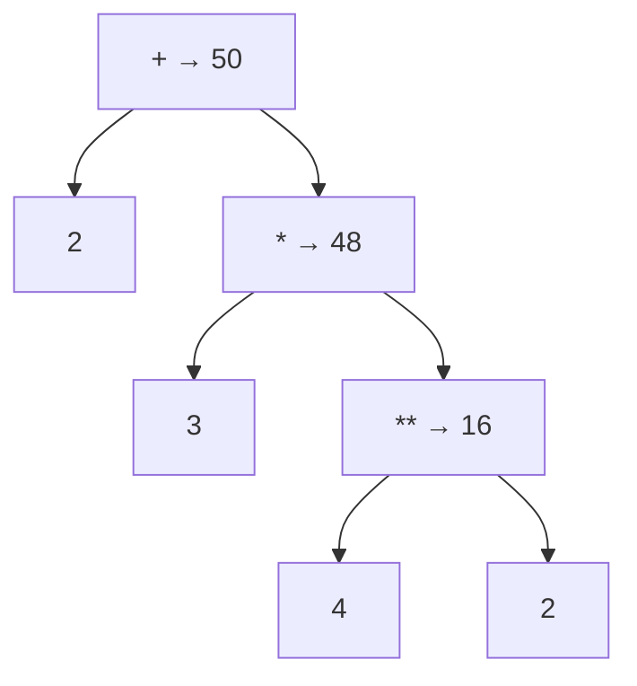

# 🔢 M6 - Sabitler, Değişkenler, Operatörler ve İşlem Öncelikleri

<p align="center"><em>Hafta 6</em></p>

## ❔ Öğrenme hedefleri

Bu modülün sonunda öğrenci:

* Değişken ve sabit kavramlarını ayırt eder, PEP 8'e uygun anlamlı isimler verir
* Aritmetik, karşılaştırma, mantıksal ve atama operatörlerini kullanır
* Atama (`=`) ile eşitlik karşılaştırmasını (`==`) birbirinden ayırır
* İşlem önceliği kurallarına göre bir ifadenin sonucunu elle hesaplar, gerektiğinde parantezle netleştirir
* Bir ifade dizisini iz tablosu (trace table) ile adım adım yürütür
* Kayan noktalı sayılarla çalışırken yuvarlama hatalarının farkına varır
* Formülleri (alan, dönüşüm, vergi hesabı gibi) sözde koda ve Python'a dönüştürür

---

## 1. Değişken nedir? Bellekte değişkenler { #1-degisken-nedir }

Bir program çalışırken bazı değerleri "aklında tutmak" zorundadır: kullanıcının girdiği yaş, sepetteki
ürünlerin toplamı, oyundaki puan. **Değişken** (variable), bir değere verdiğimiz **isimdir**. En basit
zihinsel model, değişkeni üzerinde etiket olan bir kutu gibi düşünmektir: etiket değişkenin adı, kutunun
içi de o anki değeridir.

```text
BAŞLA
    yas ← 19
    ad ← "Ayşe"
    yas ← yas + 1       // kutunun içindeki değer değişti, etiket aynı kaldı
    YAZ ad, yas
BİTİR
```

```python
yas = 19
ad = "Ayşe"
yas = yas + 1
print(ad, yas)  # Ayşe 20
```

Python'da değişken oluşturmak için ayrı bir "tanımlama" adımı yoktur. Bir isme ilk kez değer atadığınız
anda değişken oluşur. Değerin tipi (`int`, `float`, `str`, `bool`; bkz.
[M5](../m5_giris_cikis_veri_tipleri/README.md)) değere göre belirlenir.



!!! note "Kutu mu, etiket mi?"

    Kutu benzetmesi bu ders için yeterlidir. Teknik olarak Python'da değişken, bellekteki bir
    **nesneyi** (object) gösteren bir isimdir: `yas = yas + 1` satırı kutunun içini değiştirmez,
    `yas` etiketini yeni bir `20` nesnesine yapıştırır. Yukarıdaki diyagram bu "isim → nesne"
    görüşünü çizer. Bu fark, listeleri işlediğimiz M8'de önem kazanacak.

Değişkenin adı "değişken" çünkü değeri program boyunca değişebilir. Bir değişkenin **o anki** değeri,
kendisine yapılan **son** atamadır. Bu yüzden kodu yukarıdan aşağıya, satır satır okumak gerekir.

!!! example "Kendinizi deneyin"

    Aşağıdaki kod çalıştığında ekrana ne yazılır?

    ```python
    puan = 10
    puan = 25
    bonus = puan
    puan = 0
    print(bonus, puan)
    ```

    ??? success "Cevap"

        `25 0`. `bonus = puan` satırı çalıştığında `puan` değeri 25'tir; `bonus` bu değeri alır.
        Sonradan `puan`'ı 0 yapmak `bonus`'u etkilemez.

## 2. Sabitler ve isimlendirme kuralları

### 2.1 Sabitler

**Sabit** (constant), program boyunca değişmemesi gereken bir değerdir: KDV oranı, bir dakikadaki saniye
sayısı, geçme notu. Sabitleri isimlendirmek iki fayda sağlar: kod okunur hâle gelir ve değer
değişirse (ör. KDV oranı güncellenirse) tek bir yerde düzeltmek yeter.

```python
KDV_ORANI = 0.20
GECME_NOTU = 50
SANIYE_PER_DAKIKA = 60

fiyat = 250
kdvli_fiyat = fiyat * (1 + KDV_ORANI)
```

`fiyat * 1.2` yazmak da aynı sonucu verir; ama altı ay sonra koda bakan biri `1.2`'nin ne olduğunu
tahmin etmek zorunda kalır. Koda açıklamasız gömülmüş bu tür sayılara **sihirli sayı** (magic number)
denir ve kaçınılması gerekir.

!!! warning "Python'da gerçek sabit yoktur"

    Bazı dillerde (C'de `const`, Java'da `final`) sabitin değiştirilmesini dil engeller. Python'da böyle
    bir mekanizma yoktur: `KDV_ORANI = 0.18` yazarsanız Python itiraz etmez. Sabit olduğunu yalnızca
    **BÜYÜK_HARF** yazım geleneğiyle belirtiriz. Bu, programcılar arasında bir sözdür: "büyük harfle
    yazılmış bir ismin değerini değiştirme."

### 2.2 İsimlendirme kuralları

Python'un kesin kuralları (uymazsanız program hiç çalışmaz):

| Kural | Geçerli | Geçersiz |
|---|---|---|
| Harf ya da alt çizgi (`_`) ile başlar | `toplam`, `_gizli` | `2sayi` |
| Yalnızca harf, rakam ve alt çizgi içerir | `ogrenci_sayisi`, `not1` | `ogrenci-sayisi`, `not 1` |
| Büyük/küçük harfe duyarlıdır | `Yas` ile `yas` farklı değişkenlerdir | – |
| Ayrılmış kelime (keyword) olamaz | `sinif` | `class`, `if`, `for`, `True` |

**Kurallara ek olarak iyi alışkanlıklar** (Python'un resmî stil rehberi
[PEP 8](https://peps.python.org/pep-0008/)):

* Değişken ve fonksiyon isimleri **snake_case** yazılır: küçük harf, kelimeler alt çizgiyle ayrılır
  (`ogrenci_sayisi`, `ortalama_puan`).
* Sabitler **BÜYÜK_HARF_SNAKE_CASE** yazılır (`KDV_ORANI`).
* Tek harfli `l` (küçük L), `O` (büyük o) ve `I` (büyük ı) isimleri kullanılmaz; `1` ve `0` ile
  karışır.
* İsim, içindekini anlatmalıdır: `x` yerine `sicaklik`, `t` yerine `toplam_tutar`.

!!! tip "Türkçe karakterler"

    Python 3, `öğrenci_sayısı` gibi Türkçe karakterli isimleri kabul eder. Yine de bu derste kod içi
    isimleri **ASCII** yazıyoruz (`ogrenci_sayisi`): farklı klavye düzenlerinde ve araçlarda sorun
    çıkarmaz. Yorumlar ve metinler (`"Merhaba, Ayşe!"`) Türkçe karakterli olabilir.

## 3. Aritmetik operatörler

**Operatör** (operator), bir veya daha fazla değer (işlenen, operand) üzerinde işlem yapan semboldür.
Değerler, değişkenler ve operatörlerden oluşan ve bir sonuç üreten parçaya **ifade** (expression) denir:
`fiyat * 2 + 5` bir ifadedir.

| Operatör | Anlamı | Örnek | Sonuç |
|---|---|---|---|
| `+` | toplama | `7 + 2` | `9` |
| `-` | çıkarma | `7 - 2` | `5` |
| `*` | çarpma | `7 * 2` | `14` |
| `/` | bölme (sonuç her zaman `float`) | `7 / 2` | `3.5` |
| `//` | tam sayı bölmesi (bölüm) | `7 // 2` | `3` |
| `%` | mod (kalan) | `7 % 2` | `1` |
| `**` | üs alma | `7 ** 2` | `49` |

`/` ile `//` farkı M1 §2'deki ortalama örneğinde gördüğümüz tuzaktır: `(3 + 4) / 2` sonucu `3.5`,
`(3 + 4) // 2` sonucu `3`'tür.

### 3.1 `//` ve `%` ne işe yarar?

Bu iki operatör, "kaç tane tam sığar, geriye ne kalır?" sorusunun cevabıdır. İlkokuldaki bölme
işlemini düşünün: 17'yi 5'e bölünce bölüm 3, kalan 2'dir. Python'da `17 // 5` → `3`, `17 % 5` → `2`.

**Örnek 1: saniyeyi dakika ve saniyeye çevirmek.** Bir müzik uygulaması şarkı süresini 245 saniye
olarak saklıyor, ekranda "4 dk 5 sn" göstermek istiyoruz.

```text
BAŞLA
    OKU toplam_saniye
    dakika ← toplam_saniye // 60      // 60 saniye kaç kez tam sığar?
    saniye ← toplam_saniye % 60       // geriye kalan saniye
    YAZ dakika, " dk ", saniye, " sn"
BİTİR
```



```python
toplam_saniye = 245
dakika = toplam_saniye // 60  # 4
saniye = toplam_saniye % 60  # 5
print(f"{dakika} dk {saniye} sn")  # 4 dk 5 sn
```

Aynı fikri saat ekleyerek genişleten çözüm `exercise_files/operator_zaman.py` dosyasındadır.

**Örnek 2: çift mi, tek mi?** Bir sayı 2'ye bölündüğünde kalan 0 ise çifttir: `sayi % 2 == 0`. Aynı
yöntemle "5'in katı mı?" (`sayi % 5 == 0`) ya da "son basamağı ne?" (`sayi % 10`) sorularını da
cevaplayabilirsiniz. Çözüm: `exercise_files/operator_cift_tek.py`.

!!! warning "Negatif sayılarda `//` ve `%`"

    Python'da `//` sonucu her zaman **aşağıya** (eksi sonsuza doğru) yuvarlar, sıfıra doğru değil:

    ```python
    >>> 7 // 2
    3
    >>> -7 // 2
    -4      # -3.5 aşağı yuvarlanır: -4 (-3 değil!)
    >>> -7 % 2
    1       # çünkü -4 * 2 + 1 = -7
    ```

    Bazı diller (C, Java) burada `-3` ve `-1` verir. Negatif sayılarla `//` ve `%` kullanıyorsanız
    sonucu mutlaka bir örnekle kontrol edin. Güzel bir yan etki: Python'da `sayi % 2` negatif
    sayılar için de her zaman `0` ya da `1` olur, bu yüzden çift/tek testi negatiflerde de doğru çalışır.

### 3.2 Kayan nokta tuzağı: `0.1 + 0.2`

Python'a `0.1 + 0.2` yazdırın:

```python
>>> 0.1 + 0.2
0.30000000000000004
>>> 0.1 + 0.2 == 0.3
False
```

Bu Python'un bir hatası değildir. Bilgisayar `float` değerleri ikilik sistemde saklar ve `0.1` gibi
bazı ondalık sayılar ikilik sistemde tam olarak yazılamaz (tıpkı 1/3'ün onluk sistemde `0.333...`
diye sonsuza kadar gitmesi gibi). Sonuçta çok küçük bir yuvarlama farkı oluşur. Ne yapmalı?

| Durum | Çözüm | Örnek |
|---|---|---|
| Sonucu ekranda göstermek | `round(sayi, basamak)` ile yuvarla | `round(0.1 + 0.2, 2)` → `0.3` |
| İki `float` değeri karşılaştırmak | `==` yerine `math.isclose` | `math.isclose(0.1 + 0.2, 0.3)` → `True` |
| Para hesabı | Kuruş cinsinden tam sayı (`int`) kullan | `1050` kuruş = 10,50 TL |

```python
import math

toplam = 0.1 + 0.2
print(round(toplam, 2))  # 0.3
print(math.isclose(toplam, 0.3))  # True
```

`import math` satırı, Python'un hazır matematik araçlarını (`math.pi`, `math.sqrt`, `math.isclose`)
kullanıma açar. Kural olarak **iki `float` değeri asla `==` ile karşılaştırmayın.**

## 4. Karşılaştırma ve mantıksal operatörler

### 4.1 Karşılaştırma operatörleri

Karşılaştırma operatörleri iki değeri kıyaslar ve sonuç olarak her zaman `bool` (`True` ya da `False`)
üretir. Bu sonuçlar M7'deki kararların hammaddesidir.

| Python | Sözde kod | Anlamı | Örnek | Sonuç |
|---|---|---|---|---|
| `==` | `=` | eşit mi? | `5 == 5` | `True` |
| `!=` | `≠` | eşit değil mi? | `5 != 3` | `True` |
| `<` | `<` | küçük mü? | `2 < 1` | `False` |
| `>` | `>` | büyük mü? | `2 > 1` | `True` |
| `<=` | `≤` | küçük veya eşit mi? | `50 <= 50` | `True` |
| `>=` | `≥` | büyük veya eşit mi? | `49 >= 50` | `False` |

Python matematikteki gibi zincirleme karşılaştırmaya izin verir: `0 <= puan <= 100`, "puan 0 ile 100
arasında mı?" anlamına gelir.

### 4.2 Mantıksal operatörler

Birden fazla koşulu birleştirmek için üç mantıksal operatör vardır:

| Python | Sözde kod | Anlamı | Ne zaman `True`? |
|---|---|---|---|
| `and` | `VE` | ve | İki taraf da `True` ise |
| `or` | `VEYA` | veya | En az bir taraf `True` ise |
| `not` | `DEĞİL` | değil | Tek işlenen `False` ise (tersini alır) |

**Doğruluk tablosu** (truth table), bir mantıksal ifadenin tüm olası girdiler için sonucunu gösterir:

| `a` | `b` | `a and b` | `a or b` | `not a` |
|---|---|---|---|---|
| `True` | `True` | `True` | `True` | `False` |
| `True` | `False` | `False` | `True` | `False` |
| `False` | `True` | `False` | `True` | `True` |
| `False` | `False` | `False` | `False` | `True` |

Günlük hayattan: sinemaya öğrenci indirimiyle girmek için "öğrenci kartın var **ve** seans hafta içi"
olmalıdır (`and`). Kargo bedava olsun diye "sepet 500 TL üstü **veya** premium üyesin" yeterlidir
(`or`).

```python
yas = 20
ehliyet_var = True
arac_kullanabilir = yas >= 18 and ehliyet_var  # True
hafta_sonu = False
alarm_calsin = not hafta_sonu  # True
```

!!! tip "Kısa devre (short-circuit)"

    Python `and` ifadesinde sol taraf `False` ise sağ tarafa hiç bakmaz; sonuç zaten `False`'tur.
    `or`'da sol taraf `True` ise aynı şekilde sağa geçmez. Bu, `bolen != 0 and sayi / bolen > 2`
    gibi ifadelerde sıfıra bölme hatasını önler.

## 5. Atama operatörleri { #5-atama-operatorleri }

### 5.1 `=` atamadır, `==` karşılaştırmadır

Matematikte `x = 5` "x, 5'e eşittir" demektir. Python'da ise `=` **atama**dır: "sağdaki ifadeyi hesapla,
sonucu soldaki isme ver." Bu yüzden matematikte anlamsız olan `sayac = sayac + 1` Python'da çok
yaygındır: "sayacın şimdiki değerine 1 ekle, sonucu yine sayaca koy."

| | `=` | `==` |
|---|---|---|
| Anlamı | Atama: sağdaki değeri sola koy | Karşılaştırma: iki taraf eşit mi? |
| Sonucu | Değer üretmez, bir **deyimdir** (statement) | `True` ya da `False` |
| Sözde kodda | `←` | `=` |
| Örnek | `puan = 85` | `puan == 85` |

Sözde kodda atamaya `←` kullanmamızın nedeni tam olarak bu karışıklığı önlemektir. `=` ile `==`'yi
karıştırmak, M7'de kararları yazarken en sık yapılan hatalardan biridir.

### 5.2 Bileşik atama

Bir değişkeni kendi eski değeriyle güncellemek o kadar sık yapılır ki kısaltmaları vardır:

| Kısa yazım | Uzun yazım | Örnek: `x = 10` iken sonuç |
|---|---|---|
| `x += 3` | `x = x + 3` | `13` |
| `x -= 3` | `x = x - 3` | `7` |
| `x *= 3` | `x = x * 3` | `30` |
| `x /= 4` | `x = x / 4` | `2.5` |
| `x //= 4` | `x = x // 4` | `2` |
| `x %= 4` | `x = x % 4` | `2` |
| `x **= 2` | `x = x ** 2` | `100` |

Örneğin bir kafeteryada sepete ürün eklerken `toplam += fiyat` yazarız. Bu kalıbı M8'de döngülerle
sürekli kullanacağız.

### 5.3 İz tablosu ile yürütme

**İz tablosu** (trace table), bir programı kâğıt üzerinde satır satır çalıştırıp her adımdan sonra
değişkenlerin değerini not ettiğimiz tablodur. Hata ayıklamanın en temel yöntemidir; M4'te gördüğümüz
[Python Tutor](https://pythontutor.com/) bu tabloyu sizin için otomatik çizer.

```python
a = 7
b = 2
c = a // b
d = a % b
a = a + d * b
b **= 2
e = a > b and not c == 3
```

| Satır | Kod | `a` | `b` | `c` | `d` | `e` |
|---|---|---|---|---|---|---|
| 1 | `a = 7` | 7 | – | – | – | – |
| 2 | `b = 2` | 7 | 2 | – | – | – |
| 3 | `c = a // b` | 7 | 2 | 3 | – | – |
| 4 | `d = a % b` | 7 | 2 | 3 | 1 | – |
| 5 | `a = a + d * b` | **9** | 2 | 3 | 1 | – |
| 6 | `b **= 2` | 9 | **4** | 3 | 1 | – |
| 7 | `e = a > b and not c == 3` | 9 | 4 | 3 | 1 | **False** |

5\. satırda önce `d * b` (1 × 2 = 2) hesaplanır, sonra `a`'ya eklenir: 7 + 2 = 9. 7. satırda
`a > b` → `True`, `c == 3` → `True`, `not True` → `False`, `True and False` → `False`. Bu sıranın
neden böyle olduğunu bir sonraki bölüm açıklıyor.

## 6. İşlem öncelikleri { #6-islem-oncelikleri }

`2 + 3 * 4` ifadesinin sonucu 20 mi, 14 mü? Matematikteki gibi çarpma toplamadan önce yapılır, sonuç
**14**'tür. Python, bir ifadede birden çok operatör olduğunda hangisinin önce uygulanacağını **işlem
önceliği** (operator precedence) kurallarıyla belirler. Bu derste kullandığımız operatörler için tablo
(en yüksek öncelik en üstte):

| Öncelik | Operatör | Açıklama |
|---|---|---|
| 1 (en yüksek) | `( )` | Parantez içi |
| 2 | `**` | Üs alma (**sağdan sola**) |
| 3 | `-x`, `+x` | Tekli eksi / artı |
| 4 | `*`, `/`, `//`, `%` | Çarpma, bölme, tam bölme, mod |
| 5 | `+`, `-` | Toplama, çıkarma |
| 6 | `==`, `!=`, `<`, `>`, `<=`, `>=` | Karşılaştırmalar |
| 7 | `not` | Mantıksal değil |
| 8 | `and` | Mantıksal ve |
| 9 (en düşük) | `or` | Mantıksal veya |

Aynı öncelikteki operatörler **soldan sağa** uygulanır: `10 - 4 - 3` → `(10 - 4) - 3` → `3`. Tek
istisna `**`'dır: `2 ** 3 ** 2` → `2 ** (3 ** 2)` → `2 ** 9` → `512`. Atama (`=`, `+=`) bir operatör
değil deyim olduğu için her zaman en son, bütün ifade hesaplandıktan sonra yapılır. Tam tablo için
[Python belgelerine](https://docs.python.org/3/reference/expressions.html#operator-precedence) bakın.

Bir ifadenin nasıl hesaplandığını bir **ifade ağacı** ile çizebiliriz. `2 + 3 * 4 ** 2` için:



Ağaç aşağıdan yukarıya hesaplanır: önce `4 ** 2 = 16`, sonra `3 * 16 = 48`, en son `2 + 48 = 50`.
Öncelik ne kadar yüksekse düğüm o kadar aşağıdadır.

!!! warning "İki klasik tuzak"

    * `-2 ** 2` sonucu `4` değil **`-4`**'tür: `**` tekli eksiden önce gelir, yani ifade `-(2 ** 2)`
      olarak okunur. `(-2) ** 2` yazarsanız `4` elde edersiniz.
    * Ortalama hesabında `a + b / 2` yazmak `a + (b / 2)` demektir. Doğrusu `(a + b) / 2`.

**Parantezle netleştirin.** Önceliği ezberlemek yerine, niyetinizi parantezle açıkça yazmak çoğu zaman
daha iyidir. `x > 0 and y > 0 or z` ifadesi doğru çalışsa bile `(x > 0 and y > 0) or z` okuyana
düşünme zahmeti bırakmaz. Parantez gereksiz olsa bile zarar vermez.

!!! example "Kendinizi deneyin"

    Her ifadenin sonucunu önce elle bulun, sonra Python'da kontrol edin.

    1. `10 - 2 * 3 + 1`
    2. `17 % 5 * 2`
    3. `(1 + 2) ** 2 // 4`
    4. `not 3 > 5 and 2 == 2`

    ??? success "Cevap"

        1. `2 * 3 = 6`, sonra soldan sağa `10 - 6 = 4`, `4 + 1 = 5` → **5**
        2. `%` ve `*` aynı öncelikte, soldan sağa: `17 % 5 = 2`, `2 * 2 = 4` → **4**
        3. Parantez: `3`, üs: `9`, tam bölme: `9 // 4 = 2` → **2**
        4. Karşılaştırmalar önce: `3 > 5` → `False`, `2 == 2` → `True`. Sonra `not False` → `True`.
           En son `True and True` → **True**

## 7. Formülden koda

Öğrendiklerimizi birleştirelim. Bir formülü koda çevirirken izlenecek yol hep aynıdır: girdileri ve
sabitleri belirle, formülü parantezleriyle birlikte sözde koda yaz, sonra Python'a aktar.

**Örnek: Celsius'tan Fahrenheit'a.** Formül: F = C × 9/5 + 32.

```text
BAŞLA
    OKU celsius
    fahrenhayt ← celsius * 9 / 5 + 32
    YAZ fahrenhayt
BİTİR
```

```python
def fahrenhayta_cevir(celsius: float) -> float:
    """Celsius cinsinden sıcaklığı Fahrenheit'a çevirir."""
    return celsius * 9 / 5 + 32
```

Öncelik kuralları burada bize yardım ediyor: `*` ve `/` soldan sağa, sonra `+ 32`. Kontrol: su 100 °C'de
kaynar, `100 * 9 / 5 + 32` → `212.0` °F. Doğru.

Hesabı M1'deki gibi bir fonksiyonun içine koyuyoruz; böylece testler onu farklı girdilerle
deneyebiliyor. Fonksiyonların ayrıntısını M9'da göreceğiz. `exercise_files/degisken_formul.py`
dosyasında bu dönüşüm, daire alanı (`math.pi` sabitiyle) ve KDV'li fiyat hesabı (`KDV_ORANI` sabitiyle)
birlikte yer alır.

## 8. Alıştırmalar

Çalışan çözümler ve testleri `exercise_files/` klasöründedir:

```bash
uv run pytest m6_degiskenler_operatorler
```

1. **İsim avı.** Aşağıdaki isimlerden hangileri Python'da geçersizdir, hangileri geçerli ama PEP 8'e
   aykırıdır? `ogrenciSayisi`, `2nci_sinif`, `toplam-tutar`, `KDV_ORANI`, `if`, `_gecici`, `l`,
   `ortalama_puan`.
2. **İz tablosu.** Aşağıdaki kod için §5.3'teki gibi bir iz tablosu çizin, sonra
   [Python Tutor](https://pythontutor.com/) ile kontrol edin.

    ```python
    x = 5
    y = x * 2
    x += y
    y = x % 4
    z = x // y > 3 or y == 0
    ```

3. **Zaman dönüşümü.** `operator_zaman.py` dosyasındaki `saat_dakika_saniye` fonksiyonunu inceleyin.
   Önce sözde kodunu yazın, sonra fonksiyonu gün de gösterecek şekilde (`"1 gün 2 sa 0 dk 5 sn"`)
   genişletin ve yeni bir test ekleyin.
4. **Çift / tek.** `operator_cift_tek.py` dosyasındaki `cift_mi` fonksiyonunun yanına, bir sayının
   son basamağını döndüren `son_basamak(sayi)` fonksiyonunu `%` ile yazın. Negatif sayılar için ne
   olmalı? (İpucu: §3.1'deki uyarı kutusu.)
5. **Formüller.** `degisken_formul.py` dosyasına vücut kitle indeksini (kilo / boy²) hesaplayan bir
   fonksiyon ekleyin. Boy metre cinsindendir. `kilo / boy ** 2` ile `kilo / boy * boy` aynı sonucu
   verir mi? Neden?
6. **Kayan nokta.** `0.1 + 0.1 + 0.1 == 0.3` sonucunu tahmin edin, deneyin ve `math.isclose` ile doğru
   bir karşılaştırma yazın.

---

## Özet

Değişken bir değere verilen isimdir; değeri son atamayla belirlenir ve program boyunca değişebilir.
Sabitler değişmemesi gereken değerlerdir; Python bunu zorunlu kılmaz, BÜYÜK_HARF yazım geleneğiyle
belirtiriz. İsimler kurallara (harfle başla, boşluk yok, ayrılmış kelime değil) ve PEP 8'e (snake_case)
uymalıdır. `=` atama, `==` karşılaştırmadır. Aritmetik operatörler arasında `//` ve `%` bölüm-kalan
sorularını çözer; `/` her zaman `float` verir ve `float` karşılaştırmalarında `math.isclose` kullanılır.
Karşılaştırma ve mantıksal operatörler `True`/`False` üretir. Birden çok operatör içeren ifadeler işlem
önceliğine göre hesaplanır; şüphe durumunda parantez kullanın, emin olmak için iz tablosu çizin. Bir
sonraki modülde bu `True`/`False` değerlerini kullanarak programın hangi yoldan gideceğine karar
vereceğiz: [M7 - Karar Yapıları](../m7_karar_yapilari/README.md).

## İleri okuma

* [CS50P, Hafta 0: Functions, Variables](https://cs50.harvard.edu/python/weeks/0/). Değişkenler,
  `int`/`float` işlemleri ve yuvarlama üzerine video ve notlar.
* Allen B. Downey, [*Think Python*, 3. baskı, 2. bölüm: Variables and Statements](https://allendowney.github.io/ThinkPython/chap02.html).
  Değişkenler, atama ve ifadeler.
* [Python belgeleri: Floating-Point Arithmetic: Issues and Limitations](https://docs.python.org/3/tutorial/floatingpoint.html).
  `0.1 + 0.2` sorununun ayrıntılı açıklaması.

## Kaynaklar

* [PEP 8 – Style Guide for Python Code](https://peps.python.org/pep-0008/). §2.2'deki isimlendirme
  gelenekleri.
* [Python belgeleri: Lexical analysis, "Identifiers and keywords"](https://docs.python.org/3/reference/lexical_analysis.html#identifiers).
  İsimlendirme kuralları ve ayrılmış kelimeler.
* [Python belgeleri: Expressions, "Operator precedence"](https://docs.python.org/3/reference/expressions.html#operator-precedence).
  §6'daki öncelik tablosunun kaynağı.
* [Python belgeleri: Built-in Types, "Numeric Types"](https://docs.python.org/3/library/stdtypes.html#numeric-types-int-float-complex).
  `//` ve `%` operatörlerinin negatif sayılardaki davranışı.
* [Python belgeleri: `math.isclose`](https://docs.python.org/3/library/math.html#math.isclose) ve
  [`round`](https://docs.python.org/3/library/functions.html#round).
* David Goldberg, "What Every Computer Scientist Should Know About Floating-Point Arithmetic",
  *ACM Computing Surveys* 23(1), 1991, s. 5–48. Kayan nokta aritmetiğinin klasik başvuru makalesi.
