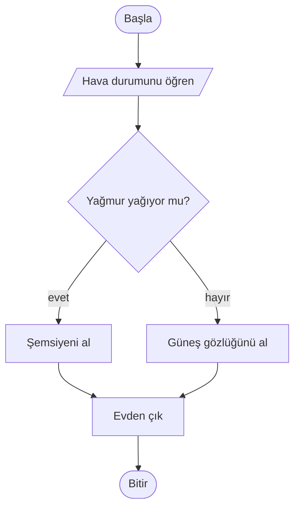
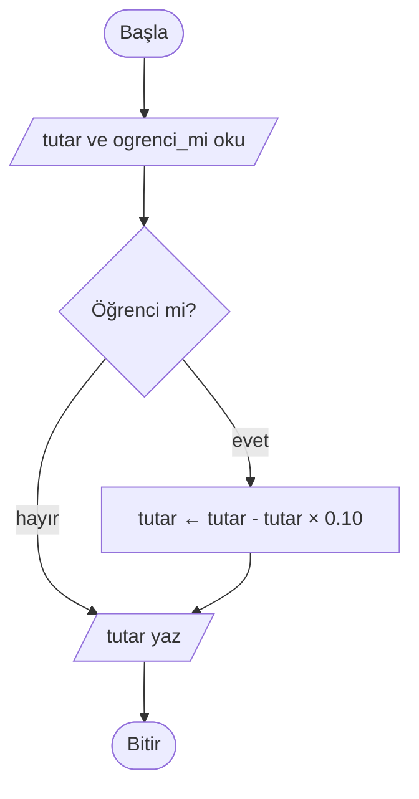
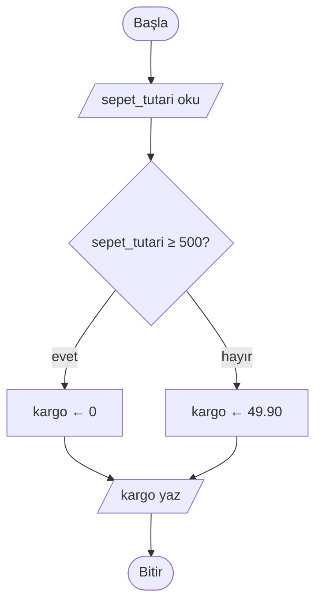
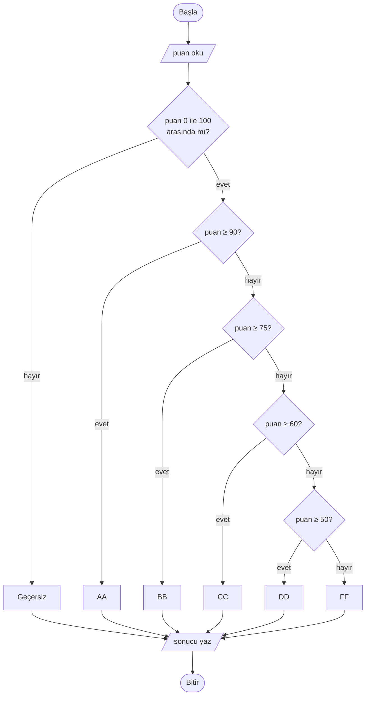
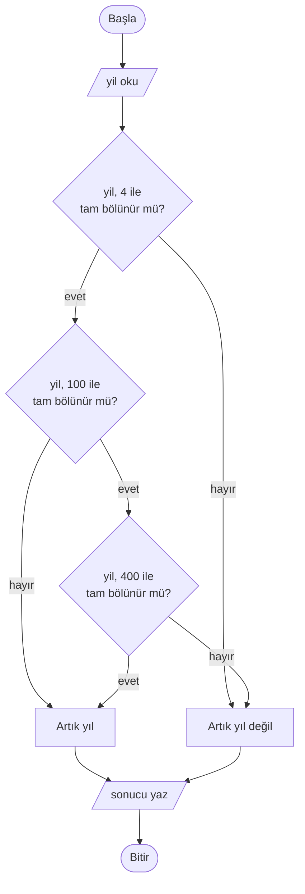
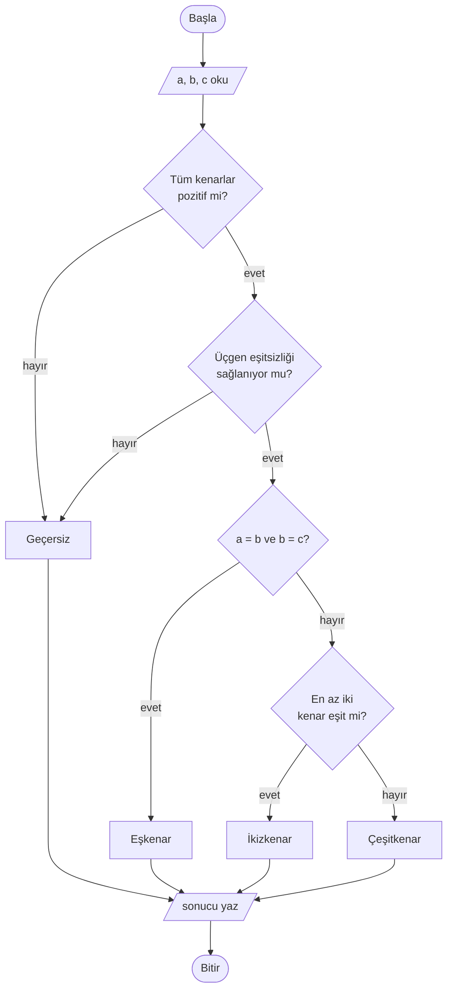

# 🔀 M7 - Karar Yapıları

<p align="center"><em>Hafta 7</em></p>

## ❔ Öğrenme hedefleri

Bu modülün sonunda öğrenci:

* Karar gerektiren problemleri akış şemasında karar elmasıyla ve sözde kodda `EĞER` yapısıyla gösterir
* `if`, `if-else` ve `if-elif-else` yapılarını doğru girintiyle yazar
* İç içe koşulları kurar ve gerektiğinde mantıksal operatörlerle (`and`, `or`) düzleştirir
* Çok yönlü kararlarda koşul sırasının sonucu nasıl etkilediğini açıklar
* Karar yapılarındaki yaygın hataları (`=` / `==`, girinti, kapsanmayan durumlar) tanır
* Her dal ve her sınır değer için test yazarak bir kararın doğruluğunu sınar

---

## 1. Karar yapısı nedir? { #1-karar-yapisi-nedir }

Şimdiye kadar yazdığımız programlar her çalıştığında aynı adımları, aynı sırayla uyguladı. Gerçek
problemlerin çoğunda ise program, duruma göre farklı yollardan gitmelidir: şifre doğruysa giriş
yapılır, değilse hata gösterilir; sepet 500 TL'yi geçerse kargo bedavadır; not 50'nin altındaysa ders
tekrarlanır. Bir koşula bakıp hangi adımların uygulanacağını seçen yapıya **karar yapısı** (selection,
decision structure) denir.

Her karar, cevabı **evet** ya da **hayır** olan bir sorudur. M6'da gördüğümüz karşılaştırma
(`puan >= 50`) ve mantıksal (`yas >= 18 and ehliyet_var`) ifadeler tam olarak bu soruları üretir:
sonuçları `True` ya da `False`'tur. Akış şemasında karar, **elmas** (eşkenar dörtgen) ile gösterilir ve
elmastan çıkan iki ok, iki olası cevabı temsil eder.



İki önemli nokta: (1) Karar elmasından çıkan her ok etiketlenir ("evet" / "hayır"). (2) Yollar bir
süre ayrı gider ama sonunda yeniden **birleşir**; program bir sonraki ortak adımdan devam eder.

Karar yapıları üç biçimde karşımıza çıkar:

| Yapı | Sözde kod | Python | Ne zaman? |
|---|---|---|---|
| Tek yönlü | `EĞER ... İSE` | `if` | Koşul doğruysa ek bir iş yap, değilse hiçbir şey yapma |
| İki yönlü | `EĞER ... İSE / DEĞİLSE` | `if` / `else` | İki seçenekten tam olarak biri |
| Çok yönlü | `EĞER / DEĞİLSE EĞER / DEĞİLSE` | `if` / `elif` / `else` | Üç veya daha fazla seçenekten tam olarak biri |

### Python'da girinti

Python'da bir koşula bağlı satırlar, koşuldan sonra gelen **iki nokta** (`:`) ve **4 boşluk
girinti** (indentation) ile belirtilir. Girintili satırlar bir **blok** oluşturur; girinti bittiği anda
blok da biter. Birçok dilde bu iş süslü parantezle (`{ }`) yapılır; Python'da girinti isteğe bağlı bir
süs değil, dilin kuralıdır.

```python
if yagmur_yagiyor:
    print("Şemsiyeni al")  # blok içinde: yalnızca koşul True ise çalışır
print("Evden çık")  # blok dışında: her durumda çalışır
```

## 2. Tek yönlü seçim (if)

Tek yönlü seçimde koşul doğruysa bir veya birkaç ek adım uygulanır; yanlışsa bu adımlar atlanır ve
program kaldığı yerden devam eder.

**Örnek: öğrenci indirimi.** Bir kırtasiye, öğrencilere %10 indirim yapıyor. İndirim yalnızca
öğrenciyse uygulanır; öğrenci değilse fiyat olduğu gibi kalır. "Değilse" durumunda yapılacak ayrı bir
iş olmadığı için tek yönlü seçim yeterlidir.

```text
BAŞLA
    OKU tutar, ogrenci_mi
    EĞER ogrenci_mi İSE
        tutar ← tutar - tutar * 0.10
    EĞER SONU
    YAZ tutar
BİTİR
```



```python
INDIRIM_ORANI = 0.10

tutar = 200.0
ogrenci_mi = True
if ogrenci_mi:
    tutar = tutar - tutar * INDIRIM_ORANI
print(tutar)  # 180.0
```

`ogrenci_mi` zaten bir `bool` olduğu için `if ogrenci_mi == True:` yazmaya gerek yoktur;
`if ogrenci_mi:` aynı anlama gelir ve daha okunaklıdır.

## 3. İki yönlü seçim (if-else)

İki yönlü seçimde koşul doğruysa bir yol, yanlışsa diğer yol izlenir. İki yoldan **tam olarak biri**
çalışır; ikisi birden ya da hiçbiri çalışmaz.

**Örnek: kargo ücreti.** Bir çevrimiçi mağaza, 500 TL ve üzeri siparişlerde kargoyu bedava yapıyor;
diğer siparişlerde 49,90 TL kargo ücreti alıyor.

```text
BAŞLA
    OKU sepet_tutari
    EĞER sepet_tutari ≥ 500 İSE
        kargo ← 0
    DEĞİLSE
        kargo ← 49.90
    EĞER SONU
    YAZ "Kargo: ", kargo
BİTİR
```



```python
UCRETSIZ_KARGO_ESIGI = 500
KARGO_UCRETI = 49.90


def kargo_ucreti(sepet_tutari: float) -> float:
    """Sepet tutarına göre kargo ücretini döndürür."""
    if sepet_tutari >= UCRETSIZ_KARGO_ESIGI:
        return 0
    else:
        return KARGO_UCRETI
```

Kararı M1'deki gibi bir fonksiyonun içine koyuyoruz; böylece testler farklı sepet tutarlarıyla onu
otomatik olarak deneyebiliyor. `return` satırı fonksiyonun sonucunu verir ve fonksiyonu bitirir.
Fonksiyonların ayrıntısını M9'da göreceğiz. İndirim ve kargoyu birleştiren tam çözüm
`exercise_files/karar_kargo.py` dosyasındadır.

!!! example "Kendinizi deneyin"

    Sepet tutarı tam olarak `500` olduğunda kargo ücreti nedir? Koşulu yanlışlıkla
    `sepet_tutari > 500` yazsaydık ne olurdu?

    ??? success "Cevap"

        `500 >= 500` → `True` olduğu için kargo **0** olur. Koşul `>` olsaydı `500 > 500` → `False`
        olur ve tam 500 TL'lik alışveriş yapan müşteriden haksız yere 49,90 TL alınırdı. Bu tür
        hatalar yalnızca **sınır değer** denendiğinde ortaya çıkar (bkz. [§6](#6-sinir-degerler)).

## 4. Çok yönlü seçim (if-elif-else, match-case)

Seçenek sayısı ikiden fazlaysa kararları zincirleriz. Python'da `elif` ("else if"in kısaltması),
sözde kodda `DEĞİLSE EĞER` kullanılır. Koşullar **yukarıdan aşağıya** sırayla denenir; **ilk** doğru
çıkan koşulun bloğu çalışır ve geri kalanlar atlanır. Hiçbiri doğru değilse `else` bloğu çalışır.

**Örnek: harf notu.** Bu örnekte basitleştirilmiş bir ölçek kullanıyoruz (üniversitenizin resmî ölçeği
farklı olabilir): 90–100 AA, 75–89 BB, 60–74 CC, 50–59 DD, 0–49 FF. 0–100 dışındaki puanlar geçersizdir.

```text
BAŞLA
    OKU puan
    EĞER puan < 0 VEYA puan > 100 İSE
        YAZ "Geçersiz"
    DEĞİLSE EĞER puan ≥ 90 İSE
        YAZ "AA"
    DEĞİLSE EĞER puan ≥ 75 İSE
        YAZ "BB"
    DEĞİLSE EĞER puan ≥ 60 İSE
        YAZ "CC"
    DEĞİLSE EĞER puan ≥ 50 İSE
        YAZ "DD"
    DEĞİLSE
        YAZ "FF"
    EĞER SONU
BİTİR
```



```python
def harf_notu(puan: float) -> str:
    """0-100 arası puanı harf notuna çevirir; aralık dışı puanlar için "Geçersiz" döndürür."""
    if puan < 0 or puan > 100:
        return "Geçersiz"
    elif puan >= 90:
        return "AA"
    elif puan >= 75:
        return "BB"
    elif puan >= 60:
        return "CC"
    elif puan >= 50:
        return "DD"
    else:
        return "FF"
```

`elif puan >= 75` satırında "ve 90'dan küçükse" dememize gerek yok: bu satıra gelindiyse önceki
koşulun (`puan >= 90`) yanlış olduğu zaten bellidir. Zincirin gücü buradadır: her koşul, öncekilerin
yanlış olduğunu varsayar.

### 4.1 Koşul sırası önemlidir

Aynı koşulları ters sırayla yazdığımızı düşünelim:

```python
if puan >= 50:
    return "DD"
elif puan >= 60:
    return "CC"
elif puan >= 75:
    return "BB"
elif puan >= 90:
    return "AA"
```

Puan 95 olsun. İlk koşul `95 >= 50` → `True`, fonksiyon `"DD"` döndürür ve diğer koşullara hiç
bakılmaz. Kod hata vermez ama 50'nin üstündeki **herkes** DD alır. Kural: `>=` ile yazılan aralık
zincirlerinde **en büyük eşikten başlayın** (ya da `<` ile yazıyorsanız en küçükten). Her koşulun,
kendisinden önceki koşulların kapsamadığı bir durumu yakaladığından emin olun.

!!! info "Ek bilgi: `match` ifadesi (Python 3.10+)"

    Bir değişkenin birkaç **sabit değerden** hangisine eşit olduğuna bakıyorsanız `if-elif` zinciri
    yerine `match` kullanılabilir:

    ```python
    match gun:
        case "Cumartesi" | "Pazar":
            mesaj = "Hafta sonu"
        case "Cuma":
            mesaj = "Hafta sonuna bir gün"
        case _:
            mesaj = "Hafta içi"
    ```

    `|` "veya" anlamına gelir, `case _` ise hiçbir `case` uymadığında çalışır (`else` gibi).
    `match`, aralık kontrolü (`puan >= 90`) için tasarlanmamıştır; bu derste çok yönlü kararlar için
    `if-elif-else` kullanacağız. Ayrıntı için
    [Python öğreticisindeki `match` bölümüne](https://docs.python.org/3/tutorial/controlflow.html#match-statements)
    bakın.

## 5. İç içe koşullar

Bir kararın dallarından birinin içinde başka bir karar bulunuyorsa **iç içe** (nested) koşuldan söz
ederiz. Bazı problemler doğal olarak böyle kurulur: önce bir soru sorulur, cevaba göre ikinci soruya
geçilir.

### 5.1 Örnek: artık yıl

Gregoryen takvimde bir yıl şu kurallarla **artık yıl** (leap year, 366 gün) sayılır:

1. 4'e tam bölünmüyorsa artık yıl **değildir** (2023).
2. 4'e bölünüyor ama 100'e bölünmüyorsa artık **yıldır** (2024).
3. 100'e bölünüyor ama 400'e bölünmüyorsa artık yıl **değildir** (1900, 2100).
4. 400'e bölünüyorsa artık **yıldır** (2000).

"Tam bölünme" M6'daki `%` operatörüyle sınanır: `yil % 4 == 0`.

```text
BAŞLA
    OKU yil
    EĞER yil % 4 = 0 İSE              // % : bölümden kalan (M6)
        EĞER yil % 100 = 0 İSE
            EĞER yil % 400 = 0 İSE
                artik ← DOĞRU
            DEĞİLSE
                artik ← YANLIŞ
            EĞER SONU
        DEĞİLSE
            artik ← DOĞRU
        EĞER SONU
    DEĞİLSE
        artik ← YANLIŞ
    EĞER SONU
    YAZ artik
BİTİR
```



İç içe Python sürümü:

```python
def artik_yil_mi(yil: int) -> bool:
    if yil % 4 == 0:
        if yil % 100 == 0:
            if yil % 400 == 0:
                return True
            else:
                return False
        else:
            return True
    else:
        return False
```

Girinti derinleştikçe kodu okumak zorlaşır. Aynı kuralları mantıksal operatörlerle tek bir koşulda
**düzleştirebiliriz**: "4'e bölünür **ve** (100'e bölünmez **veya** 400'e bölünür)".

```python
def artik_yil_mi(yil: int) -> bool:
    return yil % 4 == 0 and (yil % 100 != 0 or yil % 400 == 0)
```

Buradaki parantez şarttır: M6 §6'daki öncelik tablosuna göre `and`, `or`'dan önce uygulanır.
Parantez olmasaydı ifade `(yil % 4 == 0 and yil % 100 != 0) or yil % 400 == 0` olarak okunurdu. Bu
örnekte sonuç şans eseri aynı çıkar (400'e bölünen her sayı 4'e de bölünür), ama bu şansa güvenmek
yerine niyetinizi parantezle yazın.

!!! tip "İç içe mi, düz mü?"

    İki biçim de doğrudur. İç içe biçim, akış şemasını adım adım izlediği için ilk tasarımda daha
    kolaydır. Düz biçim daha kısadır ama doğruluk tablosunu kafada kurmayı gerektirir. Önce iç içe
    yazıp testlerle doğruladıktan sonra düzleştirmek güvenli bir yoldur: testler, düzleştirmenin
    davranışı değiştirmediğini size söyler.

### 5.2 Örnek: üçgen türü

Kenar uzunlukları `a`, `b`, `c` verilen bir üçgenin türünü bulalım. Önce bu üç uzunlukla bir üçgen
**çizilebilir mi**, ona bakmalıyız: her kenar pozitif olmalı ve her iki kenarın toplamı üçüncüsünden
büyük olmalıdır (üçgen eşitsizliği). Ancak geçerli bir üçgense türüne bakarız. Bu iki aşamalı yapı iç
içe bir karardır.

```text
BAŞLA
    OKU a, b, c
    EĞER a ≤ 0 VEYA b ≤ 0 VEYA c ≤ 0 İSE
        YAZ "Geçersiz"
    DEĞİLSE EĞER a + b ≤ c VEYA a + c ≤ b VEYA b + c ≤ a İSE
        YAZ "Geçersiz"
    DEĞİLSE
        EĞER a = b VE b = c İSE
            YAZ "Eşkenar"
        DEĞİLSE EĞER a = b VEYA b = c VEYA a = c İSE
            YAZ "İkizkenar"
        DEĞİLSE
            YAZ "Çeşitkenar"
        EĞER SONU
    EĞER SONU
BİTİR
```



Python çözümü `exercise_files/karar_ucgen.py` dosyasındadır. Eşkenar kontrolünün ikizkenardan
**önce** yapıldığına dikkat edin: eşkenar bir üçgen, "en az iki kenarı eşit" koşulunu da sağlar. Sıra
ters olsaydı hiçbir üçgen eşkenar çıkmazdı (§4.1'deki tuzağın aynısı).

## 6. Sınır değerlerin test edilmesi { #6-sinir-degerler }

Bir karar yapısı yazdığınızda "çalışıyor" demek için birkaç rastgele girdi denemek yetmez. Hatalar
çoğunlukla **sınırlarda** saklanır: `>` yerine `>=` yazmak, 89 ile 90 arasındaki geçişi kaydırmak,
0'ı ya da 100'ü unutmak. **Sınır değer testi** (boundary value testing) fikri basittir: her karar dalı
için en az bir test yaz ve her eşiğin **hemen altını**, **tam üstünü** ve **hemen üstünü** dene.

Harf notu için test planı:

| Dal / sınır | Girdi | Beklenen | Neyi yakalar? |
|---|---|---|---|
| Geçersiz (alt) | `-1` | `"Geçersiz"` | Negatif puan kontrolü unutulmuş mu? |
| FF alt sınırı | `0` | `"FF"` | 0 yanlışlıkla geçersiz sayılıyor mu? |
| FF / DD sınırı | `49`, `50` | `"FF"`, `"DD"` | 50'de `>` / `>=` karışıklığı |
| DD / CC sınırı | `59`, `60` | `"DD"`, `"CC"` | |
| CC / BB sınırı | `74`, `75` | `"CC"`, `"BB"` | |
| BB / AA sınırı | `89`, `90` | `"BB"`, `"AA"` | |
| AA üst sınırı | `100` | `"AA"` | 100 yanlışlıkla geçersiz sayılıyor mu? |
| Geçersiz (üst) | `101` | `"Geçersiz"` | Üst sınır kontrolü unutulmuş mu? |
| Ondalıklı | `89.5` | `"BB"` | Ondalıklı puanlar doğru dala düşüyor mu? |

Bu tablo doğrudan pytest testlerine dönüşür (`exercise_files/test_karar_harf_notu.py`):

```python
from karar_harf_notu import harf_notu


def test_ff_dd_siniri():
    assert harf_notu(49) == "FF"
    assert harf_notu(50) == "DD"


def test_gecersiz_puanlar():
    assert harf_notu(-1) == "Geçersiz"
    assert harf_notu(101) == "Geçersiz"
```

```bash
uv run pytest m7_karar_yapilari
```

§4.1'deki ters sıralı hatalı kod, bu testlerden `harf_notu(90) == "AA"` testinde hemen yakalanır.
Artık yıl için sınır değerler "özel" yıllardır (2023, 2024, 1900, 2000); kargo için tam `500` ve
hemen altı `499.99`'dur.

## 7. Yaygın hatalar

| Hata | Örnek | Ne olur? | Doğrusu |
|---|---|---|---|
| `=` ile `==`'yi karıştırmak | `if puan = 100:` | `SyntaxError`: program hiç çalışmaz | `if puan == 100:` |
| İki noktayı (`:`) unutmak | `if puan >= 50` | `SyntaxError` | `if puan >= 50:` |
| Girinti hatası | Blok içindeki satırlardan biri 2, diğeri 4 boşluk | `IndentationError` ya da satırın yanlış bloğa düşmesi | Her blokta tutarlı 4 boşluk |
| `or`'u yanlış kullanmak | `if gun == "Cumartesi" or "Pazar":` | Her zaman `True`: boş olmayan metin doğru sayılır | `if gun == "Cumartesi" or gun == "Pazar":` |
| `elif` yerine ayrı `if`'ler | Harf notunda her satırda `if` | 95 puan için hem AA hem BB hem CC... dalları çalışır | Birbirini dışlayan seçenekler için `elif` |
| Kapsanmayan durum | Harf notunda negatif puanı düşünmemek | `-5` için `"FF"` gibi anlamsız bir sonuç | Geçersiz girdiler için ayrı bir dal |
| `float` değerleri `==` ile karşılaştırmak | `if 0.1 + 0.2 == 0.3:` | `False` (M6 §3.2) | `math.isclose(...)` |

!!! warning "Sessiz hatalar daha tehlikelidir"

    Tablodaki ilk üç hata `SyntaxError` ya da `IndentationError` verir; Python programı çalıştırmadan
    sizi uyarır. Son dört hata ise **sessizdir**: program çalışır ama yanlış sonuç üretir. Bunları
    yalnızca testler, özellikle sınır değer testleri, yakalar.

## 8. Alıştırmalar

Çalışan çözümler ve testleri `exercise_files/` klasöründedir. Her alıştırmada önce sözde kodu ve
akış şemasını kâğıt üzerinde çizin, sonra koda geçin.

1. **Tek mi, iki mi, çok mu?** Aşağıdaki durumlar için hangi karar yapısının uygun olduğunu söyleyin
   ve sözde kodunu yazın: (a) Saat 22:00'yi geçtiyse telefonu sessize al. (b) Yaş 18 ve üzeriyse
   "Oy kullanabilir", değilse "Oy kullanamaz" yaz. (c) Vücut kitle indeksine (M6 alıştırma 5) göre
   "Zayıf / Normal / Fazla kilolu / Obez" sınıflandırması yap.
2. **Harf notu.** `karar_harf_notu.py` dosyasındaki ölçeği resmî ölçeğe genişletin (ör. BA, CB, DC
   aralıkları ekleyerek). Her yeni sınır için §6'daki gibi bir alt/üst test çifti ekleyin.
3. **Artık yıl.** `karar_artik_yil.py` dosyasındaki iç içe ve düz iki sürümün aynı sonucu verdiğini
   test eden `test_iki_surum_ayni` testini inceleyin. Python'un hazır `calendar.isleap` fonksiyonuyla
   da karşılaştırılıyor; neden bu bir "ikinci görüş" sağlar?
4. **Üçgen türü.** `karar_ucgen.py` dosyasına, üçgenin **dik üçgen** olup olmadığını
   (a² + b² = c², en uzun kenar c) söyleyen `dik_ucgen_mi(a, b, c)` fonksiyonunu ekleyin. Kenarlar
   ondalıklıysa neden `math.isclose` gerekir?
5. **Kargo ve indirim.** `karar_kargo.py` dosyasında kargo eşiği indirimden **önceki** tutara göre
   uygulanıyor. Mağaza kuralı "indirimden sonraki tutar 500 TL ve üzeriyse kargo bedava" olarak
   değişirse hangi satır değişir? Hangi test artık başarısız olur? Önce tahmin edin, sonra deneyin.
6. **Hata avı.** §7'deki tablodaki sessiz hatalardan birini `karar_harf_notu.py` içine bilerek
   ekleyin ve hangi testin başarısız olduğunu gözlemleyin.

---

## Özet

Karar yapısı, bir koşulun doğru ya da yanlış olmasına göre programın hangi adımları uygulayacağını
seçer. Akış şemasında elmasla, sözde kodda `EĞER ... İSE / DEĞİLSE / EĞER SONU` ile, Python'da `if`,
`elif`, `else` ve 4 boşluk girintiyle yazılır. Tek yönlü seçim ek bir iş yapar, iki yönlü seçim iki
yoldan birini, çok yönlü seçim ise ilk doğru koşulun yolunu izler; bu yüzden zincirde koşul sırası
sonucu belirler. İç içe koşullar mantıksal operatörlerle düzleştirilebilir, ancak parantez ve öncelik
kurallarına dikkat etmek gerekir. Bir kararın doğru olduğundan emin olmanın yolu, her dal ve her sınır
değer için test yazmaktır. Bir sonraki haftadaki Sprint A'da M1–M7 arasındaki her şeyi bir projede
birleştireceksiniz; ardından M8'de adımları tekrar etmeyi (döngüler) öğreneceğiz.

## İleri okuma

* [CS50P, Hafta 1: Conditionals](https://cs50.harvard.edu/python/weeks/1/). `if`, `elif`, `else`,
  `match` ve mantıksal operatörler üzerine video ve alıştırmalar.
* Allen B. Downey, [*Think Python*, 3. baskı, 5. bölüm: Conditionals and Recursion](https://allendowney.github.io/ThinkPython/chap05.html).
  Koşullu ifadeler ve iç içe koşullar.
* [PEP 636 – Structural Pattern Matching: Tutorial](https://peps.python.org/pep-0636/). `match`
  ifadesinin ayrıntılı öğreticisi.

## Kaynaklar

* [Python öğreticisi: More Control Flow Tools, "if Statements"](https://docs.python.org/3/tutorial/controlflow.html#if-statements).
  `if-elif-else` söz dizimi.
* [Python öğreticisi: "match Statements"](https://docs.python.org/3/tutorial/controlflow.html#match-statements).
  §4'teki ek bilgi kutusunun kaynağı.
* [Python belgeleri: `calendar.isleap`](https://docs.python.org/3/library/calendar.html#calendar.isleap).
  §5.1'deki artık yıl çözümünü karşılaştırdığımız hazır fonksiyon.
* Glenford J. Myers, Corey Sandler, Tom Badgett, *The Art of Software Testing*, 3. baskı, Wiley, 2011.
  Sınır değer analizi (boundary value analysis) ve klasik üçgen türü test problemi.
* ISO 5807:1985, *Information processing — Documentation symbols and conventions for data, program and
  system flowcharts*. Karar elması dahil akış şeması sembollerinin standardı.
