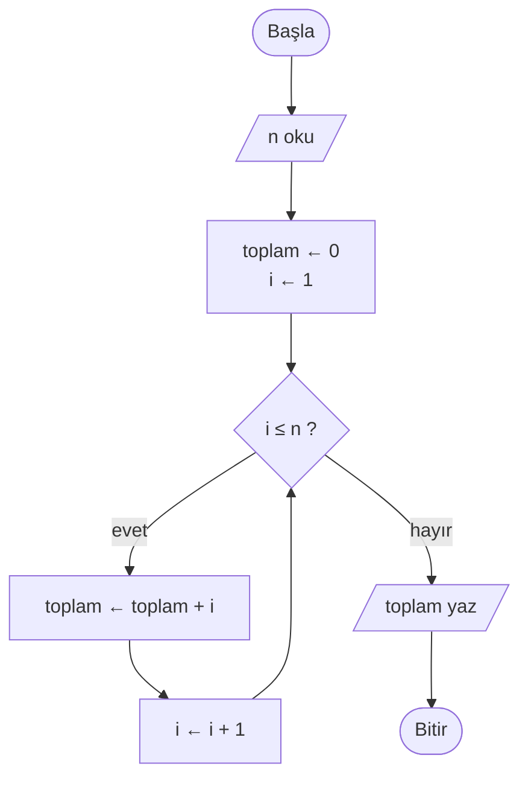
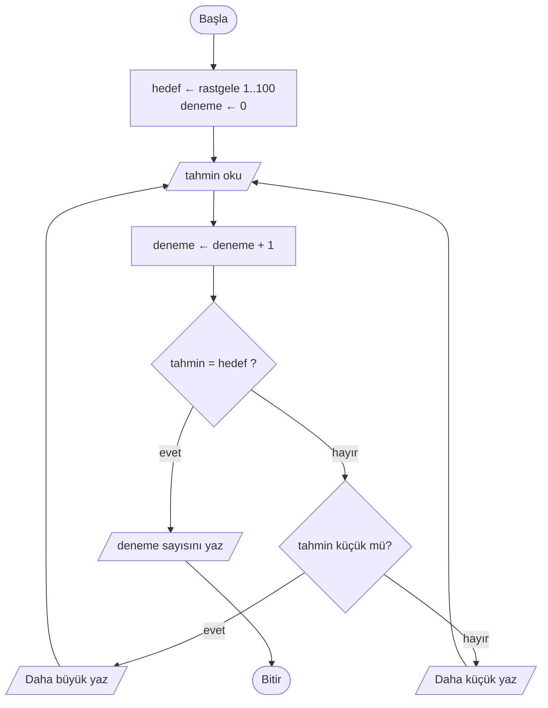

# 🔁 M8 - Döngüler

<p align="center"><em>Hafta 9</em></p>

## ❔ Öğrenme hedefleri

Bu modülün sonunda öğrenci:

* Tekrar gerektiren problemleri tanır ve döngüyle ifade eder; döngüyü akış şemasında gösterir
* Bir döngüyü iz tablosuyla elle yürütür ve her turda değişkenlerin değerini izler
* `while` (koşul kontrollü) ve `for` + `range()` (sayaç kontrollü) döngülerini uygun yerde kullanır
* Sayaç, toplayıcı (accumulator) ve en büyük/en küçük bulma kalıplarını uygular
* Sonsuz döngüleri tespit eder; `break` ve `continue` kullanır; iç içe döngü yazar
* Python listesi oluşturur, elemanlarına indeksle erişir ve listeyi döngüyle gezer

---

## 1. Tekrar yapısı ve akış şemasında döngü { #1-tekrar-yapisi }

Şimdiye kadar yazdığımız programlar yukarıdan aşağıya bir kez aktı. M7'de karar yapılarıyla akışı
ikiye ayırmayı öğrendik, ama hiçbir adım ikinci kez çalışmadı. Oysa gerçek problemlerin çoğu **tekrar**
içerir:

| Günlük iş | Tekrarlanan adım | Ne zaman durur? |
|---|---|---|
| Merdiven çıkmak | Bir basamak çık | Kata varınca |
| Sınav kâğıdı okumak | Bir kâğıdı oku, notunu yaz | Kâğıt kalmayınca |
| Çay demlenmesini beklemek | Bir dakika bekle, rengine bak | Rengi koyulaşınca |
| Telefon şifresi denemek | Şifreyi gir | Doğru girince ya da 5 hatalı denemede |

Her satırda iki parça var: tekrarlanan bir **gövde** ve tekrarın ne zaman biteceğini söyleyen bir
**koşul**. Bu yapıya **döngü** (loop) denir. Gövdenin her bir çalışmasına **tur** ya da **yineleme**
(iteration) diyeceğiz.

M3'teki sembollerle bir döngü, karar kutusundan önceki bir adıma **geri dönen ok** olarak çizilir.
Aşağıdaki şema 1'den n'e kadar olan sayıları toplar:



`F --> D` oku, akışı yeniden karar kutusuna götürür; döngüyü döngü yapan budur. Bir döngünün dört
parçası vardır ve dördünü de şemada görebilirsiniz:

1. **Başlangıç** (initialization): `toplam ← 0`, `i ← 1`. Döngüden önce bir kez çalışır.
2. **Koşul**: `i ≤ n ?`. Her turdan önce kontrol edilir; yanlışsa döngüden çıkılır.
3. **Gövde**: `toplam ← toplam + i`. Asıl iş.
4. **Güncelleme**: `i ← i + 1`. Koşulu bir gün yanlış yapacak adım.

Aynı algoritmanın sözde kodu:

```text
BAŞLA
    OKU n
    toplam ← 0
    i ← 1
    İKEN i ≤ n YAP
        toplam ← toplam + i
        i ← i + 1
    İKEN SONU
    YAZ toplam
BİTİR
```

## 2. Döngüyü elle izleme (iz tablosu) { #2-iz-tablosu }

Bir döngünün ne yaptığını anlamanın en güvenilir yolu, bilgisayar gibi davranıp onu kâğıt üzerinde
çalıştırmaktır. Bunun için **iz tablosu** (trace table) kullanırız: her sütun bir değişken ya da koşul,
her satır bir adımdır. Yukarıdaki algoritmayı `n = 4` için izleyelim:

| Adım | `i` | `i ≤ n ?` | `toplam` | Açıklama |
|---|---|---|---|---|
| Başlangıç | 1 | | 0 | Döngüden önce |
| 1. tur | 1 | evet | 0 + 1 = 1 | Sonra `i` 2 olur |
| 2. tur | 2 | evet | 1 + 2 = 3 | Sonra `i` 3 olur |
| 3. tur | 3 | evet | 3 + 3 = 6 | Sonra `i` 4 olur |
| 4. tur | 4 | evet | 6 + 4 = 10 | Sonra `i` 5 olur |
| Çıkış | 5 | hayır | 10 | `10` yazılır |

İz tablosundan üç şey okunur: gövde **4 kez** çalıştı, koşul **5 kez** kontrol edildi (son kontrol
döngüyü bitirdi) ve döngüden çıkıldığında `i` değeri `n + 1` oldu. Bu son gözlem, döngü sınırlarında
yapılan "bir eksik/bir fazla" hatalarını (off-by-one) yakalamanın anahtarıdır.

!!! tip "Python Tutor ile karşılaştırın"

    M4'te tanıştığımız [Python Tutor](https://pythontutor.com/) aynı işi otomatik yapar: kodu adım adım
    çalıştırır ve her adımda değişkenlerin değerini gösterir. Önce iz tablosunu kendiniz doldurun,
    sonra Python Tutor ile kontrol edin. Tersini yaparsanız izlemeyi öğrenmezsiniz.

!!! example "Kendinizi deneyin"

    Aşağıdaki algoritmanın iz tablosunu `n = 472` için doldurun. `%` kalan, `//` tam sayı bölmesidir (M6).

    ```text
    toplam ← 0
    İKEN n > 0 YAP
        toplam ← toplam + (n % 10)
        n ← n // 10
    İKEN SONU
    YAZ toplam
    ```

    ??? success "Cevap"

        | Adım | `n` | `n > 0 ?` | `n % 10` | `toplam` |
        |---|---|---|---|---|
        | Başlangıç | 472 | | | 0 |
        | 1. tur | 472 → 47 | evet | 2 | 2 |
        | 2. tur | 47 → 4 | evet | 7 | 9 |
        | 3. tur | 4 → 0 | evet | 4 | 13 |
        | Çıkış | 0 | hayır | | 13 |

        Algoritma bir sayının **rakamları toplamını** hesaplıyor. Kaç tur döneceği sayının basamak
        sayısına bağlı; bunu baştan bilmiyoruz. Bu, bir sonraki bölümün konusu.

## 3. while döngüsü { #3-while-dongusu }

Python'da `İKEN ... YAP` yapısının karşılığı `while` döngüsüdür. Koşul doğru olduğu sürece girintili
gövde tekrar tekrar çalışır:

```python
toplam = 0
n = 472
while n > 0:  # koşul her turdan önce kontrol edilir
    toplam = toplam + n % 10
    n = n // 10  # güncelleme: n her turda küçülür
print(toplam)  # 13
```

`while`, **koşul kontrollü** bir döngüdür: kaç tur döneceğini baştan bilmediğimiz, "şu olana kadar
devam et" dediğimiz durumlar için uygundur. Rakamlar toplamında tur sayısı basamak sayısına bağlıdır.
Sayı tahmin oyununda ise oyuncunun kaç denemede bulacağını hiç bilemeyiz.

### Örnek: sayı tahmin oyunu

M2'de tasarım örneği olarak ele aldığımız sayı tahmin oyununu artık çalışan bir programa
dönüştürebiliriz. Bilgisayar 1–100 arasında bir sayı tutar, oyuncu bulana kadar tahmin eder:



```python
import random  # hazır rastgele sayı araçları; modülleri M9'da göreceğiz

hedef = random.randint(1, 100)  # 1 ve 100 dahil
deneme = 0
tahmin = 0  # döngüye girebilmek için hedefe eşit olamayacak bir başlangıç değeri
while tahmin != hedef:
    tahmin = int(input("Tahmininiz: "))
    deneme = deneme + 1
    if tahmin < hedef:
        print("Daha büyük bir sayı deneyin.")
    elif tahmin > hedef:
        print("Daha küçük bir sayı deneyin.")
print(f"{deneme} denemede buldunuz.")
```

`exercise_files/dongu_tahmin.py` aynı oyunu içerir. İpucu üretme işini `tahmin_degerlendir` adlı bir
fonksiyona koyduk; M1'deki gibi, test edilebilsin diye bir kutuya koyuyoruz, ayrıntısı M9'da.

### Sonsuz döngü ve bitiş koşulu

M1'de iyi bir algoritmanın ilk özelliğinin **sonluluk** olduğunu gördük
([M1 §3](../m1_algoritma_ve_problem_cozme/README.md#3-iyi-bir-algoritmanin-ozellikleri)). Döngüler bu
özelliği bozabilecek ilk yapıdır. Koşul hiçbir zaman yanlış olmazsa döngü hiç bitmez:

```python
i = 1
while i <= 10:
    print(i)
    # i = i + 1 unutuldu: i hep 1, koşul hep doğru
```

!!! warning "Sonsuz döngüden çıkmak"

    Programınız donmuş gibi durmadan ekrana yazıyorsa ya da hiç tepki vermiyorsa büyük olasılıkla sonsuz
    döngüdesiniz. Terminalde `Ctrl+C` programı durdurur. Sonra kendinize şunu sorun: **gövdenin
    içinde koşulu yanlışa doğru götüren bir adım var mı?** `while` yazdığınız her yerde bu adımı
    gösterebilmelisiniz. Rakamlar toplamında bu adım `n = n // 10`, tahmin oyununda ise yeni tahmin
    okumaktır.

## 4. for döngüsü ve range() { #4-for-dongusu }

Tur sayısını baştan bildiğimizde ("10 kez yap", "1'den n'e kadar her sayı için") başlangıç, koşul ve
güncellemeyi elle yazmak zorunda değiliz. **Sayaç kontrollü** `for` döngüsü bu üçünü tek satırda toplar.
Sözde koddaki `HER ... İÇİN` yapısının karşılığıdır:

```text
toplam ← 0
HER i İÇİN 1'den n'e KADAR YAP
    toplam ← toplam + i
HER SONU
```

```python
def toplam_1den_n(n: int) -> int:
    toplam = 0
    for i in range(1, n + 1):  # i sırayla 1, 2, ..., n değerlerini alır
        toplam = toplam + i
    return toplam
```

`range()` bir sayı dizisi üretir. Üç biçimi vardır:

| Yazım | Ürettiği sayılar | Not |
|---|---|---|
| `range(5)` | 0, 1, 2, 3, 4 | 0'dan başlar, 5 **dahil değil** |
| `range(1, 6)` | 1, 2, 3, 4, 5 | Başlangıç dahil, bitiş dahil değil |
| `range(0, 20, 5)` | 0, 5, 10, 15 | Üçüncü değer adım miktarı |
| `range(10, 0, -2)` | 10, 8, 6, 4, 2 | Negatif adımla geriye sayma |

!!! warning "En sık hata: bitiş değeri dahil değildir"

    `range(1, n)` son değer olarak `n - 1` üretir. 1'den n'e kadar toplamak için `range(1, n + 1)`
    yazmalısınız. §2'deki iz tablosunda döngüden çıkarken `i` değerinin `n + 1` olmasının bununla
    aynı fikir olduğuna dikkat edin.

### Hangisini seçmeli?

| Soru | Seçim | Örnek |
|---|---|---|
| Kaç tur döneceğini döngüye girmeden biliyor muyum? | `for` + `range()` | 1..n toplamı, çarpım tablosu, 30 öğrencinin notu |
| Bir koşul sağlanana kadar mı devam ediyorum? | `while` | Tahmin oyunu, rakamlar toplamı, doğru şifre girilene kadar sorma |
| Bir listenin her elemanına bakacak mıyım? | `for x in liste` | Not listesinin ortalaması (§7) |

Her `for` döngüsü `while` ile yazılabilir (§1'deki sözde kod bunun örneği), ama tersi her zaman kolay
değildir. Seçebildiğiniz yerde `for` tercih edin: güncellemeyi unutup sonsuz döngüye girme riski yoktur.

## 5. Sayaç ve toplayıcı kalıpları { #5-kaliplar }

Döngülerle yazılan programların büyük kısmı birkaç tekrar eden **kalıptan** (pattern) oluşur. Bu
kalıpları tanırsanız yeni bir problemi sıfırdan düşünmek yerine hazır bir iskeletle başlarsınız.

| Kalıp | Başlangıç | Gövdede | Örnek soru |
|---|---|---|---|
| **Sayaç** (counter) | `sayac = 0` | Koşul sağlanınca `sayac = sayac + 1` | Kaç öğrenci geçti? |
| **Toplayıcı** (accumulator) | `toplam = 0` | `toplam = toplam + deger` | Notların toplamı ne? |
| **En büyük** | `en_buyuk = ilk_deger` | Daha büyüğü görünce `en_buyuk = deger` | En yüksek not kaç? |
| **En küçük** | `en_kucuk = ilk_deger` | Daha küçüğü görünce `en_kucuk = deger` | En düşük not kaç? |

### Örnek: girilen notların ortalaması

Kullanıcı notları tek tek giriyor, kaç not gireceğini baştan söylemiyor. Bitirmek için `-1` yazıyor.
Bu tür "bitti" anlamına gelen özel değere **gözcü değer** (sentinel) denir. Hem sayaç hem toplayıcı
kullanırız:

```python
toplam = 0.0
adet = 0
not_degeri = float(input("Not (bitirmek için -1): "))
while not_degeri != -1:
    toplam = toplam + not_degeri  # toplayıcı
    adet = adet + 1  # sayaç
    not_degeri = float(input("Not (bitirmek için -1): "))

if adet > 0:  # hiç not girilmediyse sıfıra bölme yapma (M7)
    print(f"Ortalama: {toplam / adet:.2f}")
else:
    print("Hiç not girilmedi.")
```

### En büyüğü bulmak

En büyük değeri bulurken başlangıç değeri kritik bir tasarım kararıdır:

```python
en_buyuk = 0  # HATALI başlangıç
for sicaklik in [-5, -2, -9]:
    if sicaklik > en_buyuk:
        en_buyuk = sicaklik
print(en_buyuk)  # 0 yazar; oysa listede 0 yok, doğru cevap -2
```

Doğru yaklaşım, ilk elemanı "şimdilik en büyük" kabul edip diğerleriyle karşılaştırmaktır.
`exercise_files/dongu_notlar.py` içindeki `en_yuksek_not` fonksiyonu böyle yazılmıştır ve
`test_tum_notlar_negatifse_en_buyuk` testi tam olarak bu hatayı yakalar.

!!! note "Hazır fonksiyonlar var, ama..."

    Python'da `sum()`, `max()` ve `min()` hazır fonksiyonları bu işleri tek satırda yapar. Bu hafta
    bunları bilerek kullanmıyoruz: amacımız algoritmayı kurmak. M10'da (arama) ve M11'de (sıralama)
    yazacağınız algoritmalar tam olarak bu kalıpların üzerine kuruludur.

## 6. İç içe döngüler, break ve continue { #6-ic-ice-donguler }

### İç içe döngüler

Bir döngünün gövdesinde başka bir döngü olabilir. Dış döngünün **her** turu için iç döngü baştan sona
çalışır. Çarpım tablosu bunun klasik örneğidir:

```python
for i in range(1, 4):  # dış döngü: 1, 2, 3
    for j in range(1, 4):  # iç döngü: her i için yeniden 1, 2, 3
        print(f"{i} x {j} = {i * j}")
```

| Dış tur (`i`) | İç turlar (`j`) | Yazılan satırlar |
|---|---|---|
| 1 | 1, 2, 3 | 1 x 1 = 1, 1 x 2 = 2, 1 x 3 = 3 |
| 2 | 1, 2, 3 | 2 x 1 = 2, 2 x 2 = 4, 2 x 3 = 6 |
| 3 | 1, 2, 3 | 3 x 1 = 3, 3 x 2 = 6, 3 x 3 = 9 |

Dış döngü 3, iç döngü 3 tur döndüğünde iç gövde 3 × 3 = 9 kez çalışır. n × n bir tablo için bu n² eder:
n = 10 için 100, n = 1000 için bir milyon işlem. Bu "iç içe döngü, karesel büyüme" sezgisi M11'de
sıralama algoritmalarını, M12'de algoritmaları karşılaştırırken tekrar karşımıza çıkacak.

### break: döngüden hemen çık

`break`, koşulun durumuna bakmadan döngüyü o anda bitirir. Genellikle "aradığımı buldum, devam etmeye
gerek yok" durumunda kullanılır. Tahmin oyununu `break` ile daha doğal yazabiliriz:

```python
while True:  # koşul hep doğru: çıkışı gövdenin içinde yapacağız
    tahmin = int(input("Tahmininiz: "))
    deneme = deneme + 1
    if tahmin == hedef:
        break
    print("Tekrar deneyin.")
```

`while True` bilerek yazılmış bir sonsuz döngüdür ve ancak gövdede mutlaka ulaşılan bir `break` varsa
güvenlidir. Sonluluk sorusunu burada "`break` satırına bir gün gelinecek mi?" diye sorarız.

### continue: bu turu atla

`continue`, gövdenin geri kalanını atlayıp bir sonraki tura geçer. Örneğin 0–100 dışındaki hatalı not
girişlerini hesaba katmamak için:

```python
for not_degeri in [80, -10, 60, 150]:
    if not_degeri < 0 or not_degeri > 100:
        continue  # hatalı giriş: toplama ekleme, sıradakine geç
    toplam = toplam + not_degeri
    adet = adet + 1
# toplam = 140, adet = 2, ortalama = 70
```

!!! tip "Az kullanın"

    `break` ve `continue` kodun akışını takip etmeyi zorlaştırabilir: okuyucunun artık yalnızca döngü
    koşuluna bakması yetmez. Bir döngüde birden çok `break` görüyorsanız koşulu yeniden düşünmenin
    zamanı gelmiş olabilir.

## 7. Listelere giriş { #7-listelere-giris }

Notların ortalamasını hesapladık, ama notları sakladığımız bir yer yoktu: her not okunup toplama eklendi
ve unutuldu. "Ortalamanın üzerinde kaç öğrenci var?" sorusunu cevaplamak için ise ortalamayı bulduktan
sonra notlara **tekrar** bakmamız gerekir. Bunun için birçok değeri tek bir isim altında sıralı olarak
tutan **liste** (list) veri yapısını kullanırız.

!!! note "Bu bölüm neden önemli?"

    Listeler dersin geri kalanının temelidir. M10'da bir listede eleman **arayacak**, M11'de bir listeyi
    **sıralayacak**, M12'de bu algoritmaların liste büyüdükçe nasıl davrandığını karşılaştıracağız.
    Bu bölümdeki beş işlemi (oluşturma, indeksle erişim, `len`, `append`, döngüyle gezme) rahatça
    kullanabildiğinizden emin olun.

### Oluşturma ve indeks

```python
notlar = [70, 85, 40, 55, 90]  # köşeli parantez, virgülle ayrılmış elemanlar
bos_liste = []  # hiç elemanı olmayan liste
```

Her elemanın bir **indeksi** (index), yani sıra numarası vardır. Python'da indeks **0'dan başlar**:

| İndeks | 0 | 1 | 2 | 3 | 4 |
|---|---|---|---|---|---|
| `notlar[i]` | 70 | 85 | 40 | 55 | 90 |

```python
print(notlar[0])  # 70: ilk eleman
print(notlar[4])  # 90: son eleman (5 elemanlı listede son indeks 4)
notlar[2] = 45  # elemanı değiştirme: liste artık [70, 85, 45, 55, 90]
print(len(notlar))  # 5: eleman sayısı
notlar.append(100)  # sona ekleme: [70, 85, 45, 55, 90, 100]
```

!!! warning "IndexError"

    n elemanlı bir listede geçerli indeksler `0` ile `n - 1` arasıdır. `notlar[len(notlar)]` her zaman
    hatadır ve Python `IndexError: list index out of range` mesajı verir. Sözde kodda da aynı kuralı
    kullanıyoruz: `liste[i]`, `uzunluk(liste)`, indeks 0'dan başlar.

### Listeyi döngüyle gezmek

Bir listenin her elemanına bakmanın iki yolu vardır:

```python
# 1. Elemanların kendisiyle: "her not için"
for not_degeri in notlar:
    print(not_degeri)

# 2. İndekslerle: "her i için 0'dan len - 1'e kadar"
for i in range(len(notlar)):
    print(i, notlar[i])
```

| | `for x in liste` | `for i in range(len(liste))` |
|---|---|---|
| Döngü değişkeni | Elemanın değeri | Elemanın indeksi |
| Ne zaman? | Yalnızca değerlere bakacaksanız | Konumu bilmeniz, komşu elemanlara bakmanız ya da elemanı değiştirmeniz gerekiyorsa |
| Dersteki yeri | Ortalama, sayma | M10'da "kaçıncı sırada bulundu?", M11'de iki elemanın yerini değiştirme |

Kullanıcıdan liste doldurmak için `append` ve gözcü değeri birleştiririz. Artık notlar saklandığı için
§7'nin başındaki soruyu cevaplayabiliriz:

```python
notlar = []
while True:
    giris = float(input("Not (bitirmek için -1): "))
    if giris == -1:
        break
    notlar.append(giris)

if len(notlar) > 0:
    ortalama = not_ortalamasi(notlar)  # dongu_notlar.py içindeki fonksiyon
    ustunde = 0
    for not_degeri in notlar:  # listeyi ikinci kez geziyoruz
        if not_degeri > ortalama:
            ustunde = ustunde + 1
    print(f"Ortalama {ortalama:.2f}; {ustunde} öğrenci ortalamanın üzerinde.")
```

## 8. Alıştırmalar

Alıştırma dosyaları `exercise_files/` klasöründedir. Testleri çalıştırmak için:

```bash
uv run pytest m8_donguler
```

1. **İz tablosu.** `toplam_1den_n` fonksiyonunu (`dongu_toplam.py`) `n = 5` için elle izleyin. Sonra
   `range(1, n + 1)` yerine yanlışlıkla `range(1, n)` yazıldığını varsayıp tabloyu yeniden doldurun.
   Hangi test başarısız olurdu?
2. **Akış şemasından koda.** §1'deki akış şemasını değiştirerek 1'den n'e kadar yalnızca **çift**
   sayıları toplayan bir akış şeması çizin. Önce `while`, sonra `range()`'in üçüncü parametresiyle
   `for` kullanarak Python'a çevirin.
3. **Rakamlar.** `dongu_toplam.py` dosyasına bir sayının **kaç basamaklı** olduğunu döndüren
   `basamak_sayisi(n)` fonksiyonunu ekleyin ve testlerini yazın. `0` kaç basamaklıdır? Kodunuz bunu
   doğru veriyor mu?
4. **Tahmin oyunu.** `dongu_tahmin.py` dosyasını çalıştırıp oynayın. Sonra oyuncuya en fazla 7 hak
   verin: hakkı biterse doğru sayıyı gösterip oyunu bitirin. 1–100 arasındaki bir sayının her zaman 7
   denemede bulunabileceğini hangi stratejiyle garanti edersiniz? (İpucu: M10.)
5. **Not istatistikleri.** `dongu_notlar.py` içindeki fonksiyonları inceleyin; her birinin §5'teki
   hangi kalıbı kullandığını yazın. Ardından ortalamanın üzerindeki not sayısını döndüren
   `ortalama_ustu_sayisi(notlar)` fonksiyonunu ve testlerini ekleyin.
6. **Çarpım tablosu.** `dongu_carpim.py` dosyasındaki `carpim_tablosu` fonksiyonunu, yalnızca
   `i ≤ j` olan çarpımları yazacak biçimde değiştirin (3 × 2 zaten 2 × 3 ile aynı). n = 4 için kaç
   satır yazılır? Testleri buna göre güncelleyin.

---

## Özet

Döngü, bir gövdenin bir koşul sağlandığı sürece tekrar çalışmasıdır ve akış şemasında geri dönen bir ok
olarak görünür. Her döngünün başlangıç, koşul, gövde ve güncelleme parçaları vardır; güncelleme
unutulursa döngü sonsuza kadar döner ve algoritma sonluluk özelliğini kaybeder. Kaç tur döneceğini
bilmediğimizde `while`, bildiğimizde `for` + `range()` kullanırız. Sayaç, toplayıcı ve en büyük/en küçük
kalıpları döngülü programların çoğunun iskeletidir. Bir döngünün ne yaptığını görmenin en güvenilir yolu
iz tablosudur. Listeler birçok değeri indeksleriyle birlikte saklar; onları döngüyle gezmek M10 ve M11'in
temelidir. Bir sonraki modülde, bu hafta "bir kutuya koyduğumuz" fonksiyonları ayrıntılı ele alıyoruz.

## İleri okuma

* [CS50P, Hafta 2: Loops](https://cs50.harvard.edu/python/weeks/2/). `while`, `for`, listeler ve
  döngülerle ilgili ders videosu ve alıştırmalar.
* Allen B. Downey, [*Think Python*, 3. baskı, 7. bölüm](https://allendowney.github.io/ThinkPython/chap07.html)
  (Iteration and Search) ve [9. bölüm](https://allendowney.github.io/ThinkPython/chap09.html) (Lists).
* [Python Tutor](https://pythontutor.com/). §2 ve §6'daki döngüleri adım adım çalıştırıp iz
  tablolarınızla karşılaştırın.

## Kaynaklar

* [Python belgeleri: More Control Flow Tools](https://docs.python.org/3/tutorial/controlflow.html).
  `for`, `range()`, `break` ve `continue` ifadelerinin resmî anlatımı.
* [Python belgeleri: An Informal Introduction to Python, "Lists"](https://docs.python.org/3/tutorial/introduction.html#lists)
  ve [Data Structures, "More on Lists"](https://docs.python.org/3/tutorial/datastructures.html).
  §7'deki liste işlemlerinin kaynağı.
* [Python belgeleri: random modülü](https://docs.python.org/3/library/random.html). `random.randint`
  fonksiyonunun tanımı.
* Donald E. Knuth, *The Art of Computer Programming, Vol. 1: Fundamental Algorithms*, 3. baskı,
  Addison-Wesley, 1997, §1.1. Sonluluk özelliği ve algoritmaların adım adım izlenmesi.
