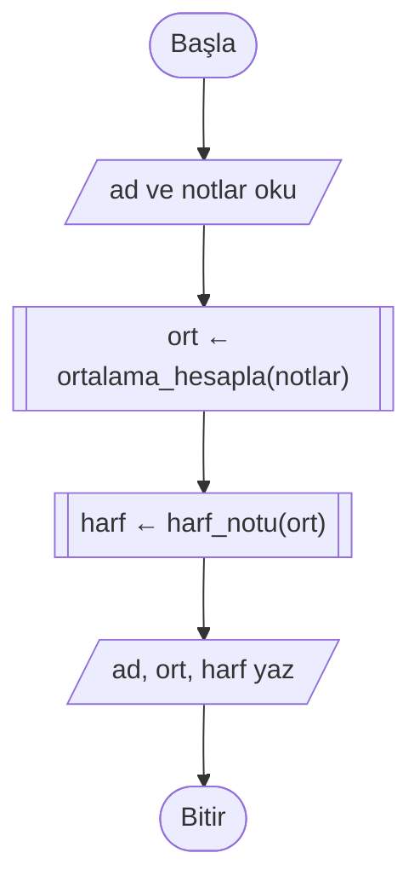
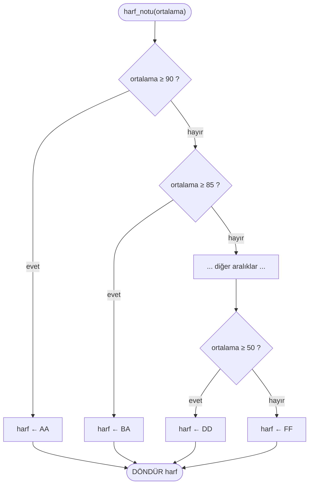

# 🧱 M9 - Fonksiyon Kullanımı

<p align="center"><em>Hafta 10</em></p>

## ❔ Öğrenme hedefleri

Bu modülün sonunda öğrenci:

* Fonksiyonun ne olduğunu açıklar; tekrarlanan ya da ayrışabilen işleri fonksiyonlara ayırır
* Akış şemasında alt program sembolünü kullanarak ana akış ve alt akış çizer
* `def` ile parametre alan ve `return` ile değer döndüren fonksiyonlar yazar; `return` ile `print` farkını açıklar
* Varsayılan parametre ve anahtar kelimeli argüman kullanır
* Yerel ve global kapsamı ayırt eder; fonksiyonunu docstring ile belgeler
* Hazır fonksiyonları ve `math`, `random` gibi modülleri kullanır
* Fonksiyonlarını sınır durumları da kapsayan pytest testleriyle sınar

---

## 1. Fonksiyon nedir? Neden kullanılır? { #1-fonksiyon-nedir }

**Fonksiyon** (function), bir işi yapan adımlara bir **ad** verip onları tek bir birim hâline getirmektir.
Bir kez tanımlanır, istenildiği kadar **çağrılır** (call). Günlük hayattan bir benzetme: bir yemek
tarifinde "beşamel sos hazırla" yazar ve sosun tarifi ayrı bir sayfadadır. Ana tarif sosun nasıl
yapıldığıyla uğraşmaz; sadece "hazırla" der ve sonucu kullanır.

Fonksiyon kullanmanın iki temel nedeni vardır:

| Neden | Anlamı | Örnek |
|---|---|---|
| **Tekrarı önlemek** | Aynı adımları her ihtiyaç duyduğunuzda yeniden yazmak yerine bir kez yazıp çağırırsınız. Bir hata bulduğunuzda tek bir yeri düzeltirsiniz. | 5 dersin her birinin ortalamasını hesaplamak |
| **Ayrıştırma** (decomposition) | Büyük bir problemi, her biri ayrı ayrı anlaşılıp test edilebilen küçük parçalara bölersiniz. | Not sistemi = ortalama hesapla + harf notu ver + rapor yaz |

İkinci neden M2'de öğrendiğimiz **ayrıştırma** tekniğinin koddaki karşılığıdır. M2'de bir problemi
kâğıt üzerinde alt problemlere bölmüştük. Fonksiyonlar, her alt problemi programda kendi adı olan,
ayrı bir parça olarak yazmamızı sağlar.

Aslında fonksiyonları M1'den beri kullanıyoruz. `print()`, `input()`, `len()` Python'un hazır
fonksiyonlarıdır. `selamla()` ve `ortalama()` ise M1'de kendi yazdığımız fonksiyonlardı. O zaman
"test edilebilsin diye bir kutuya koyuyoruz, ayrıntısı M9'da" demiştik. Bu hafta o kutuyu açıyoruz.

## 2. Akış şemasında alt program sembolü { #2-alt-program-sembolu }

ISO 5807 standardında **önceden tanımlanmış işlem** (predefined process) sembolü, kenarları çift
çizgili bir dikdörtgendir. Bu sembol "buradaki adımlar başka bir yerde, ayrı bir akış şemasında
tanımlı" anlamına gelir. Fonksiyonlu bir programı iki (ya da daha fazla) akış şemasıyla çizeriz:
**ana akış** ve her fonksiyon için bir **alt akış**.

Ana akış, not sisteminin genel planını gösterir. Ayrıntılar alt programlardadır:



`harf_notu` alt akışı kendi başlangıcı ve bitişi olan ayrı bir şemadır. Başla kutusunda fonksiyonun
adı ve parametresi, bitiş kutusunda döndürdüğü değer yazılır. Burada M7'deki basitleştirilmiş ölçek yerine, M7'nin 2. alıştırmasında
genişlettiğiniz sekiz harfli ölçeği (AA, BA, BB, CB, CC, DC, DD, FF) kullanıyoruz:



Ana akışı okuyan biri, harf notunun nasıl hesaplandığını bilmeden programın ne yaptığını anlar. Bu,
iyi bir ayrıştırmanın işaretidir. Sözde kodda aynı yapı `FONKSİYON ... FONKSİYON SONU` bloğuyla yazılır:

```text
FONKSİYON ortalama_hesapla(notlar)
    toplam ← 0
    HER i İÇİN 0'dan uzunluk(notlar) - 1'e KADAR YAP
        toplam ← toplam + notlar[i]
    HER SONU
    DÖNDÜR toplam / uzunluk(notlar)
FONKSİYON SONU
```

## 3. Python'da fonksiyon tanımlama (def) { #3-def }

M1'deki `selamla` fonksiyonunu satır satır inceleyelim:

```python
def selamla(ad: str) -> str:  # (1)!
    """Verilen ada göre bir selam cümlesi döndürür."""  # (2)!
    return f"Merhaba, {ad}!"  # (3)!


print(selamla("Ayşe"))  # (4)!
```

1. **Başlık satırı.** `def` anahtar kelimesi, fonksiyonun adı, parantez içinde parametreleri ve iki
   nokta. `: str` ve `-> str` **tip ipuçlarıdır** (type hints): "`ad` bir metin olmalı, fonksiyon bir
   metin döndürür" der. Python bunları zorunlu tutmaz ama hem okuyucuya hem de editörünüze yardım eder.
2. **Docstring.** Başlığın hemen altındaki üç tırnaklı metin, fonksiyonun **ne yaptığını** anlatır.
   `help(selamla)` yazdığınızda bu metin görünür. Her fonksiyona bir docstring yazın.
3. **Gövde.** Girintili satırlar fonksiyonun gövdesidir. `return` sonucu çağıran yere geri gönderir ve
   fonksiyonu bitirir.
4. **Çağrı.** Fonksiyon tanımlandığında **çalışmaz**; ancak adıyla çağrıldığında çalışır.

!!! note "Ana program bloğu ne işe yarar?"

    M1'den beri alıştırma dosyalarımızda `input()` ve `print()` satırlarını `if __name__ == "__main__":`
    bloğunun içine koyuyoruz.
    Bir dosya doğrudan çalıştırıldığında (`uv run python merhaba.py`) blok çalışır. Başka bir dosya onu
    `from merhaba import selamla` diye içe aktardığında ise **çalışmaz**. Böylece pytest fonksiyonu
    içe aktarırken program klavyeden girdi beklemeye başlamaz.

## 4. Parametreler ve dönüş değeri { #4-parametreler }

### Parametre ve argüman

**Parametre** (parameter), fonksiyon tanımındaki değişken adıdır. **Argüman** (argument), çağrı
sırasında o parametreye verilen gerçek değerdir:

```python
def dikdortgen_alani(en: float, boy: float) -> float:  # en, boy: parametre
    return en * boy


alan = dikdortgen_alani(3, 5)  # 3 ve 5: argüman; en = 3, boy = 5 olur
```

Bir mutfak benzetmesiyle: tarifteki "2 bardak **un**" ifadesindeki *un* parametredir. Dolabınızdan
aldığınız belirli bir paket un ise argümandır.

### return ve print aynı şey değildir

Yeni başlayanların en sık yaptığı hatalardan biri, sonucu `return` etmek yerine `print` ile yazmaktır.
İkisi ekranda aynı görünebilir ama çok farklıdır:

```python
def kare_yaz(x: int) -> None:
    print(x * x)  # sonucu EKRANA yazar, çağırana hiçbir şey vermez


def kare(x: int) -> int:
    return x * x  # sonucu ÇAĞIRANA verir, ekrana bir şey yazmaz


a = kare(4)  # a = 16
b = kare_yaz(4)  # ekranda 16 görünür, ama b = None
print(a + 1)  # 17
print(b + 1)  # TypeError: unsupported operand type(s) for +: 'NoneType' and 'int'
```

| | `return` | `print` |
|---|---|---|
| Sonuç nereye gider? | Çağıran koda | Ekrana |
| Sonuç başka bir hesapta kullanılabilir mi? | Evet | Hayır |
| Test edilebilir mi? | Evet (`assert kare(4) == 16`) | Kolayca değil |
| Fonksiyon bitiyor mu? | Evet, `return` satırında | Hayır, devam eder |

`return` içermeyen bir fonksiyon `None` ("hiçbir şey") değerini döndürür. Kural olarak: **hesap yapan
fonksiyonlar `return` eder, ekrana yazma işi ana programda (`__main__` bloğunda) yapılır.**

### Varsayılan parametre

Bir parametreye tanımda bir **varsayılan değer** (default value) verebilirsiniz. Çağrıda o argüman
verilmezse varsayılan kullanılır (`exercise_files/fonk_fiyat.py`):

```python
def kdvli_fiyat(fiyat: float, oran: float = 0.20) -> float:
    return round(fiyat * (1 + oran), 2)


kdvli_fiyat(100)  # 120.0: oran verilmedi, 0.20 kullanıldı
kdvli_fiyat(100, 0.10)  # 110.0: varsayılan ezildi
```

Varsayılan değeri olan parametreler, olmayanlardan **sonra** yazılmalıdır: `def f(oran=0.20, fiyat)`
bir söz dizimi hatasıdır.

### Anahtar kelimeli argüman

Argümanları sırayla vermek yerine parametre adıyla da verebilirsiniz. Buna **anahtar kelimeli argüman**
(keyword argument) denir. Sıra önemsizleşir ve çağrı kendini açıklar:

```python
kdvli_fiyat(oran=0.01, fiyat=100)  # 101.0
sepet_toplami([40, 60], indirim_yuzdesi=20)  # hangi sayının ne olduğu belli
```

Bunu aslında daha önce de gördünüz: `print("a", "b", sep="-")` ve `print(metin, end="")` çağrılarındaki
`sep` ve `end`, `print` fonksiyonunun varsayılan değerli parametreleridir.

## 5. Kapsam (scope) { #5-kapsam }

Bir fonksiyonun içinde oluşturulan değişken **yereldir** (local): yalnızca o fonksiyonun içinde vardır ve
fonksiyon bitince yok olur. Fonksiyonların dışında, dosyanın en üst seviyesinde tanımlanan değişken ise
**globaldir** (global).

```python
KDV_ORANI = 0.20  # global sabit (M6: sabitleri büyük harfle yazarız)


def kdv_tutari(fiyat: float) -> float:
    tutar = fiyat * KDV_ORANI  # tutar yerel; KDV_ORANI globalden okunuyor
    return tutar


print(kdv_tutari(50))  # 10.0
print(tutar)  # NameError: name 'tutar' is not defined
```

Farklı fonksiyonlardaki aynı adlı yerel değişkenler birbirini etkilemez. `ortalama_hesapla` içindeki
`toplam` ile `sepet_toplami` içindeki `ara_toplam` tamamen ayrı kutulardır; birini değiştirmek
diğerini bozmaz. Ayrıştırmayı mümkün kılan da budur.

!!! warning "global kullanmaktan kaçının"

    Python, `global sayac` yazarak bir fonksiyonun içinden global değişkeni değiştirmenize izin verir.
    Bunu yapmayın. Değeri birçok fonksiyonun değiştirebildiği bir değişkende hatanın nereden geldiğini
    bulmak çok zorlaşır ve fonksiyonu tek başına test edemezsiniz. Bir fonksiyonun ihtiyaç duyduğu
    değeri **parametre** olarak alın, ürettiği değeri **`return`** ile verin. Globalleri yalnızca
    değişmeyen sabitler (`KDV_ORANI` gibi) için kullanın.

## 6. Hazır fonksiyonlar ve modüller { #6-hazir-fonksiyonlar }

Python, hiçbir şey içe aktarmadan kullanabileceğiniz birçok **yerleşik** (built-in) fonksiyonla gelir:

| Fonksiyon | Ne yapar? | Örnek |
|---|---|---|
| `len(x)` | Eleman/karakter sayısı | `len([3, 5, 7])` → `3` |
| `abs(x)` | Mutlak değer | `abs(-4)` → `4` |
| `round(x, n)` | n basamağa yuvarlama | `round(3.14159, 2)` → `3.14` |
| `max(...)`, `min(...)` | En büyük / en küçük | `max([4, 9, 2])` → `9` |
| `sum(liste)` | Toplam | `sum([1, 2, 3])` → `6` |
| `int()`, `float()`, `str()` | Tip dönüşümü (M5) | `int("42")` → `42` |

Daha özel işler için **modüller** vardır. Modül, fonksiyonlar içeren bir Python dosyasıdır ve `import`
ile kullanılır:

```python
import math
import random

print(math.sqrt(16))  # 4.0
print(math.pi)  # 3.141592653589793
print(random.randint(1, 6))  # 1 ile 6 arasında (dahil) rastgele bir zar
```

M8'deki tahmin oyununda `random.randint` bu şekilde kullanılmıştı. Kendi yazdığınız her `.py` dosyası
da bir modüldür: testlerdeki `from fonk_not_sistemi import harf_notu` satırı, tam olarak sizin
modülünüzden bir fonksiyonu içe aktarır.

!!! tip "Dosyanıza modül adı vermeyin"

    Bir dosyaya `random.py` ya da `math.py` adını verirseniz, `import random` satırı Python'un
    modülü yerine sizin dosyanızı bulur ve anlaşılması zor hatalar alırsınız.

## 7. Fonksiyonları test etme (pytest) { #7-test }

M1'de `test_merhaba.py` ile ilk otomatik testimizi yazmıştık: `assert selamla("Ayşe") == "Merhaba, Ayşe!"`.
Artık bunun neden işe yaradığını tam olarak görebiliriz: `selamla` **değer döndürdüğü** için sonucu
bir beklenen değerle karşılaştırabiliyoruz. `print` ile yazan bir fonksiyonu bu kadar kolay test
edemezdik.

İyi bir test dosyası tek bir örneği değil, birbirinden farklı durumları dener:

```python
import pytest
from fonk_not_sistemi import harf_notu, ortalama_hesapla


def test_ortalama():  # tipik durum
    assert ortalama_hesapla([70, 80, 90]) == 80


def test_ortalama_bos_liste():  # uç durum: sıfıra bölme olmamalı
    assert ortalama_hesapla([]) == 0.0


def test_ortalama_ondalikli():  # ondalıklı sayılarda küçük yuvarlama farkları olabilir
    assert ortalama_hesapla([0.1, 0.2]) == pytest.approx(0.15)


def test_harf_notu_sinir_degerleri():  # sınır durumlar
    assert harf_notu(90) == "AA"
    assert harf_notu(89.99) == "BA"
    assert harf_notu(50) == "DD"
    assert harf_notu(49.99) == "FF"
```

| Test türü | Ne sorar? | Bu dosyadaki örnek |
|---|---|---|
| **Tipik durum** | Olağan bir girdiyle doğru sonuç çıkıyor mu? | `[70, 80, 90]` → 80 |
| **Sınır durumu** (boundary) | Bir aralığın tam kenarında doğru davranıyor mu? | 90 → AA ama 89.99 → BA |
| **Uç durum** (edge case) | Boş, sıfır, negatif gibi alışılmadık girdilerde çöküyor mu? | Boş liste → 0.0 |

Hataların çoğu sınırlarda saklanır: `>=` yerine `>` yazmak, `range(1, n)` yerine `range(1, n + 1)`
yazmak (M8) gibi. Bu yüzden her `EĞER` koşulunun eşiğini hem tam değeriyle hem de hemen altıyla
deneyin. Testleri çalıştırmak için:

```bash
uv run pytest m9_fonksiyonlar -v
```

`-v` her testin adını ve sonucunu tek tek gösterir. Test adlarını açıklayıcı seçin: başarısız olan
`test_harf_notu_sinir_degerleri` adı, hatanın nerede olduğunu size daha çıktıyı okumadan söyler.

## 8. Büyük problemi fonksiyonlara bölmek: not sistemi { #8-not-sistemi }

§2'deki ana akışı şimdi Python'a çevirelim (`exercise_files/fonk_not_sistemi.py`). Problem: bir
öğrencinin notlarından ortalamasını ve harf notunu içeren bir rapor satırı üretmek. Ayrıştırma:

| Fonksiyon | Girdi | Çıktı | Sorumluluğu |
|---|---|---|---|
| `ortalama_hesapla` | not listesi | sayı | Toplayıcı kalıbıyla ortalama (M8) |
| `harf_notu` | ortalama | metin | Karar zinciri (M7) |
| `rapor_yaz` | ad, not listesi | metin | Diğer ikisini çağırıp sonucu biçimlendirme |

```python
def rapor_yaz(ad: str, notlar: list[float]) -> str:
    """Öğrencinin adını, ortalamasını ve harf notunu içeren tek satırlık rapor döndürür."""
    ort = ortalama_hesapla(notlar)
    harf = harf_notu(ort)
    return f"{ad}: ortalama {ort:.2f}, harf notu {harf}"


rapor_yaz("Ayşe", [80, 90])  # 'Ayşe: ortalama 85.00, harf notu BA'
```

`rapor_yaz` hiçbir hesap yapmıyor; işi uzmanlarına devrediyor. Bu yapının üç kazancı var:

1. Her fonksiyon **tek başına test edilebilir**. `harf_notu` hatalıysa yalnızca onun testi başarısız olur.
2. Harf ölçeği değişirse yalnızca `harf_notu` fonksiyonunu değiştirirsiniz; diğerlerine dokunmazsınız.
3. `ortalama_hesapla` başka bir programda (ör. sınıf ortalaması) aynen yeniden kullanılabilir.

!!! note "İleride: kendini çağıran fonksiyonlar"

    Bir fonksiyon başka bir fonksiyonu çağırabildiği gibi **kendisini** de çağırabilir. Buna
    **özyineleme** (recursion) denir ve bazı problemleri (ör. klasör içinde klasör gezmek) çok doğal
    biçimde ifade eder. Bu giriş dersinin kapsamında değildir; algoritmalar ve veri yapıları derslerinde
    karşınıza çıkacak.

## 9. Alıştırmalar

Alıştırma dosyaları `exercise_files/` klasöründedir. Testleri çalıştırmak için:

```bash
uv run pytest m9_fonksiyonlar
```

1. **return mü, print mi?** §4'teki `kare_yaz` ve `kare` fonksiyonlarını bir dosyaya yazıp çalıştırın.
   `b + 1` satırındaki hata mesajını okuyun ve `None` kelimesinin nereden geldiğini açıklayın.
2. **Alt akış çizin.** `ortalama_hesapla` fonksiyonunun alt akış şemasını boş liste kontrolü dahil
   çizin. Başla kutusuna fonksiyonun adını ve parametresini, bitiş kutusuna döndürdüğü değeri yazın.
3. **Harf ölçeği.** `fonk_not_sistemi.py` içindeki `harf_notu` fonksiyonuna 0–100 dışındaki bir ortalama
   için `"Geçersiz"` döndüren bir kontrol ekleyin. Önce testini yazın (`harf_notu(101)` ve
   `harf_notu(-1)`), testin başarısız olduğunu görün, sonra kodu düzeltin.
4. **Varsayılan ve anahtar kelimeli argüman.** `fonk_fiyat.py` dosyasındaki `__main__` bloğunu çalıştırın
   ve her satırın sonucunu önceden tahmin edin. Ardından `sepet_toplami` fonksiyonunu,
   `kdv_orani` argümanını anahtar kelimeyle, `indirim_yuzdesi` argümanını hiç vermeden çağırın.
5. **Fonksiyon içinden fonksiyon.** `fonk_sicaklik.py` dosyasına Fahrenheit'tan Celsius'a çeviren
   `celsius(f)` fonksiyonunu yazın. `celsius(fahrenheit(x)) == pytest.approx(x)` olduğunu birkaç farklı
   `x` için doğrulayan bir test ekleyin.
6. **Kendi ayrıştırmanız.** M8'deki sayı tahmin oyununu en az üç fonksiyona bölün (ör. `hedef_sec`,
   `tahmin_degerlendir`, `oyunu_oyna`). Ana akışı ve bir alt akışı çizin; `oyunu_oyna` dışındaki her
   fonksiyon için en az iki test yazın.

---

## Özet

Fonksiyon, bir işi yapan adımlara bir ad verip onları tek bir birim hâline getirir. Tekrarı önler ve
M2'deki ayrıştırma fikrini koda taşır. Akış şemasında alt program sembolüyle gösterilir ve her fonksiyon
için ayrı bir alt akış çizilir. Python'da `def` ile tanımlanır; parametreler tanımdaki adlar,
argümanlar çağrıdaki değerlerdir. Hesap yapan fonksiyon sonucunu `print` ile değil `return` ile verir.
Ancak o zaman sonuç başka hesaplarda kullanılabilir ve test edilebilir. Varsayılan parametreler ve
anahtar kelimeli argümanlar çağrıları esnek ve okunaklı yapar. Fonksiyon içindeki değişkenler yereldir;
global değişkenleri değiştirmekten kaçınırız. İyi ayrıştırılmış bir programda her fonksiyon tipik, sınır
ve uç durumları kapsayan testlerle tek başına sınanabilir. Bir sonraki modülde, bu araçları kullanarak
bir listede eleman arayan ilk algoritmalarımızı yazacağız.

## İleri okuma

* [CS50P, Hafta 0: Functions, Variables](https://cs50.harvard.edu/python/weeks/0/) ve
  [Hafta 5: Unit Tests](https://cs50.harvard.edu/python/weeks/5/). Fonksiyon tanımlama, `return` ve
  pytest ile birim testi.
* Allen B. Downey, [*Think Python*, 3. baskı, 3. bölüm](https://allendowney.github.io/ThinkPython/chap03.html)
  (Functions) ve [6. bölüm](https://allendowney.github.io/ThinkPython/chap06.html) (Return Values).
* [Python Tutor](https://pythontutor.com/). `rapor_yaz` çağrısını adım adım çalıştırın; her fonksiyon
  çağrısında yeni bir çerçevenin (frame) açılıp `return` ile kapandığını izleyin.

## Kaynaklar

* [Python belgeleri: More Control Flow Tools, "Defining Functions"](https://docs.python.org/3/tutorial/controlflow.html#defining-functions).
  `def`, varsayılan parametreler ve anahtar kelimeli argümanların resmî anlatımı.
* [Python belgeleri: Built-in Functions](https://docs.python.org/3/library/functions.html). §6'daki
  yerleşik fonksiyonların tam listesi.
* [Python belgeleri: Python Scopes and Namespaces](https://docs.python.org/3/tutorial/classes.html#python-scopes-and-namespaces).
  §5'teki yerel/global kapsam kurallarının kaynağı.
* [PEP 257: Docstring Conventions](https://peps.python.org/pep-0257/). Docstring yazım kuralları.
* [pytest belgeleri: Get Started](https://docs.pytest.org/en/stable/getting-started.html). §7'deki test
  yazma ve çalıştırma adımları.
* ISO 5807:1985, *Information processing: Documentation symbols and conventions for data, program and
  system flowcharts, program network charts and system resources charts*. §2'deki önceden tanımlanmış
  işlem sembolünün kaynağı.
* Jeannette M. Wing, "Computational Thinking", *Communications of the ACM*, 49(3), 2006, s. 33–35.
  Ayrıştırma ve soyutlamanın problem çözmedeki yeri.
