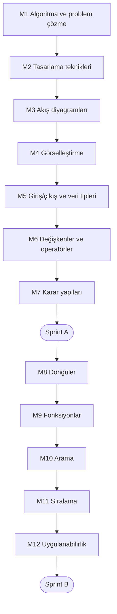

# Özet

Dersin konu akışı, temel kavramlardan algoritma karşılaştırmasına doğru ilerler:

```mermaid
flowchart TD
    A["M1 Algoritma ve problem çözme"] --> B["M2 Tasarlama teknikleri"]
    B --> C["M3 Akış diyagramları"]
    C --> D["M4 Görselleştirme"]
    D --> E["M5 Giriş/çıkış ve veri tipleri"]
    E --> F["M6 Değişkenler ve operatörler"]
    F --> G["M7 Karar yapıları"]
    G --> SA(["Sprint A"])
    SA --> H["M8 Döngüler"]
    H --> I["M9 Fonksiyonlar"]
    I --> J["M10 Arama"]
    J --> K["M11 Sıralama"]
    K --> L["M12 Uygulanabilirlik"]
    L --> SB(["Sprint B"])
```

!!! info "Durum"

    Modüller tamamlandıkça her modülün kısa özeti buraya eklenecek.
